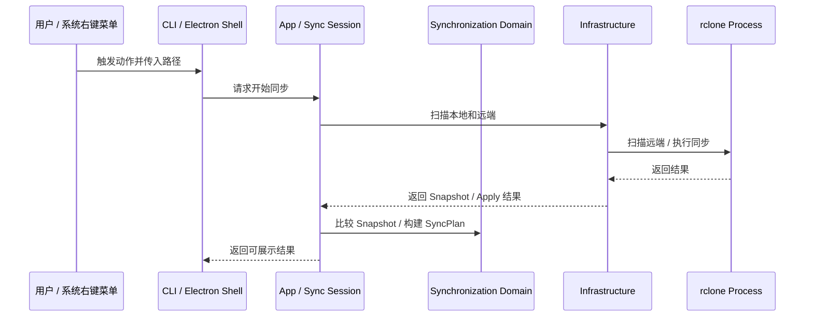
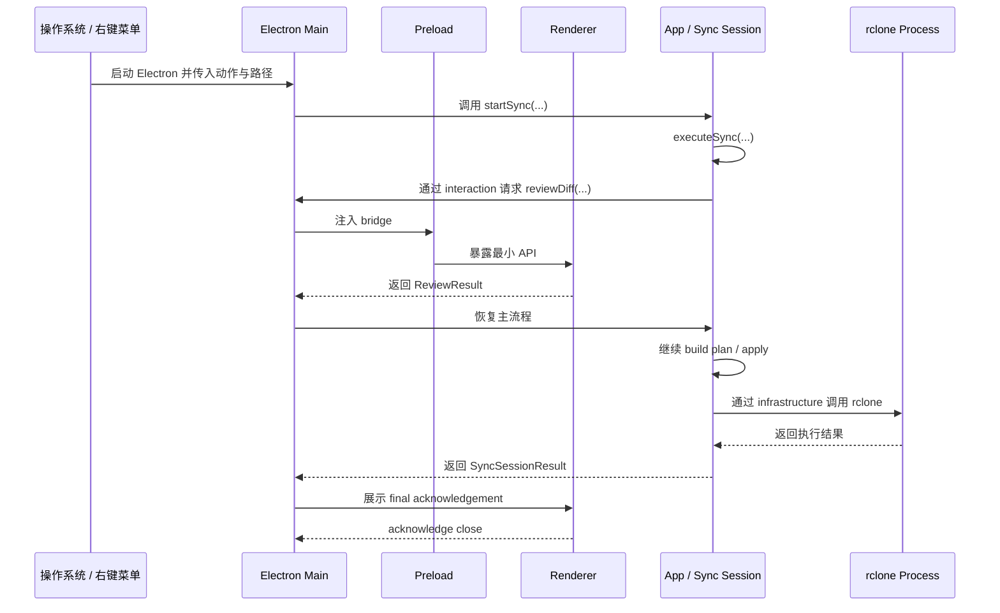
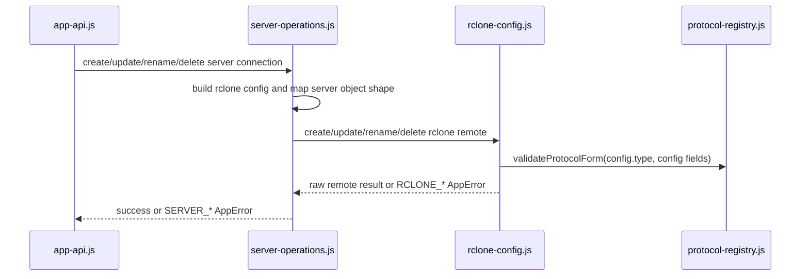
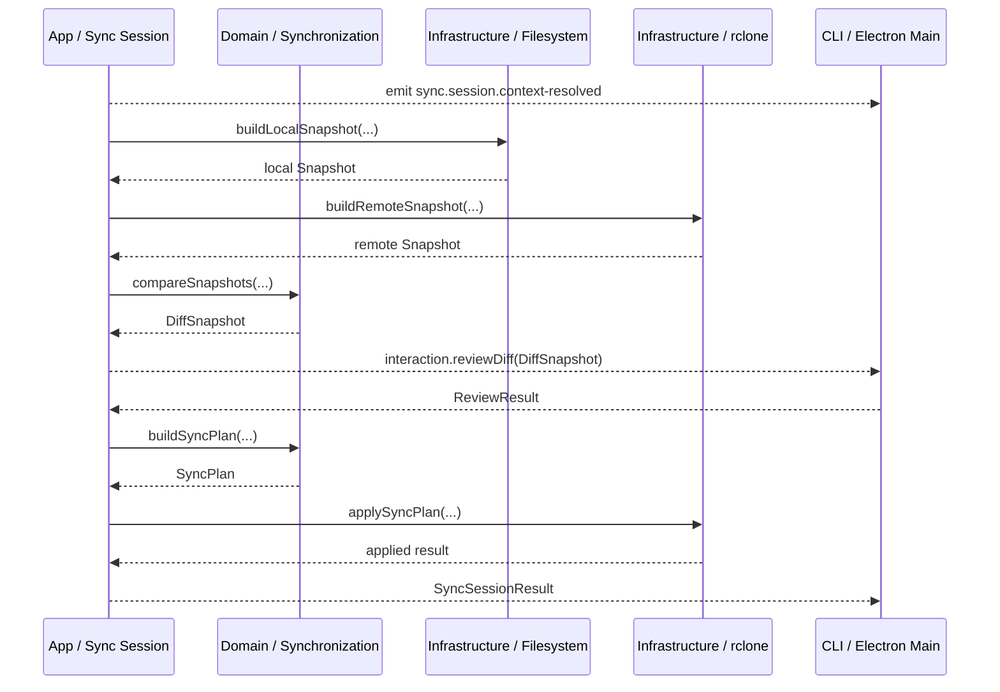

# sync-with-rclone 当前方案

## 1. 当前总结构

当前方案由以下职责区域组成：

- `shell`
- `app`
- `domain`
- `infrastructure`
- `rclone`




这张图想表达的是：

- `electron` 是当前桌面壳层
- `cli` 是当前保留的命令行壳层
- `app/sync-session` 拥有从 context resolution 到最终结果的同步会话生命周期，并通过 `executeSync` 执行已解析的同步流程
- `domain/synchronization` 保存不依赖 shell、文件系统或 rclone 的同步模型和规则
- `infrastructure/filesystem` 负责读取本地文件系统并构建 Snapshot
- `infrastructure/rclone` 负责 rclone 命令、远端 Snapshot 和 SyncPlan 执行


## 2. 目录职责

```text
src/           // 运行时代码
  app/         // shell-neutral application use cases 和编排
    events/    // shell-neutral application notifications
    sync-session/ // 同步会话生命周期、同步执行、统一 contract 和 review serialization
  command-line/ // 可执行文件的启动分发、命令名和同步参数语法
  cli/         // CLI入口、终端review和终端输出
  domain/
    synchronization/ // Snapshot、Diff 比较和 SyncPlan 构建规则
  electron/    // 当前桌面主壳层，包含 Electron main、preload、renderer
  infrastructure/
    filesystem/ // 本地文件扫描
    rclone/      // rclone 命令、远端目录准备、远端扫描和 SyncPlan 执行
  locales/     // GUI / CLI 共用的业务 message、error、operation 翻译
scripts/       // 非运行时代码
  dev/         // 开发启动脚本
  build/       // 打包校验、产物准备脚本
  install/     // 安装器脚本、安装辅助脚本
resources/     // bundled binaries、图标等静态资源
```

**层级边界:**
- domain 不读取 Electron API、配置文件、文件系统或 rclone
- infrastructure 不读取 Electron API，也不拥有 application session 生命周期
- app 不读取 Electron API；它接收 shell 已解析的结构化输入、管理同步用例并协调 domain 和 infrastructure
- `src/app/app-api.js` 是 GUI、CLI 和未来 agent/automation shell 调用应用能力的统一入口；普通 query、command 和 `startSync()` 都从这里导出
- electron 负责桌面壳层和窗口，不直接承担同步业务
- cli 负责命令行壳层和终端交互
- `src/command-line/` 是 CLI 和 Electron 共用的可执行文件输入边界；其中 `launch-dispatch.cjs` 分类启动模式，`command-names.cjs` 定义正式 CLI 命令，`parse-sync-args.js` 解析同步参数
- cli 不作为 Electron UI 的下层依赖；UI 通过 Electron Main 调用 app 层能力
- Electron Main 在进程入口处把命令行参数分发给 cli 壳层，这是打包入口职责，不代表 UI 依赖 cli
- cli 和 electron 通过 app 调用应用能力；app 可以依赖 domain 和 infrastructure，domain / infrastructure 不反向依赖 shell

当前打包方向采用一个 Electron 可执行文件，区分 GUI 单实例入口和独立 CLI 入口：

```text
sync-with-rclone                 -> 启动桌面 UI
sync-with-rclone list-tasks      -> 命令模式，列出同步任务
sync-with-rclone list-servers    -> 命令模式，列出 servers
sync-with-rclone sync push ...   -> 命令模式，执行同步
```

`src/command-line/launch-dispatch.cjs` 统一分类 main、session 和 CLI 启动。入口先识别显式 `--session`，其余启动只有在首个应用参数是正式 CLI 子命令时才进入 CLI。参数后部出现命令同名的路径或值不会改变启动类型，顶级 `push` / `pull` 不再作为 CLI 命令兼容。

GUI 启动通过 `requestSingleInstanceLock()` 汇入一个 Electron Main 进程。这个进程可以持有零或一个主窗口，以及多个互不冲突的 sync-session 窗口。普通启动创建或聚焦主窗口；`--session` 启动只提交同步会话。CLI 命令不参与 GUI 单实例锁，仍然作为独立命令行壳层负责参数路由、终端输出和终端 review。

`src/electron/main/index.cjs` 是产品可执行文件的统一入口。Renderer 不调用 `src/cli/`，只通过 preload bridge 请求 Electron Main，再由 Electron Main 调用 app 层。


## 3. Electron、Vite、Renderer、Application 的关系

当前需要重点理解的是桌面运行链路：



需要特别记住：

- `Renderer` 不直接调用 domain 或 infrastructure
- `Renderer` 通过 `preload` 暴露的 bridge 与 `Electron Main` 通信
- `Electron Main` 再去调用 `app`
- `app/sync-session` 协调 domain 与 infrastructure
- infrastructure 调用外部 `rclone` 进程
- `Vite` 的作用不是参与运行时通信，而是把 renderer 源码编译成 Electron 可加载的页面
- `CLI` 不是为了测试临时补出来的旁路，而是当前架构下的独立 shell 入口
- `CLI` 的存在也使 shell-neutral application flow 更容易独立运行、测试和排查
- 打包后可以由同一个 Electron 可执行文件承接 CLI 命令；这是入口分发，不改变 CLI 与 Electron UI 的依赖边界
- `Electron Main` 使用 `startSync(...)` 的返回值推进 final 流程，不依赖 `sync.session.result` event 推进控制流
- `Renderer` 负责按钮 pending 和重复点击防护；`Electron Main` 负责窗口生命周期和同步取消适配

### 3.1 GUI 窗口与会话生命周期

- 第二次 GUI 启动通过 single-instance `additionalData` 传递规范化 launch request，不依赖可能被 Chromium 重排的 argv。
- 主窗口是可重建的进程级单例；`desktop-application.js` 直接调用 `main-window/window.js` 创建窗口，不增加无职责的 runner。关闭主窗口不会取消活跃同步。
- `app/sync-session/start-sync.js` 是 shell-neutral application use case，负责 history、context resolution、session events 和最终结果。
- `app/sync-session/execute-sync.js` 只负责已解析上下文中的 snapshot、compare、review、plan 和 apply 流程。
- session 与 review 的 JSDoc contract 统一定义在 `app/sync-session/contract.js`。
- 远端目录检查和创建由 `infrastructure/rclone/ensure-remote-folder.js` 实现，`startSync` 只决定何时调用这项 rclone 能力。
- `electron/main/sync-session/controller.js` 把 application use case 连接到 session window 的 events、review interaction、acknowledgement 和 cancellation。
- `electron/main/sync-session/manager.js` 先通过 controller 解析只读 `SyncSessionContext`，再以本地和远程根路径执行原子 admission，并管理活跃 Electron session handle。
- 任一侧路径相同或存在祖先/后代关系时，session manager 拒绝新会话并聚焦已有会话；未启动的重叠请求不写入 operation history。
- admission 成功后，`electron/main/sync-session/window.js` 为每个窗口维护独立 channel prefix、UI state、review Promise 和 AbortController。
- session manager 在最后一个 session 清理后检查 Electron 窗口；没有窗口且不是显式 shutdown 时直接退出应用，不需要向 DesktopApplication 回传 idle 事件。
- 最后一个 session 完成且没有主窗口时，Electron Main 在 terminal history 写入完成后退出。

## 4. 关键数据契约

### 4.1 `Snapshot`

```js
/**
 * @typedef {object} FileEntry
 * @property {string} path - Path relative to the root
 * @property {number} mtimeMs - Modified time in number
 * @property {number} size - File size
 */

/**
 * @typedef {object} Snapshot
 * @property {string} root - Absolute path of the root directory
 * @property {FileEntry[]} files - Serializable file entries sorted by path
 */
```

说明：

- `Snapshot` 是扫描结果的正式结构定义
- `root` 是绝对路径
- `files` 只记录文件，不记录目录
- 目录不是同步内容，只在 review UI 中由文件路径派生出来
- 空目录不会作为 snapshot 内容保存
- 本地扫描会在进入目录前应用 ignore 规则，已忽略目录不会继续读取子内容
- `Snapshot` 只表达扫描到的文件事实，不携带远端协议能力、hash 能力或 backend 精度等基础设施属性

示例：

```js
{
  root: "/project/root",
  files: [
    {
      path: "README.md",
      size: 1204,
      mtimeMs: 1711880000000
    },
    {
      path: "src/index.js",
      size: 532,
      mtimeMs: 1711880001000
    }
  ]
}
```

### 4.2 `DiffSnapshot`

```js
/** @enum {number} */
export const DiffState = Object.freeze({
  unchanged: 0,
  modified: 1,
  added: 2,
  deleted: 3,
})

/** @typedef {FileEntry & { state: DiffState }} DiffFileEntry */

/**
 * @typedef {object} DiffSnapshot
 * @property {string} srcRoot - Absolute path of the source folder
 * @property {string} dstRoot - Absolute path of the dest folder
 * @property {DiffFileEntry[]} files - Serializable file differences sorted by path
 * @property {{ modified: number, added: number, deleted: number }} summary
 */
```

说明：

- `DiffSnapshot` 是差异计算后的正式结构定义
- 它同时记录源端根路径和目标端根路径
- `files` 保存文件级差异
- `summary` 保存文件级差异统计
- 目录级统计由 `serializeDiffSnapshot` 在 review 展示前从文件路径派生
- 文件是否 `modified` 由路径、大小和 `mtimeMs` 决定；当前实现对 `mtimeMs` 使用 1 秒容差
- 同步扫描流水线假设远端协议能可靠保存并返回文件 `mtime`，协议能力校验属于 app/settings 层，不进入 `Snapshot` 或 `DiffSnapshot` 数据契约
- 当前支持的 NAS 远端基线是 SFTP；Synology WebDAV 不保证返回源文件 `mtime`，不满足可靠重复同步预览的要求
- apply 阶段传入 `--sftp-disable-hashcheck`。Synology 的 SFTP 路径和 shell 卷路径可能不同，未验证的 `md5sum_command` / `sha1sum_command` 会让 rclone 在上传完成后误判 checksum 失败并重试整批 copy。hash 能力只在未来配置界面验证通过后作为可选增强使用
- apply 阶段暂时不使用 `--inplace`，保留 rclone 默认的 `.partial` 上传行为，让用户和系统都能区分未完成文件与已完成文件。代价是 Synology 回收站可能保留失败上传的 `.partial` 文件；这是运维清理问题，不应通过牺牲完成状态可见性来隐藏

示例：

```js
{
  srcRoot: "/local/project",
  dstRoot: "remote:project",
  summary: {
    added: 1,
    modified: 1,
    deleted: 0
  },
  files: [
    {
      path: "README.md",
      size: 1204,
      mtimeMs: 1711880000000,
      state: DiffState.modified
    },
    {
      path: "src/index.js",
      size: 532,
      mtimeMs: 1711880001000,
      state: DiffState.added
    }
  ]
}
```

### 4.3 `ReviewResult`

```js
/**
 * @typedef {'confirm' | 'cancel'} ReviewAction
 */

/**
 * Minimal review result contract returned from CLI or Electron review.
 *
 * @typedef {object} ReviewResult
 * @property {ReviewAction} action
 * @property {string[]} [selectedPaths]
 */
```

说明：

- `ReviewResult` 是 review 阶段返回给主流程的正式结构定义
- 它只表达结果，不表达 UI 细节
- `action = confirm` 表示继续
- `action = cancel` 表示正常取消，不是执行异常
- `selectedPaths` 是相对于当前 diff 根的路径集合

示例：

```js
{
  action: "confirm",
  selectedPaths: [
    "README.md",
    "src/index.js"
  ]
}
```

### 4.4 `SyncPlan`

```js
{
  action: "confirm",
  operations: [
    { type: "copy", path: "README.md" },
    { type: "copy", path: "src/index.js" },
    { type: "delete", path: "old.txt" }
  ]
}

// 说明:
// - 这里表达的是明确的执行意图，而不是 UI 状态
// - SyncPlan 只包含文件操作，不包含目录操作
```

示例含义：

- `SyncPlan` 是 apply 阶段的直接输入
- 它把“要做什么”压缩成明确的动作集合
- `applySyncPlan(...)` 会根据它执行 rclone batch copy 和 delete
- delete 后会执行内部 `rclone rmdirs <destination-root> --leave-root` 清理因文件删除而变空的目标目录，但不会把空目录作为同步内容或 review 项

### 4.5 `ApplyProgress`

```js
{
  activity: "copy",
  index: 1,
  total: 5,
  measurement: {
    current: 1048576,
    total: 2097152,
    unit: "bytes"
  }
}
```

说明：

- `ApplyProgress` 是 apply 阶段的进度观察事件结构，只用于 UI 展示和调试，不推进主流程
- `activity` 当前固定为 `start` / `copy` / `delete` / `cleanup` / `complete`
- `index` 是当前 activity 在固定 activity 列表中的位置，`total` 是固定 activity 总数
- `measurement` 只在 copy 阶段有字节进度；其他 activity 为 `null`
- UI 可以用 `index` 和 copy 阶段的 `measurement` 推导整体进度条，但同步执行不直接暴露一个最终百分比
- 这个结构表达当前正在发生的 apply 状态，不包含完整 UI 步骤列表

copy 之外的示例：

```js
{
  activity: "cleanup",
  index: 3,
  total: 5,
  measurement: null
}
```

### 4.6 `SyncExecutionRuntime`

```js
{
  events: {
    eventListener(event) {}
  },
  interactions: {
    reviewDiff(diffSnapshot) {}
  },
  dependents: {
    runCommand(command, args) {}
  }
}
```

说明：

- `events.eventListener` 是观察流，用于进度、日志和 UI 展示，不推进主流程
- `interactions.reviewDiff` 是业务等待点，`executeSync` 必须等待它返回 `ReviewResult` 才能继续
- `dependents.runCommand` 是 application session 向 rclone infrastructure 提供的可替换命令执行能力
- `executeSync` 会 emit `sync.phase.*` 事件，事件类型定义在 `src/app/sync-session/contract.js` 的 `SYNC_PHASE_EVENT`
- apply 阶段的 progress payload 使用 `ApplyProgress`
- `executeSync` 返回 `SyncExecutionResult`，结果值定义在 `SYNC_RESULT`

### 4.7 `SyncSessionRuntime`

```js
{
  events: {
    eventListener(event) {}
  },
  interactions: {
    reviewDiff(diffSnapshot) {}
  },
  dependents: {
    runCommand(command, args) {}
  }
}
```

说明：

- `startSync` 是 app 层 synchronization use case
- `startSync` 负责读取配置、解析同步任务、生成 `SyncSessionContext`
- `startSync` 把 sync phase event 转换成 `SYNC_SESSION_EVENT.PROGRESS`
- `startSync` 返回 `SyncSessionResult`
- `startSync` 会 emit `SYNC_SESSION_EVENT.RESULT`（值为 `sync.session.result`）作为观察事件，但 Electron final 流程由返回值驱动
- failed result 在 `quick-actions.log` 已存在时携带其路径；会话窗口通过 Electron shell 在文件管理器中定位该文件，不负责创建或导航主窗口

### 4.8 `MainWindowData`

```js
{
  servers: [
    {
      name: "synology",
      type: "sftp",
      address: "nas.local",
      status: "unknown",
      config: {
        type: "sftp",
        host: "nas.local"
      }
    }
  ],
  syncTasks: []
}
```

说明：

- `MainWindowData` 是主窗口 renderer 的当前只读展示数据
- `src/app/app-api.js` 通过 `getMainWindowData()` 组合 server 列表和 sync task 列表
- server connection 由 `src/app/configuration/server-operations.js` 从 rclone remote 转换而来，对外结构固定为 `{ name, type, address, status, config }`
- sync task 来源于 `src/app/configuration/app-config.js` 中的 `config.json`
- 如果 task 引用了不存在的 server，`getMainWindowData()` 会补充 `status = "missing"` 的 server 占位对象，方便 UI 显示异常状态
- `src/electron/main/app-state.js` 只保存 Electron 窗口状态，不缓存业务数据
- renderer 通过 preload bridge 调用 `main-window:get-data`
- sync-task modal 名称和校验属于 Electron shared contract，位于 `src/electron/contracts/sync-task-modal.js`，供 Electron Main 和 renderer 共用
- server/task 修改成功后，app operation 通过 `src/app/events/configuration-events.js` 发布 config update，Electron Main 订阅后发送 `main-window:config-updated` 通知主窗口 renderer 重新读取数据

### 4.8.1 `RcloneRemote` 与 `ServerConnection`

当前配置层有两个不同的数据结构：

```js
// 只在 rclone-config.js 和 server-operations.js 边界内使用
{
  name: "synology",
  config: {
    type: "sftp",
    host: "nas.local",
    port: "22",
    user: "xiaobo"
  }
}

// app 层和 UI 层使用
{
  name: "synology",
  type: "sftp",
  address: "nas.local",
  status: "unknown",
  config: {
    type: "sftp",
    host: "nas.local",
    port: "22",
    user: "xiaobo"
  }
}
```

说明：

- `RcloneRemote` 的正式结构是 `{ name, config }`
- `RcloneRemote.config` 是 rclone 配置的原始字段集合，包含 `type`
- `rclone-config.js` 负责读写、重命名、测试 rclone remote，不负责生成 app/UI 使用的 server 展示字段
- `ServerConnection` 的正式结构是 `{ name, type, address, status, config }`
- `server-operations.js` 是 remote 和 server 之间的唯一转换层
- `type` 从 `config.type` 派生
- `address` 从 `config.host` / `config.url` / `config.remote` / `config.endpoint` 派生，只用于展示
- `status` 是 app/UI 状态，不写入 rclone config
- 上层模块不直接使用 remote 术语；`app-api.js` 调用 `createServerConnection` / `updateServerConnection` / `renameServerConnection` / `deleteServerConnection`

### 4.8.2 Server operation flow



当前职责边界：

- `app-api.js` 判断用户意图，例如 create、same-name update、rename-with-update，并在成功后通过 `configuration-events.js` 发布更新
- `server-operations.js` 负责 server-level operation flow、remote/server 对象转换、创建后的连接测试，以及将 `RCLONE_*` 转成 `SERVER_*`
- `rclone-config.js` 负责 rclone config dump/create/update/delete/rename/test，并返回 `{ name, config }` 形式的 raw remote
- `name` 是 server 与 remote 共享的资源标识，不在 server 层转换；name 校验、normalize、same-name rename no-op 由 `rclone-config.js` 处理
- 协议字段校验由 `rclone-config.js` 调用 `protocol-registry.js` 完成；server 层只把 `protocolType` 和 `protocolFields` 组装成 rclone config
- rename 作为 rclone adapter operation 暴露；内部使用 create-target 后 delete-source 的顺序，如果 delete-source 失败，会尝试删除新 target，避免同时留下新旧两个 remote/server
- server 层不直接暴露 `RCLONE_*`；例如 `RCLONE_REMOTE_MISSING` 会转成 `SERVER_NOT_FOUND`，`RCLONE_INVALID_REMOTE` 会转成 `SERVER_VALIDATION_FAILED`

### 4.9 `SyncTaskModalState`

```js
{
  modalName: "edit-server",
  context: {
    server: {
      name: "synology",
      type: "sftp",
      address: "nas.local",
      status: "unknown",
      config: {}
    },
    syncTask: {
      displayName: "Projects",
      rcloneRemote: "synology",
      localBasePath: "/Users/me/Projects",
      remoteBasePath: "Projects"
    }
  }
}
```

说明：

- 主窗口 renderer 只能把可 structured-clone 的纯数据传给 Electron Main
- Vue reactive proxy、DOM 对象、函数和窗口对象不能作为 IPC payload
- 主窗口 renderer 打开 modal 时传完整的 plain `server` 和 `syncTask` 对象
- server 对象使用 app-level 结构 `{ name, type, address, status, config }`
- 任何主窗口 renderer 的 UI 组合字段都不传给 modal
- Electron Main 不重新组装 modal context，只校验 modal 名称并创建窗口
- Electron Main 的 server IPC handler 只校验 payload 是否为 plain object；字段语义错误交给 app/server/rclone operation 返回 `SERVER_*`
- `context.server` 和 `context.syncTask` 是 Electron Main 传给 sync-task modal 的纯数据
- sync-task modal 的初始状态不通过 `additionalArguments` 传入 renderer
- Electron Main 保存 `modalState`，preload 暴露 `window.syncTaskModal.getState()`，renderer 启动后异步读取

### 4.10 `OperationReportState`

完整错误契约见 [ErrorHandling.md](./ErrorHandling.md)。

```js
{
  mode: "message",
  level: "warning",
  key: "errors.server.already_exists",
  params: {
    serverName: "synology"
  },
  detail: "The server name is already in use."
}
```

`OperationReportState` 是 operation reporter 与各类展示 surface 之间的最小契约：

```ts
type OperationReportState = {
  mode: 'message' | 'confirm' | 'progress'
  level?: 'info' | 'warning' | 'error' | 'success'
  key?: string
  params?: Record<string, SerializableValue>
  detail?: string
  text?: {
    title?: string
    message: string
  }
}
```

约束：

- `key` 和 `text` 必须且只能出现一个
- `level` 只属于 `message` mode；`confirm` 和运行中的 `progress` 不携带 level
- `params` 必须是可序列化 plain object
- `detail` 是可选的运行时补充信息；它会覆盖 locale 中同一 key 的 detail
- `text` 只用于外部文本或非预期运行时文本，不用于普通内部 UI 文案
- `normalizeOperationReportState()` 会补全 message mode 的默认 level，并对非法内部状态直接抛错

语义 key 由调用 facade 完整生成：

```text
messages.${messageCode}
errors.${errorCode}
operations.${operation}
operations.${operation}.steps.${step}
operations.${operation}.succeeded
```

message-box renderer 不解释 code 类型，也不为 key 增加前缀。它只把收到的完整 key 解析成 `{ title, message, detail }`：

- title 从当前 key 或最近的祖先 key 继承
- message 优先读取 `${key}.message`，也允许 key 本身是 string
- 找不到翻译时使用 message-box surface 的通用 fallback，不显示原始 key
- confirm 使用中性的问号图标
- progress 使用 loading 图标
- message 根据 level 选择 info / warning / error / success 图标
- renderer 根据解析后的 title 更新 document/native window title

### 4.10.1 普通消息 facade 与 operation progress facade

普通 renderer 交互使用 `useMessageBox(windowPreload)`：

```js
messageBox.information(code, options)
messageBox.warning(code, options)
messageBox.success(code, options)
messageBox.confirm(code, options)
messageBox.error(error)
```

- `information` / `warning` / `success` 通过内部 `notify()` 生成 message mode，并增加 `messages.` 前缀
- `confirm` 生成无 level 的 confirm mode，并增加 `messages.` 前缀
- `error` 接受 `AppError`、序列化 error 或普通 error，并增加 `errors.` 前缀
- renderer caller 只表达展示意图、稳定 code 和插值参数，不构造 `mode`、`level` 或完整 locale key

Operation progress 的正式 kit 位于 app 层：

```js
const reporter = createOperationReporter(
  APP_OPERATION.CREATE_SERVER,
  {
    open,
    update,
    close,
  },
)

try {
  await execute(reporter.step)
  await reporter.succeed()
}
catch (error) {
  await reporter.error(error)
}

// A caller may use reporter.close(result) as an alternative terminal event.
```

- `createOperationReporter()` 是系统级 operation progress kit
- reporter 接受中性的 `open` / `update` / `close` display interface，不依赖 message-box
- reporter 自己组装完整 `OperationReportState`，包括 `mode`、`level`、完整 locale key、params 和 error detail
- surface function 不需要理解 operation、step、success 或 error 的结构，只负责展示收到的 state
- `step(code, params)` 明确表示 step progress；未来 percentage/count progress 需要在 reporter 中增加对应 semantic method，不能伪装成 step
- `succeed(needAcknowledgement)` 由 reporter 决定关闭或更新为 success state，并复用最初 `open()` 返回的 acknowledgement
- app operation 仍然只接收 callback，不依赖 reporter 或任何具体 surface
- 当前 `createServer` operation 保留 callback-based `save` / `testConnection` / `rollback` 进度上报

`src/electron/main/message-box/operation-presentation.js` 是 Electron Main 的 operation/error presentation adapter。它把 `src/electron/main/message-box/window.js` 的三个 GUI 函数适配为 display interface，并把最终值或错误转换成 `OperationResult`：

- `open: openMessageBox` 创建/替换 GUI message-box 并返回 acknowledgement Promise
- `update: updateMessageBox` 原子替换 GUI state
- `close: closeMessageBox` 关闭 GUI window 并 settle acknowledgement
- GUI function 不包含 operation-specific key assembly
- main-window 与 sync-task-modal handler 复用该 adapter，不各自组装 reporter 或 error state

CLI 使用 `src/cli/operation-report-display.js` 暴露同一中性 interface：

- `open(state)` / `update(state)` 接收 reporter 组装好的完整 state，`close(result)` 结束展示
- CLI display 使用 `src/cli/i18n.js` 创建真实 Vue I18n instance
- locale 从 `LC_ALL` / `LC_MESSAGES` / `LANG` 解析，支持 `en` 和 `zh-CN`，fallback 为 English
- CLI 从共享 `src/locales/` 读取 operation/error translation，不依赖 Electron renderer
- terminal surface 输出翻译后的 message/detail；initial acknowledgement 立即 resolve，不阻塞命令执行

### 4.10.2 Message-box 生命周期

- message-box 是 Electron Main 里的进程级单例窗口，同一时间只允许存在一个
- parent 由 `app-state.js` 选择：优先 active modal，其次 main window
- Electron Main 内部 `openMessageBox(...)` 的 Promise 返回 `confirmed` / `cancelled` / `closed` / `replaced`
- 这些 lifecycle 值属于 `OPERATION_REPORT_ACKNOWLEDGEMENT`，表示展示交互如何结束；它们不是 `operation-result.js` 定义的业务执行结果
- renderer 通过 preload 的 `showMessageBox(payload)` 打开普通消息或确认框，IPC 返回标准 `OperationResult`
- 已有窗口再次 open 时，旧 Promise 以 `replaced` settle，新 state 原子替换当前 state
- `updateMessageBox()` 替换完整 state，不依赖旧 state 拼接 title/message
- message-box renderer 通过 `getState()` 读取初始状态，通过 state event 接收后续替换
- message-box renderer 通过 confirm/cancel bridge 通知 Electron Main；Electron Main 拥有最终关闭和 Promise settle

### 4.11 语义 code 与 locale 组织

稳定 code 是程序契约，locale 文案是展示实现。三类 code 使用各自已有的命名惯例：

```text
APP_ERROR_CODE      server.already_exists
APP_MESSAGE_CODE    server.delete_confirmation
APP_OPERATION       createServer
progress step       testConnection
```

- error/message code 使用带 domain namespace 的点分 snake_case
- operation 和 step 是 JavaScript operation 名称，使用 camelCase
- caller 使用 `APP_ERROR_CODE`、`APP_MESSAGE_CODE`、`APP_OPERATION` 和对应 step 常量，不手写正式 code
- typed locale root 防止不同类别发生碰撞：`errors`、`messages`、`operations`
- error/message code 的点只表达 domain namespace；operation progress 的 `steps` 由 `reporter.step()` 明确赋予语义

`defineLocaleTree(entries)` 让 canonical dotted code 可以直接定义 nested locale tree：

```js
messages: defineLocaleTree({
  [APP_MESSAGE_CODE.SERVER_DELETE_CONFIRMATION]: {
    title: 'Delete Server',
    message: 'Delete server "{serverName}"?',
  },
})
```

它在 locale module import 时运行一次，并拒绝空 segment、不安全 segment 和 path/value collision。它不是运行时翻译器；实际翻译仍由 Vue I18n 在 renderer 中完成。

locale 先按是否跨 shell 共享，再按 ownership 组织：

```text
src/locales/
  locale-tree.js
  <locale>/
    index.js
    infrastructure.js
    domains/
      server.js
      sync-task.js

src/electron/renderer/src/i18n/locales/<locale>/
  index.js
  common.js
  surfaces/
    main-window.js
    message-box.js
    sync-session.js
    sync-task-modal.js
```

- shared domain module 拥有该 domain 的 messages、errors 和 operations，GUI/CLI 共用
- shared `infrastructure.js` 拥有 path/config/remote/ipc/rclone 等基础设施 errors
- renderer surface module 只拥有 Electron UI surface 的固定文案
- `surfaces/message-box.js` 只定义 level title、confirmation/progress chrome 和 fallback，不承载业务文案
- shared locale `index.js` 组合 `messages` / `errors` / `operations` typed roots
- renderer locale `index.js` 再把 shared locale 与 common/surface fragments 组合
- English 和 Chinese 必须保持相同 key shape；English fallback 只是运行时安全网，不替代 locale parity

对应实现入口：

```text
src/app/app-errors.js
src/app/app-messages.js
src/app/app-api.js
src/app/events/configuration-events.js
src/app/operations/operation-report-contract.js
src/app/operations/operation-reporter.js
src/cli/i18n.js
src/cli/operation-report-display.js
src/electron/main/message-box/operation-presentation.js
src/electron/main/message-box/window.js
src/electron/renderer/src/composables/useMessageBox.js
src/electron/renderer/src/surfaces/message-box/MessageBox.presentation.js
src/locales/locale-tree.js
```

## 5. 数据契约在主要模块间的流转



运行时通道按职责区分：

- `return` 是控制流。`startSync(...)` 的返回值决定 Electron 是否展示 final、进程退出码和后续收尾。
- `events.eventListener` 是观察流。它用于展示 context、progress 和调试，不作为流程推进条件。
- `interactions.reviewDiff` 是业务等待点。它是 application sync execution 在 review 阶段继续执行所需的外部输入。

Progress 与 operation history 保持分离：

- `SYNC_SESSION_EVENT.PROGRESS`（值为 `sync.session.progress`）只进入对应 session window，不写入 history。
- operation history 每个 session 只保存一条 started 和一条 succeeded / failed / cancelled。
- GUI sessions 与主窗口位于同一进程，因此 history emitter 可以实时通知 Logs panel。
- 独立 CLI 写入的 history 仍通过刷新或重新打开 Logs panel 读取。

## 6. 打包与安装

### 6.1 打包步骤

1. Vite 先构建 renderer 页面
2. electron-builder 收集 Electron main、preload、renderer 构建产物
3. 打包时附带需要运行的 resources/ 内容
4. Windows 下由 NSIS 生成安装器
5. 安装器负责注册右键菜单

### 6.2 安装步骤

1. 用户运行安装器
2. 安装器写入程序文件
3. 安装器准备配置目录和系统集成；默认 `config.json` 由应用启动时创建
4. 安装器分发 bundled binaries 和安装脚本
5. 安装器注册右键菜单
6. 用户后续通过右键菜单或 CLI 启动程序


### 6.3 安装后的目录结构

Windows 当前安装后的目录结构可按下面理解：

安装目录（管理员安装时通常是 `C:/Program Files/sync-with-rclone/`）:
  sync-with-rclone.exe
  config/
    config.json
    rclone.conf
  logs/
  resources/
    app.asar
    binaries/

含义是：

- 程序本体安装在安装目录
- 程序运行时读取的配置默认位于安装目录下的 `config/`
- 日志默认位于安装目录下的 `logs/`
- `rclone` 二进制来自安装目录下的 bundled resources
- Windows 右键菜单调用时使用显式 `--session` 加命名参数 `--mode` 和 `--local`，避免打包后的额外 argv 干扰参数定位

## 7. 当前打包和运行结论

当前 renderer 的构建方式是：

- 使用 Vite 构建
- 由 Vite 把 `.vue` 源码编译成 Electron 可加载页面
- Electron 加载的是构建产物，而不是直接执行 `.vue`

当前打包方式是：

- 使用 `electron-builder`
- Windows 安装器使用 `NSIS`
- 安装器负责注册右键菜单
- 安装产物包含 bundled `rclone` 和配置模板
- mac 当前主要安装链路是 `pkg`，配置目录和 Finder Quick Actions 初始化由安装阶段承担
- `dmg` / `zip` 产物当前只作为开发验证和手动安装产物，不作为主要安装初始化链路

当前尚未视为稳定事实的部分是：

- Windows 安装阶段自动初始化安装目录 `config/` 的细节
- 覆盖安装 / 卸载链路
