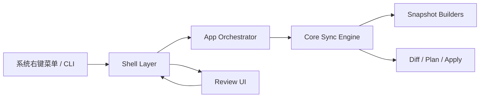
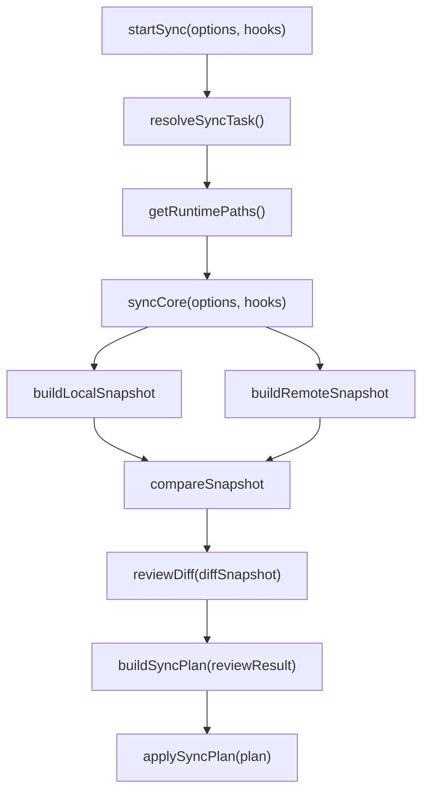

# sync-with-rclone 架构设计

## 1. 架构目标

这个项目必须同时满足两件事：

- 可以作为桌面应用运行
- 核心同步逻辑可以独立于 Electron 运行

因此，系统必须分层。

## 2. 总体分层



分层原则：

- `core` 只做业务和执行
- `app` 负责配置解析、任务编排和 review 协调
- `electron` 只做窗口与 IPC
- `cli` 只做命令行 shell
- `shared` 只放双方共享的数据契约

## 3. 推荐目录结构

```text
src/
  app/
    constants.js
    load-config.js
    path-utils.js
    runtime-paths.js
    start-sync.js
    resolve-sync-task.js
    review-contracts.js
  core/
    build-local-snapshot.js
    build-remote-snapshot.js
    compare-snapshot.js
    build-sync-plan.js
    apply-sync-plan.js
    sync-engine.js
  shared/
    diff-serializer.js
    ipc-contracts.js
  cli/
    review.js
    index.js
  electron/
    main/
      index.js
      index.cjs
      review-window.js
      ipc-handlers.js
    preload/
      review-preload.cjs
    renderer/
      index.html
      src/
        main.js
        App.vue
        components/
        utils/
        styles.css
      dist/
resources/
  binaries/
  icons/
```

## 4. 模块职责

### 4.1 `core`

负责：

- 扫描本地目录
- 扫描远端目录
- 计算差异
- 构建执行计划
- 应用执行计划

禁止：

- 直接调用 Electron API
- 直接创建窗口
- 直接依赖 UI 状态
### 4.2 `app`

负责：

- 读取和解释配置
- 匹配当前本地路径所属的同步任务
- 组织 `core` 的输入参数
- 连接 `reviewResult` 和后续 plan/apply 流程

说明：

- `config resolver` 属于这一层，不属于 `core`
- 这一层是 UI/CLI 和 `core` 之间的应用编排层

### 4.3 `electron/main`

负责：

- Electron 生命周期
- 解析启动参数
- 打开 review 窗口
- 打开执行进度窗口
- 显示执行结果提示
- 通过 IPC 与 renderer 通信
- 调用 app 层并等待结果

当前实现里：

- `src/electron/main/index.js` 是 Node 入口，只负责把命令转发给 Electron
- `src/electron/main/index.cjs` 是真正的 Electron main 入口

这样做的原因不是“架构上必须有两层 main”，而是当前运行环境里需要一个稳定的 Electron 主进程入口。

### 4.4 `electron/renderer`

负责：

- 差异树展示
- 用户勾选和确认
- 结果回传
- 使用 Vue 组织窗口 UI

建议：

- renderer 使用 Vue 作为视图层
- renderer 使用 `.vue` Single File Component 结构
- `electron/preload` 只暴露最小 IPC bridge
- renderer 不承担任何文件系统或命令执行逻辑

### 4.5 `shared`

负责：

- 可序列化 diff 结构
- IPC 输入输出契约

## 5. Core 与 Electron 的边界

最重要的边界是：

**Core 不应知道 Electron 的存在。**

正确做法是让 app 层把 review hook 注入给 Core，例如：

```js
await startSync(options, {
  reviewDiff,
})
```

这样：

- CLI 可以提供命令行 review
- Electron 可以提供窗口 review
- 测试可以提供 fake review

## 6. 关键运行模型



这意味着 Core 可以：

- 先计算 diff
- 暂停等待 review
- 接收用户筛选结果
- 再生成计划并执行

这个 review 阶段既可以来自 Electron 窗口，也可以来自 CLI 交互确认。

### 6.1 当前 Electron 运行链路

当前桌面模式的实际启动流程是：

1. 用户运行 `node ./src/electron/main/index.js ...`
2. `src/electron/main/index.js` 读取本地安装的 Electron binary
3. Node 入口清理不适合桌面进程继承的环境变量，例如 `ELECTRON_RUN_AS_NODE`
4. Node 入口启动 Electron，并把参数转交给 `src/electron/main/index.cjs`
5. `src/electron/main/index.cjs` 作为真正的 Electron main process 启动
6. Electron main 调用 `startSync(...)`
7. 当 Core 进入 `reviewDiff(...)` 阶段时，Electron main 创建窗口
8. preload 暴露最小 IPC bridge
9. renderer 通过 bridge 拉取 diff payload，渲染 Vue 界面
10. 用户确认后，renderer 把 `reviewResult` 回传给 main
11. main 再把 `reviewResult` 交回 app/core，继续后续流程

这个 `index.js -> index.cjs` 的双层入口不是长期理论要求，而是当前为了兼容：

- 仓库整体使用 ESM
- Electron 主进程入口在当前环境里用 CommonJS 更稳定
- 有时用户会直接用 `node ...` 启动桌面入口

如果后面把整个桌面启动链整理得更干净，这一层是可以被替换或移除的。

### 6.2 当前 renderer 构建链路

当前 renderer 不是直接让 Electron 去执行 `.vue` 文件。

实际流程是：

1. `.vue`、`main.js`、`styles.css` 位于 `src/electron/renderer/src/`
2. Vite 读取这些源文件
3. Vite 把 `.vue` SFC 编译成浏览器可执行的 JavaScript 和 CSS
4. 构建产物输出到 `src/electron/renderer/dist/`
5. Electron 窗口加载 `dist/index.html`

因此，当前模式下在运行桌面窗口前，确实需要先有一次 `build:renderer`。

这不是 Vue 特有要求，而是因为浏览器和 Electron renderer 不能直接执行 `.vue` 源文件，必须先经过编译。

## 7. 配置层

配置系统应作为独立能力，而不是散落在入口逻辑里。

当前已经落地的 app/config 文件包括：

- `src/app/constants.js`
- `src/app/load-config.js`
- `src/app/path-utils.js`
- `src/app/runtime-paths.js`
- `src/app/resolve-sync-task.js`

默认配置路径当前是：

- macOS: `~/Library/Application Support/sync-with-rclone/config.json`
- Windows: `%APPDATA%/sync-with-rclone/config.json`
- Linux/其他: `~/.config/sync-with-rclone/config.json`

也可以通过环境变量 `CONFIG_PATH` 覆盖。

当前 runtime paths 也会由 app 层统一导出，包括：

- app directory
- app config path
- rclone config path
- log directory
- bundled rclone binary path

这意味着远端扫描阶段和后续 apply 阶段在调用 `rclone` 时，都不应依赖 `rclone` 默认配置目录，而应显式使用 app 层提供的 `rcloneConfigPath`。

配置层负责：

- 读取同步任务定义
- 根据用户点击的本地路径匹配所属任务
- 解析本地相对路径和 remote 对应路径
- 保证本地路径和 remote 路径始终在同一个同步任务内
- 提供额外 ignore patterns
- 为 `push / pull / push to / pull from` 提供任务内路径解析能力

当前实现里，如果配置文件不存在：

- app 层会返回 `null`
- 此时仍允许沿用显式传入的 `remoteFolderPath`
- 这是一种兼容当前开发阶段的 fallback，不代表最终产品一定保留这个行为

### 7.1 `syncJob` 配置结构

`syncJob` 是配置层里最关键的数据单元，配置解析必须满足这些硬约束：

- 一个 `syncJob` 表达的是一个固定的“本地根目录 <-> 远端根目录”关系
- 用户当前选中的本地路径必须先匹配到某个 `syncJob`
- 默认 remote 路径来自 `rcloneRemote + remoteBasePath + 相对路径`
- `Push To...` 和 `Pull From...` 只能在当前 `syncJob` 对应的 remote 目录树内部选目录
- 不允许跨 `syncJob` 同步

例如：

```js
const syncJob = {
  name: 'ProjectsSynced',
  rcloneRemote: 'synology',
  localBasePath: '/Users/H/NAS/ProjectsSynced',
  remoteBasePath: 'ProjectsSynced',
  ignorePatterns: [],
}
```

如果用户当前选中本地目录：

```js
'/Users/H/NAS/ProjectsSynced/code/app'
```

那么它在这个任务中的相对路径是：

```js
'code/app'
```

默认对应的 remote 目录应解析为：

```js
'synology:ProjectsSynced/code/app'
```

## 8. 核心数据结构与处理流程

这部分信息属于“即使将来重写实现，也仍然成立”的系统知识，因此应保留在架构文档里，而不是仅存在于代码中。

### 8.1 `Snapshot`

建议直接把它理解为一个真实对象示例，而不是纯类型定义：

```js
const snapshot = {
  // 本地时是绝对路径；远端时是当前远端根目录
  root: '/Users/H/NAS/ProjectsSynced/code/app',

  // key 永远是相对于 root 的文件路径
  fileEntries: new Map([
    ['src/index.js', {
      parent: 'src',
      size: 1280,
      mtimeMs: 1719123456789,
    }],
  ]),

  // key 永远是相对于 root 的目录路径
  dirEntries: new Map([
    // 根节点默认必须存在
    ['.', {
      parent: null,
      // children 的 key 是名字，不是完整路径
      children: new Map([
        ['src', { path: 'src', isDir: true }],
        ['README.md', { path: 'README.md', isDir: false }],
      ]),
    }],

    ['src', {
      parent: '.',
      children: new Map([
        ['index.js', { path: 'src/index.js', isDir: false }],
      ]),
    }],
  ]),
}
```

这里有几条必须写死记住的细节：

- `root` 是绝对路径或远端根路径，是整棵树的参照系
- `fileEntries` 的 key 是“相对于 `root` 的路径”，例如 `src/index.js`
- `dirEntries` 的 key 也是“相对于 `root` 的路径”，例如 `src` 或 `.`
- `dirEntries` 默认就必须有一个 `'.'` 元素，表示根目录节点
- `children` 的 key 不是完整路径，而是子项的名字，例如 `index.js` 或 `src`
- `ChildRef.path` 存的是“相对于 `root` 的完整路径”，不是名字
- `parent` 存的是父目录相对于 `root` 的路径

初始化根节点时，应该是这样的：

```js
const snapshot = {
  root: rootAbsPath,
  fileEntries: new Map(),
  dirEntries: new Map([
    ['.', { parent: null, children: new Map() }],
  ]),
}
```

这几个细节如果弄错，通常不会立刻在类型层暴露，但会直接导致：

- 父子关系挂错
- diff 统计错误
- 路径拼接错误
- UI 树渲染异常
- 删除或筛选逻辑跑偏

### 8.2 `buildLocalSnapshot`

`buildLocalSnapshot` 的职责是：

- 从本地文件系统扫描目录
- 应用 `.gitignore` 风格规则
- 应用全局和任务级额外 ignore patterns
- 产出标准化 `Snapshot`

它的关键特点是：

- 本地扫描是受 ignore 规则影响的
- 它服务的不是“完整镜像本地目录”，而是“产出准备参与同步判断的本地视图”

### 8.3 `buildRemoteSnapshot`

`buildRemoteSnapshot` 的职责是：

- 通过 `rclone` 读取远端目录树
- 把远端条目转成和本地一致的 `Snapshot` 结构

它的关键特点是：

- 远端扫描是通过 `rclone` 完成的
- 不再应用`.gitignore`规则
- 它的输出必须与本地快照结构兼容，这样 diff 才能共用同一套逻辑

### 8.4 `DiffSnapshot`

建议也直接按真实对象示例理解：

```js
const diffSnapshot = {
  srcRoot: '/Users/H/NAS/ProjectsSynced/code/app',
  dstRoot: 'synology:ProjectsSynced/code/app',

  // key 仍然是相对于根目录的路径
  fileEntries: new Map([
    ['src/index.js', {
      parent: 'src',
      size: 1280,
      mtimeMs: 1719123456789,
      state: 1, // modified
    }],
    ['src/new-file.js', {
      parent: 'src',
      size: 420,
      mtimeMs: 1719123456799,
      state: 2, // added
    }],
  ]),

  dirEntries: new Map([
    // 根节点默认必须存在
    ['.', {
      parent: null,
      children: new Map([
        ['src', { path: 'src', isDir: true }],
      ]),
      state: 0, // unchanged
      // changes 是目录级聚合统计，不是目录自己的单一状态
      changes: new Map([
        [1, 1], // modified
        [2, 1], // added
      ]),
    }],

    ['src', {
      parent: '.',
      children: new Map([
        ['index.js', { path: 'src/index.js', isDir: false }],
        ['new-file.js', { path: 'src/new-file.js', isDir: false }],
      ]),
      state: 0, // unchanged
      changes: new Map([
        [1, 1],
        [2, 1],
      ]),
    }],
  ]),
}
```

这里同样有几个关键细节：

- `fileEntries` 和 `dirEntries` 的 key 仍然都是“相对于根目录”的路径
- `dirEntries.get('.')` 永远表示 diff 树的根节点
- `DiffFileEntry.state` 表示单个文件的状态
- `DiffDirEntry.state` 只表示“目录本身”的状态，主要用于目录被新增或删除的情况
- `DiffDirEntry.changes` 是目录级聚合统计，不是目录本身的单一状态
- 一个目录可以同时满足：
  - `state === unchanged`
  - 但 `changes` 里仍然有 `modified / added / deleted`
- 目录是否显示为“有变化”，取决于它下面聚合出来的 `changes`

它的意义不是“执行计划”，而是 review 和 plan 之间的中间层。

### 8.5 `compareSnapshot`

`compareSnapshot` 的职责是：

- 接收一个源快照和一个目标快照
- 判断路径在两侧的存在性和差异
- 输出可供 review 使用的 `DiffSnapshot`

它的输出要满足：

- Core 可继续基于它生成 plan
- CLI 可直接把它转成文本树
- Electron renderer 可把它转成可勾选的文件树

稳定规则：

- 文件比较不能要求 `mtimeMs` 完全逐小数位相等
- 对于时间精度不同导致的小于约 1ms 的差异，应视为未修改
- 否则文件即使刚刚同步完成，也可能在下一次 compare 时被误判为 `modified`

### 8.6 `ReviewResult`

`ReviewResult` 是 review 阶段返回给 Core 的数据契约。

它的职责是：

- 表达用户是否确认继续
- 表达哪些路径被选中
- 为后续 `buildSyncPlan` 提供输入

建议按下面这个结构固定：

```js
const reviewResult = {
  action: 'confirm',
  selectedPaths: [
    'src/index.js',
    'src/utils/format.js',
  ],
}
```

如果用户取消，则应返回：

```js
const reviewResult = {
  action: 'cancel',
  selectedPaths: [],
}
```

最少应满足这些约束：

- `action` 至少支持 `confirm` 和 `cancel`
- `selectedPaths` 中的路径必须是“相对于当前 diff 根目录”的路径
- `selectedPaths` 里的路径必须来自当前 `DiffSnapshot`
- Core 不应依赖 renderer 的 checkbox 状态树，只应依赖这个精简结果
- 用户取消不是执行错误，而是一个正常分支

如果以后需要更强的表达能力，可以演进为：

```js
const reviewResult = {
  action: 'confirm',
  selectedPaths: ['src/index.js'],
  excludedPaths: ['dist/app.js'],
  meta: {
    source: 'electron',
  },
}
```

但第一阶段建议保持最小结构，不要过早把 UI 细节带进契约里。

### 8.7 `SyncPlan`

`SyncPlan` 是 `DiffSnapshot` 与 `ReviewResult` 合并后的结果。

它的职责是：

- 把差异状态转成后续 apply 阶段可执行的操作列表
- 让后续执行层不需要理解 UI 选择状态
- 为执行层保留“先建目录、再复制、再删除文件、最后删目录”的顺序

当前建议的最小结构是：

```js
const syncPlan = {
  action: 'confirm',
  operations: [
    { type: 'mkdir', path: 'added' },
    { type: 'copy', path: 'added/added.txt' },
    { type: 'copy', path: 'modified/modified.txt' },
    { type: 'delete', path: 'deleted/deleted.txt' },
    { type: 'rmdir', path: 'deleted' },
  ],
}
```

如果 review 被取消，则应得到空计划：

```js
const syncPlan = {
  action: 'cancel',
  operations: [],
}
```

约束是：

- `operations` 的路径仍然是相对于当前 diff 根目录的路径
- `copy` 表示从 source 覆盖或创建到 destination
- `delete` 表示从 destination 删除文件
- `mkdir` / `rmdir` 表示目录级操作
- `SyncPlan` 不应携带 UI 组件状态，只应携带执行所需的信息
- `SyncPlan` 应把“用户取消”保留为正常控制流，而不是抛成异常

当前 apply 阶段的稳定策略应当是：

- `copy` / `delete` 尽量批量执行，而不是每个文件单独起一个 `rclone` 进程
- `mkdir` / `rmdir` 仍按目录逐条执行，以保留空目录语义和执行顺序
- 调用 `rclone` 时，应显式使用 app 层提供的 `rcloneConfigPath`
- `copy` 阶段应尽量保留文件时间和 metadata，避免同步后再次对比仍全部落成 `modified`
- 如果 review 被取消，则 apply 阶段应得到空执行结果，而不是抛出执行异常
- 进度窗口应至少可见几百毫秒，避免快速同步时一闪而过

### 8.8 整体处理顺序

稳定的处理顺序应当是：

1. 解析 config，确定当前 `syncJob`
2. 构建本地 `Snapshot`
3. 构建远端 `Snapshot`
4. 通过 `compareSnapshot` 产出 `DiffSnapshot`
5. 进入 review
6. 根据 review 结果生成执行计划
7. 执行同步
## 9. 打包依赖策略

### `rclone`

建议随应用一起打包。

原因：

- 是核心依赖
- 需要版本可控
- 不应要求用户额外安装

### `git`

第一阶段不要作为强依赖打包。

建议策略：

- 能不用就不用
- 若未来确实需要执行 `git`，优先检测系统安装
- 只有当系统依赖明显不可接受时，再考虑打包便携版本

## 10. 安装包架构要求

安装包应负责：
- 创建应用文件夹, 所有程序和配置都保存在此目录
- 安装 Electron 应用本体
- 安装内置 `rclone`
- 注册右键菜单
- 初始化`sync-with-rclone`的配置文件
- 初始化`rclone`的配置文件

运行时应负责：
- 读取`sync-with-rclone`配置文件
- 读取路径映射
- 在执行rclone命令时, 指定使用安装时创建的`rclone`的配置文件
- 写日志

## 11. 当前架构约束

后续编码时必须坚持：

- 不要把窗口逻辑塞回 `src/core`
- 不要把路径映射写死在原型代码里
- 不要让 renderer 直接碰系统命令执行
- 重任务始终在 Node / Electron main 一侧执行
