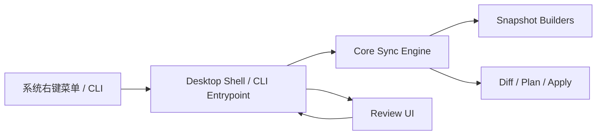
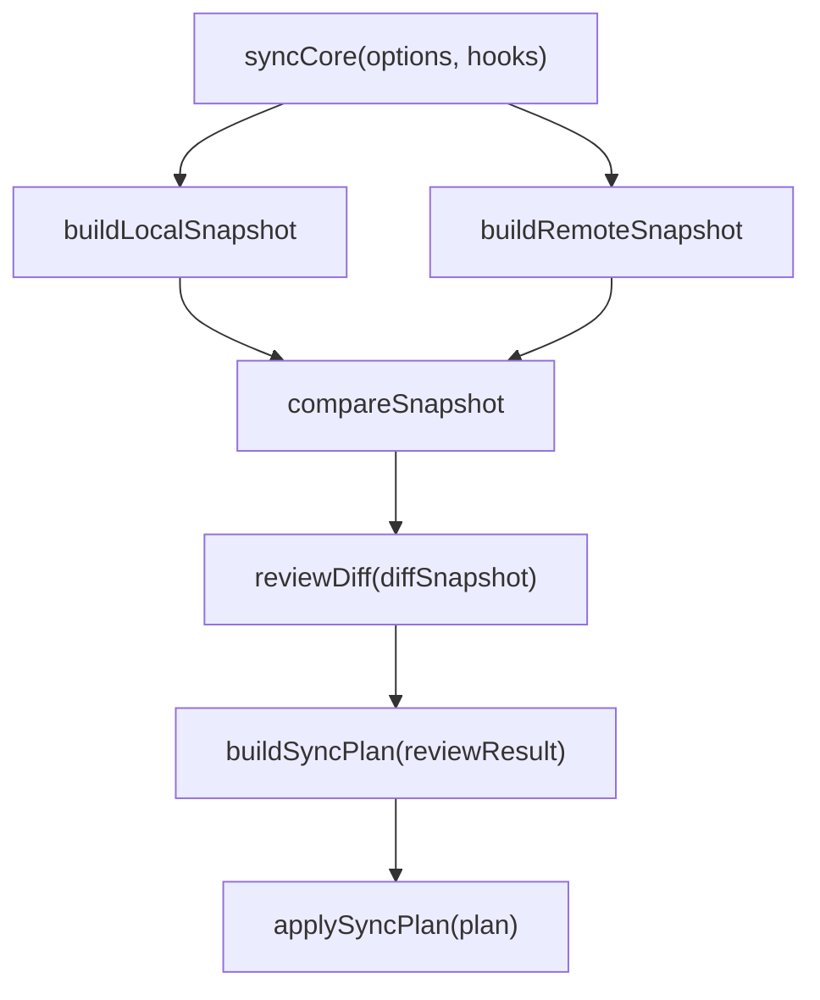

# sync-with-rclone 架构设计

## 1. 架构目标

这个项目必须同时满足两件事：

- 可以作为桌面应用运行
- 核心同步逻辑可以独立于 Electron 运行

因此，系统必须分层。

## 2. 总体分层



分层原则：

- `core` 只做业务和执行
- `desktop` 只做窗口与 IPC
- `cli` 只做命令行入口
- `shared` 只放双方共享的数据契约

## 3. 推荐目录结构

```text
src/
  core/
    build-local-snapshot.js
    build-remote-snapshot.js
    compare-snapshot.js
    build-sync-plan.js
    apply-sync-plan.js
    sync-engine.js
  shared/
    diff-serializer.js
    ipc-contracts.js
  cli/
    review.js
    index.js
  desktop/
    main/
      index.js
      review-window.js
      ipc-handlers.js
    preload/
      index.js
    renderer/
      review.html
      review-app.js
      review.css
resources/
  binaries/
  icons/
```

## 4. 模块职责

### 4.1 `core`

负责：

- 扫描本地目录
- 扫描远端目录
- 计算差异
- 构建执行计划
- 应用执行计划

禁止：

- 直接调用 Electron API
- 直接创建窗口
- 直接依赖 UI 状态

### 4.2 `desktop/main`

负责：

- Electron 生命周期
- 解析启动参数
- 打开 review 窗口
- 通过 IPC 与 renderer 通信
- 调用 core 并等待结果

### 4.3 `desktop/renderer`

负责：

- 差异树展示
- 用户勾选和确认
- 结果回传
- 使用 Vue 组织窗口 UI

建议：

- renderer 使用 Vue 作为视图层
- preload 只暴露最小 IPC bridge
- renderer 不承担任何文件系统或命令执行逻辑

### 4.4 `shared`

负责：

- 可序列化 diff 结构
- IPC 输入输出契约

## 5. Core 与 Electron 的边界

最重要的边界是：

**Core 不应知道 Electron 的存在。**

正确做法是让 Core 依赖一个注入的 review hook，例如：

```js
await syncCore(options, {
  reviewDiff,
})
```

这样：

- CLI 可以提供命令行 review
- Electron 可以提供窗口 review
- 测试可以提供 fake review

## 6. 关键运行模型



这意味着 Core 可以：

- 先计算 diff
- 暂停等待 review
- 接收用户筛选结果
- 再继续执行

这个 review 阶段既可以来自 Electron 窗口，也可以来自 CLI 交互确认。

## 7. 配置层预留

配置系统应作为独立能力预留，而不是散落在入口逻辑里。

推荐未来增加：

- `src/config/load-config.js`
- `src/config/resolve-task.js`
- `src/config/types.js`

配置层负责：

- 读取同步任务定义
- 根据用户点击的本地路径匹配所属任务
- 解析本地相对路径和 remote 对应路径
- 保证本地路径和 remote 路径始终在同一个同步任务内
- 提供额外 ignore patterns
- 为 `push / pull / push to / pull from` 提供任务内路径解析能力

### 7.1 `syncJob` 配置结构

`syncJob` 是配置层里最关键的数据单元，配置解析必须满足这些硬约束：

- 一个 `syncJob` 表达的是一个固定的“本地根目录 <-> 远端根目录”关系
- 用户当前选中的本地路径必须先匹配到某个 `syncJob`
- 默认 remote 路径来自 `rcloneRemote + remoteBasePath + 相对路径`
- `Push To...` 和 `Pull From...` 只能在当前 `syncJob` 对应的 remote 目录树内部选目录
- 不允许跨 `syncJob` 同步

例如：

```js
const syncJob = {
  name: 'ProjectsSynced',
  rcloneRemote: 'synology',
  localBasePath: '/Users/H/NAS/ProjectsSynced',
  remoteBasePath: 'ProjectsSynced',
  ignorePatterns: [],
}
```

如果用户当前选中本地目录：

```js
'/Users/H/NAS/ProjectsSynced/code/app'
```

那么它在这个任务中的相对路径是：

```js
'code/app'
```

默认对应的 remote 目录应解析为：

```js
'synology:ProjectsSynced/code/app'
```

## 8. 核心数据结构与处理流程

这部分信息属于“即使将来重写实现，也仍然成立”的系统知识，因此应保留在架构文档里，而不是仅存在于代码中。

### 8.1 `Snapshot`

建议直接把它理解为下面这个契约：

```js
/**
 * @typedef {object} FileEntry - Entry object for file
 * @property {string} parent - Parent path relative to the root
 * @property {number} mtimeMs - Modified time in number
 * @property {number} size - File size
 */

/**
 * @typedef {object} DirEntry - Entry object for directory
 * @property {string | null} parent - Parent path relative to the root
 * @property {Map<string, ChildRef>} children - Map collection of refs to all children
 */

/**
 * @typedef {object} ChildRef - Object referencing to an entry
 * @property {string} path - Path relative to the root
 * @property {boolean} isDir - Whether the entry is a directory
 */

/**
 * @typedef {object} Snapshot - Snapshot
 * @property {string} root - Absolute path of the root directory
 * @property {Map<string, FileEntry>} fileEntries - Map collection of all files
 * @property {Map<string, DirEntry>} dirEntries - Map collection of all dirs
 */
```

这里有几条必须写死记住的细节：

- `root` 是绝对路径或远端根路径，是整棵树的参照系
- `fileEntries` 的 key 是“相对于 `root` 的路径”，例如 `src/index.js`
- `dirEntries` 的 key 也是“相对于 `root` 的路径”，例如 `src` 或 `.`
- `dirEntries` 默认就必须有一个 `'.'` 元素，表示根目录节点
- `children` 的 key 不是完整路径，而是子项的名字，例如 `index.js` 或 `src`
- `ChildRef.path` 存的是“相对于 `root` 的完整路径”，不是名字
- `parent` 存的是父目录相对于 `root` 的路径

初始化根节点时，应该是这样的：

```js
const snapshot = {
  root: rootAbsPath,
  fileEntries: new Map(),
  dirEntries: new Map([
    ['.', { parent: null, children: new Map() }],
  ]),
}
```

这几个细节如果弄错，通常不会立刻在类型层暴露，但会直接导致：

- 父子关系挂错
- diff 统计错误
- 路径拼接错误
- UI 树渲染异常
- 删除或筛选逻辑跑偏

### 8.2 `buildLocalSnapshot`

`buildLocalSnapshot` 的职责是：

- 从本地文件系统扫描目录
- 应用 `.gitignore` 风格规则
- 应用全局和任务级额外 ignore patterns
- 产出标准化 `Snapshot`

它的关键特点是：

- 本地扫描是受 ignore 规则影响的
- 它服务的不是“完整镜像本地目录”，而是“产出准备参与同步判断的本地视图”

### 8.3 `buildRemoteSnapshot`

`buildRemoteSnapshot` 的职责是：

- 通过 `rclone` 读取远端目录树
- 把远端条目转成和本地一致的 `Snapshot` 结构

它的关键特点是：

- 远端扫描是通过 `rclone` 完成的
- 不再应用`.gitignore`规则
- 它的输出必须与本地快照结构兼容，这样 diff 才能共用同一套逻辑

### 8.4 `DiffSnapshot`

建议直接按下面这个契约理解：

```js
/** @enum {number} */
const DiffState = Object.freeze({
  unchanged: 0,
  modified: 1,
  added: 2,
  deleted: 3,
})

/** @typedef {FileEntry & { state: DiffState }} DiffFileEntry */
/** @typedef {DirEntry & { changes: Map<DiffState, number> }} DiffDirEntry */

/**
 * @typedef {object} DiffSnapshot - Snapshot indicating the differences
 * @property {string} srcRoot - Absolute path of the source folder
 * @property {string} dstRoot - Absolute path of the dest folder
 * @property {Map<string, DiffFileEntry>} fileEntries - File collection
 * @property {Map<string, DiffDirEntry>} dirEntries - Directory collection
 */
```

对应的初始化根节点应当是：

```js
const diffSnapshot = {
  srcRoot: srcRootPath,
  dstRoot: dstRootPath,
  fileEntries: new Map(),
  dirEntries: new Map([
    ['.', { parent: null, children: new Map(), changes: new Map() }],
  ]),
}
```

这里同样有几个关键细节：

- `fileEntries` 和 `dirEntries` 的 key 仍然都是“相对于根目录”的路径
- `dirEntries.get('.')` 永远表示 diff 树的根节点
- `DiffFileEntry.state` 表示单个文件的状态
- `DiffDirEntry.changes` 是目录级聚合统计，不是目录本身的单一状态
- 目录是否显示为“有变化”，取决于它下面聚合出来的 `changes`

它的意义不是“执行计划”，而是 review 和 plan 之间的中间层。

### 8.5 `compareSnapshot`

`compareSnapshot` 的职责是：

- 接收一个源快照和一个目标快照
- 判断路径在两侧的存在性和差异
- 输出可供 review 使用的 `DiffSnapshot`

它的输出要满足：

- Core 可继续基于它生成 plan
- CLI 可直接把它转成文本树
- Electron renderer 可把它转成可勾选的文件树

### 8.6 整体处理顺序

稳定的处理顺序应当是：

1. 解析 config，确定当前 `syncJob`
2. 构建本地 `Snapshot`
3. 构建远端 `Snapshot`
4. 通过 `compareSnapshot` 产出 `DiffSnapshot`
5. 进入 review
6. 根据 review 结果生成执行计划
7. 执行同步
## 9. 打包依赖策略

### `rclone`

建议随应用一起打包。

原因：

- 是核心依赖
- 需要版本可控
- 不应要求用户额外安装

### `git`

第一阶段不要作为强依赖打包。

建议策略：

- 能不用就不用
- 若未来确实需要执行 `git`，优先检测系统安装
- 只有当系统依赖明显不可接受时，再考虑打包便携版本

## 10. 安装包架构要求

安装包应负责：
- 创建应用文件夹, 所有程序和配置都保存在此目录
- 安装 Electron 应用本体
- 安装内置 `rclone`
- 注册右键菜单
- 初始化`sync-with-rclone`的配置文件
- 初始化`rclone`的配置文件

运行时应负责：
- 读取`sync-with-rclone`配置文件
- 读取路径映射
- 在执行rclone命令时, 指定使用安装时创建的`rclone`的配置文件
- 写日志

## 11. 当前架构约束

后续编码时必须坚持：

- 不要把窗口逻辑塞回 `src/core`
- 不要把路径映射写死在原型代码里
- 不要让 renderer 直接碰系统命令执行
- 重任务始终在 Node / Electron main 一侧执行
