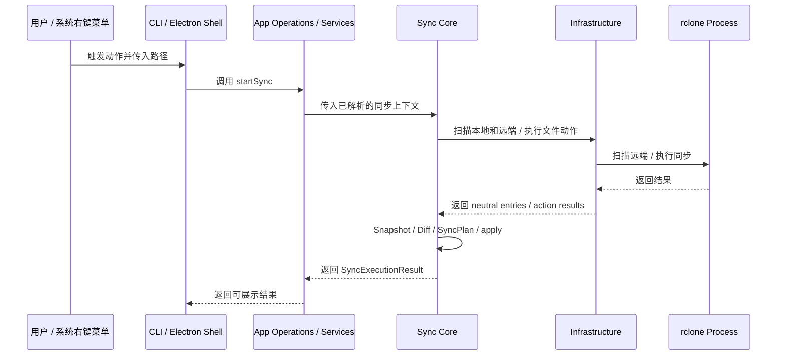

# sync-with-rclone 架构总览

本文只保留系统边界、目录职责和详细架构入口。具体契约与实现机制按领域拆分到 `docs/architecture/`。

## 1. 当前总结构

当前方案由以下职责区域组成：

- `shell`
- `app`
- `core`
- `infrastructure`
- `rclone`




这张图想表达的是：

- `shell/electron` 是当前桌面壳层
- `shell/cli` 是当前保留的命令行壳层
- `shell/index.cjs` 是统一产品入口，根据启动协议选择桌面、session 或 CLI 模式
- `app/operations/sync/start.js` 拥有同步请求的 application lifecycle：history、context resolution、session events 和最终结果
- `app/services` 为普通资源 operations 与 startSync 提供配置、server/mapping 和远端目录树等 application capabilities
- `core` 是完整同步工作模块：拥有 Snapshot、Diff、SyncPlan 和已解析同步的执行流程
- `infrastructure/filesystem` 负责读取本地文件系统并返回 neutral file entries
- `infrastructure/rclone` 负责 rclone remote path 的解析与规范化、raw rclone config、远端 file entries 和 copy/delete/cleanup actions

## 2. 目录职责

```text
src/           // 运行时代码
  app/         // shell-neutral application use cases 和编排
    contracts/ // shell 与 application 共用的 operation、sync 和 server-protocol contracts
    app-events.js // shell-neutral application notifications
    operations/ // user-intent operations 与生命周期；sync/ 包含同步 application flow
    services/  // server/mapping/settings/configuration/remote-folder capabilities
  core/        // 独立同步工作模块
    execute-sync.js // 已解析同步上下文的完整执行流
    contract.js // sync phases、review 和 execution result contracts
    snapshots/ // Snapshot 模型、构建、采集和比较
    planning/  // SyncPlan 构建、执行和结果追踪
  infrastructure/
    configuration/ // config.json 的默认值、读取、规范化和原子写入
    filesystem/ // 本地路径解析、目录校验和 neutral file-entry 扫描
    rclone/      // raw rclone config、远端目录/文件访问和 file actions
    runtime/     // 运行时路径解析，以及跨进程 sync admission lease 的原子存取
  shell/       // 所有 driving interfaces、产品入口和共享展示资源
    index.cjs  // composition root；选择 CLI 或 Electron 启动路径
    launch-classifier.cjs // 只分类 main、session 和 CLI launch
    parse-sync-args.js // CLI 和 Electron session 共用的同步参数语法
    cli/       // 终端命令、review、output 和 i18n adapter
      command-contract.cjs // canonical CLI command contract
    electron/  // Electron main、preload、renderer 和 shared shell contracts
      contracts/ // Electron Main 与 Renderer 共用的 form view、session stage 和 renderer surface contracts
      renderer/ // 单一 index.html / src/index.js bootstrap，按 surface contract 动态加载 Vue surface
    locales/   // CLI / Electron 共用的 message、error、operation 翻译
scripts/       // 非运行时代码
  dev/         // 开发启动脚本
  build/       // 打包校验、产物准备脚本
  install/     // 安装器脚本、安装辅助脚本
resources/     // bundled binaries、图标等静态资源
```

**层级边界:**
- core 不读取 Electron API、app services 或 application configuration policy；它可以调用可复用的 infrastructure actions
- infrastructure 不读取 Electron API 或 app modules，不构造 `AppError`，也不拥有 application operation lifecycle
- app 不读取 Electron API；operations 可以调用 app services、core 和 infrastructure capabilities
- `src/app/app-api.js` 是 GUI、CLI 和未来 agent/automation shell 调用应用能力的统一入口；普通 query、command 和 `startSync()` 都从这里导出
- shell 是 driving boundary；`shell/electron` 负责桌面窗口和生命周期，`shell/cli` 负责终端交互，二者都不拥有同步业务
- `src/shell/` 根部是统一产品输入边界：`index.cjs` 负责 composition，`launch-classifier.cjs` 只分类启动，`parse-sync-args.js` 解析共享同步参数；`shell/cli/command-contract.cjs` 定义 canonical CLI commands
- `package.json` 使用 `#shell`、`#cli`、`#electron` 和 `#frontend` imports aliases，分别指向 shell root、CLI、Electron 和 renderer source
- cli 不作为 Electron UI 的下层依赖；UI 通过 Electron Main 调用 app 层能力
- Electron Main 在进程入口处把命令行参数分发给 cli 壳层，这是打包入口职责，不代表 UI 依赖 cli
- cli 和 electron 通过 app 调用应用能力；core 与 app 可以共享 infrastructure actions，core / infrastructure 不反向依赖 app 或 shell

## 3. 领域文档

- [Synchronization](architecture/Synchronization.md)：sync context、Snapshot、Diff、Review、SyncPlan、apply、admission、history 与 diagnostics。
- [Servers and mappings](architecture/ServersAndMappings.md)：server、mapping、rclone remote、配置结构与资源操作。
- [Desktop and CLI](architecture/DesktopAndCLI.md)：统一可执行入口、CLI、Electron 生命周期、窗口、preload、presentation 与 i18n。
- [Distribution](architecture/Distribution.md)：renderer build、打包、安装器、右键菜单与安装后的运行时目录。

端到端交互顺序由 [Flows](Flows.md) 记录；产品目标与边界由 [PRD](PRD.md) 记录。
