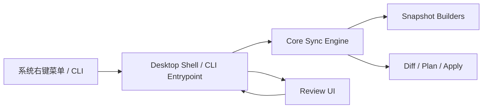
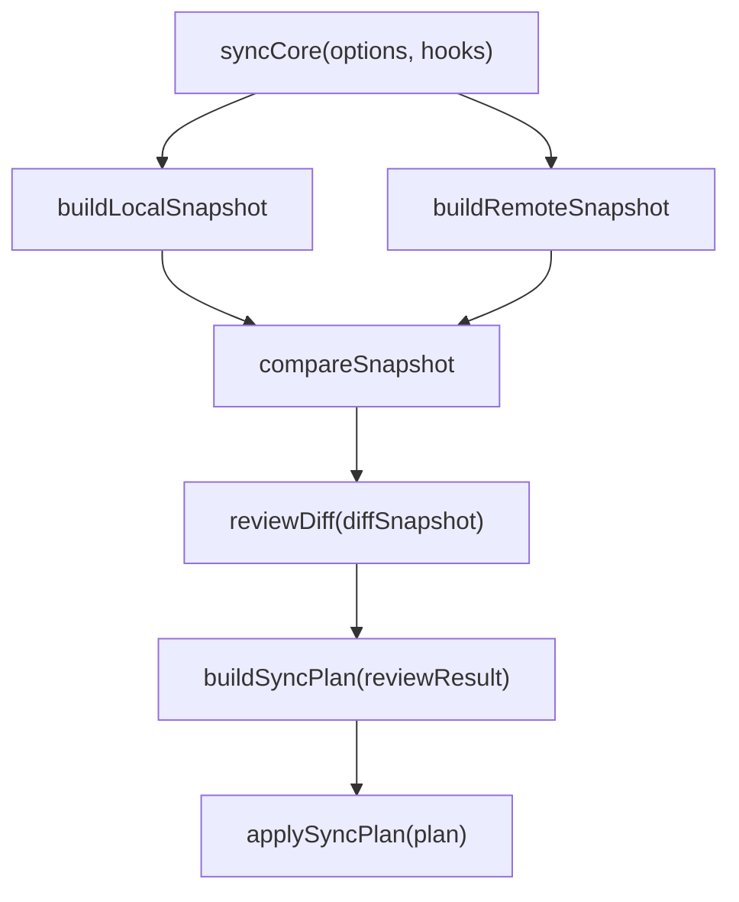

# sync-with-rclone 架构设计

## 1. 架构目标

这个项目必须同时满足两件事：

- 可以作为桌面应用运行
- 核心同步逻辑可以独立于 Electron 运行

因此，系统必须分层。

## 2. 总体分层



分层原则：

- `core` 只做业务和执行
- `desktop` 只做窗口与 IPC
- `cli` 只做命令行入口
- `shared` 只放双方共享的数据契约

## 3. 推荐目录结构

```text
src/
  core/
    build-local-snapshot.js
    build-remote-snapshot.js
    compare-snapshot.js
    build-sync-plan.js
    apply-sync-plan.js
    sync-engine.js
  shared/
    diff-serializer.js
    ipc-contracts.js
  cli/
    index.js
  desktop/
    main/
      index.js
      review-window.js
      ipc-handlers.js
    preload/
      index.js
    renderer/
      review-app.js
      review.css
resources/
  binaries/
  icons/
```

## 4. 模块职责

### 4.1 `core`

负责：

- 扫描本地目录
- 扫描远端目录
- 计算差异
- 构建执行计划
- 应用执行计划

禁止：

- 直接调用 Electron API
- 直接创建窗口
- 直接依赖 UI 状态

### 4.2 `desktop/main`

负责：

- Electron 生命周期
- 解析启动参数
- 打开 review 窗口
- 通过 IPC 与 renderer 通信
- 调用 core 并等待结果

### 4.3 `desktop/renderer`

负责：

- 差异树展示
- 用户勾选和确认
- 结果回传

### 4.4 `shared`

负责：

- 可序列化 diff 结构
- IPC 输入输出契约

## 5. Core 与 Electron 的边界

最重要的边界是：

**Core 不应知道 Electron 的存在。**

正确做法是让 Core 依赖一个注入的 review hook，例如：

```js
await syncCore(options, {
  reviewDiff,
})
```

这样：

- CLI 可以提供命令行 review
- Electron 可以提供窗口 review
- 测试可以提供 fake review

## 6. 关键运行模型



这意味着 Core 可以：

- 先计算 diff
- 暂停等待 review
- 接收用户筛选结果
- 再继续执行

## 7. 打包依赖策略

### `rclone`

建议随应用一起打包。

原因：

- 是核心依赖
- 需要版本可控
- 不应要求用户额外安装

### `git`

第一阶段不要作为强依赖打包。

建议策略：

- 能不用就不用
- 若未来确实需要执行 `git`，优先检测系统安装
- 只有当系统依赖明显不可接受时，再考虑打包便携版本

## 8. 安装包架构要求

安装包应负责：

- 安装 Electron 应用本体
- 安装内置 `rclone`
- 注册右键菜单

运行时应负责：

- 初始化配置
- 读取路径映射
- 写日志

## 9. 当前架构约束

后续编码时必须坚持：

- 不要把窗口逻辑塞回 `src/core`
- 不要把路径映射写死在原型代码里
- 不要让 renderer 直接碰系统命令执行
- 重任务始终在 Node / Electron main 一侧执行
