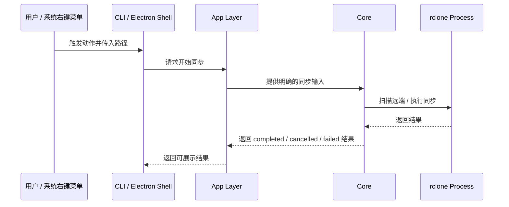
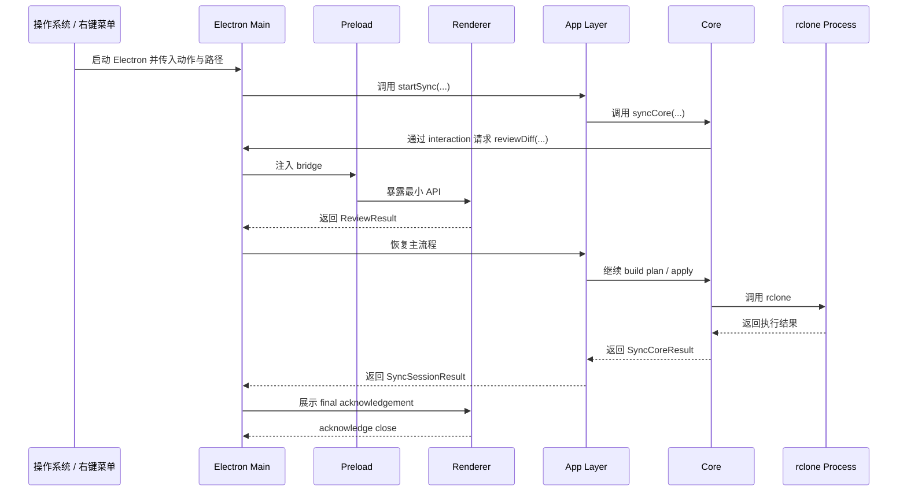
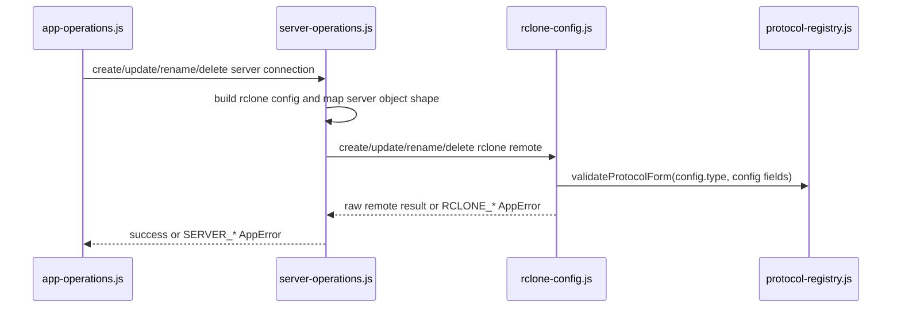
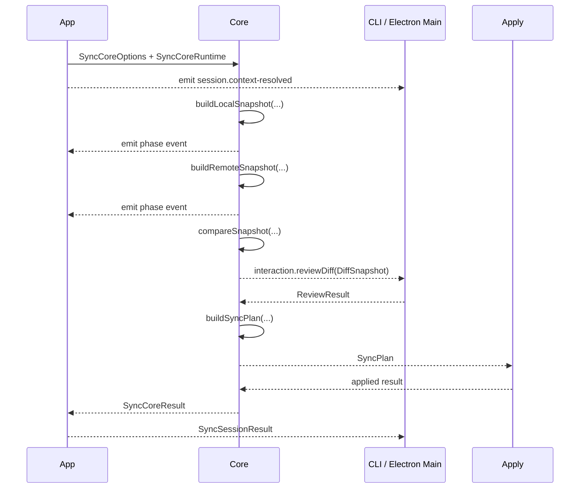

# sync-with-rclone 当前方案

## 1. 当前总结构

当前方案由四层组成：

- `shell`
- `app`
- `core`
- `rclone`




这张图想表达的是：

- `electron` 是当前桌面壳层
- `cli` 是当前保留的命令行壳层
- `app` 是 shell 和 `core` 之间的编排层
- `core` 会调用外部 `rclone` 进程


## 2. 目录职责

```text
src/           // 运行时代码
  app/         // shell 和 core 之间的应用编排层
  cli/         // CLI入口、终端review、终端输出，可独立承接主流程
  core/        // Snapshot、Diff、SyncPlan、Apply、rclone 执行封装
  electron/    // 当前桌面主壳层，包含 Electron main、preload、renderer
scripts/       // 非运行时代码
  dev/         // 开发启动脚本
  build/       // 打包校验、产物准备脚本
  install/     // 安装器脚本、安装辅助脚本
resources/     // bundled binaries、图标等静态资源
```

**层级边界:**
- core 不读取 Electron API，不解析配置文件
- app 负责把 shell 的输入整理成 core 的输入
- electron 负责桌面壳层和窗口，不直接承担同步业务
- cli 负责命令行壳层和终端交互
- cli 不作为 Electron UI 的下层依赖；UI 通过 Electron Main 调用 app 层能力
- Electron Main 在进程入口处把命令行参数分发给 cli 壳层，这是打包入口职责，不代表 UI 依赖 cli
- cli 和 electron 都只能依赖 app / core，不允许 app / core 反向依赖 cli 或 electron

当前打包方向采用“一个 Electron 可执行文件，两个运行模式”：

```text
sync-with-rclone                 -> 启动桌面 UI
sync-with-rclone list-tasks      -> 命令模式，列出同步任务
sync-with-rclone list-servers    -> 命令模式，列出 servers
sync-with-rclone sync push ...   -> 命令模式，执行同步
```

在这个模式下，`src/cli/` 仍然是独立的命令行壳层：它负责参数路由、终端输出和终端 review。`src/electron/main/index.cjs` 只是产品可执行文件的统一入口，可以根据 argv 选择进入桌面窗口、同步会话窗口或命令模式。Renderer 不调用 `src/cli/`，它只通过 preload bridge 请求 Electron Main，再由 Electron Main 调用 app 层。


## 3. Electron、Vite、Renderer、Core 的关系

当前需要重点理解的是桌面运行链路：



需要特别记住：

- `Renderer` 不直接调用 `core`
- `Renderer` 通过 `preload` 暴露的 bridge 与 `Electron Main` 通信
- `Electron Main` 再去调用 `app`
- `app` 再去调用 `core`
- `core` 再去调用外部 `rclone` 进程
- `Vite` 的作用不是参与运行时通信，而是把 renderer 源码编译成 Electron 可加载的页面
- `CLI` 不是为了测试临时补出来的旁路，而是当前架构下的独立 shell 入口
- `CLI` 的存在也使 core 更容易独立运行、测试和排查
- 打包后可以由同一个 Electron 可执行文件承接 CLI 命令；这是入口分发，不改变 CLI 与 Electron UI 的依赖边界
- `Electron Main` 使用 `startSync(...)` 的返回值推进 final 流程，不依赖 `session.result` event 推进控制流
- `Renderer` 负责按钮 pending 和重复点击防护；`Electron Main` 负责窗口生命周期和同步取消适配

## 4. 关键数据契约

### 4.1 `Snapshot`

```js
/**
 * @typedef {object} FileEntry
 * @property {string} path - Path relative to the root
 * @property {number} mtimeMs - Modified time in number
 * @property {number} size - File size
 */

/**
 * @typedef {object} Snapshot
 * @property {string} root - Absolute path of the root directory
 * @property {FileEntry[]} files - Serializable file entries sorted by path
 */
```

说明：

- `Snapshot` 是扫描结果的正式结构定义
- `root` 是绝对路径
- `files` 只记录文件，不记录目录
- 目录不是同步内容，只在 review UI 中由文件路径派生出来
- 空目录不会作为 snapshot 内容保存
- 本地扫描会在进入目录前应用 ignore 规则，已忽略目录不会继续读取子内容
- `Snapshot` 只表达扫描到的文件事实，不携带远端协议能力、hash 能力或 backend 精度等基础设施属性

示例：

```js
{
  root: "/project/root",
  files: [
    {
      path: "README.md",
      size: 1204,
      mtimeMs: 1711880000000
    },
    {
      path: "src/index.js",
      size: 532,
      mtimeMs: 1711880001000
    }
  ]
}
```

### 4.2 `DiffSnapshot`

```js
/** @enum {number} */
export const DiffState = Object.freeze({
  unchanged: 0,
  modified: 1,
  added: 2,
  deleted: 3,
})

/** @typedef {FileEntry & { state: DiffState }} DiffFileEntry */

/**
 * @typedef {object} DiffSnapshot
 * @property {string} srcRoot - Absolute path of the source folder
 * @property {string} dstRoot - Absolute path of the dest folder
 * @property {DiffFileEntry[]} files - Serializable file differences sorted by path
 * @property {{ modified: number, added: number, deleted: number }} summary
 */
```

说明：

- `DiffSnapshot` 是差异计算后的正式结构定义
- 它同时记录源端根路径和目标端根路径
- `files` 保存文件级差异
- `summary` 保存文件级差异统计
- 目录级统计由 `serializeDiffSnapshot` 在 review 展示前从文件路径派生
- 文件是否 `modified` 由路径、大小和 `mtimeMs` 决定；当前实现对 `mtimeMs` 使用 1 秒容差
- core 假设远端协议能可靠保存并返回文件 `mtime`，协议能力校验属于 app/settings 层，不进入 `Snapshot` 或 `DiffSnapshot` 数据契约
- 当前支持的 NAS 远端基线是 SFTP；Synology WebDAV 不保证返回源文件 `mtime`，不满足可靠重复同步预览的要求
- apply 阶段传入 `--sftp-disable-hashcheck`。Synology 的 SFTP 路径和 shell 卷路径可能不同，未验证的 `md5sum_command` / `sha1sum_command` 会让 rclone 在上传完成后误判 checksum 失败并重试整批 copy。hash 能力只在未来配置界面验证通过后作为可选增强使用
- apply 阶段暂时不使用 `--inplace`，保留 rclone 默认的 `.partial` 上传行为，让用户和系统都能区分未完成文件与已完成文件。代价是 Synology 回收站可能保留失败上传的 `.partial` 文件；这是运维清理问题，不应通过牺牲完成状态可见性来隐藏

示例：

```js
{
  srcRoot: "/local/project",
  dstRoot: "remote:project",
  summary: {
    added: 1,
    modified: 1,
    deleted: 0
  },
  files: [
    {
      path: "README.md",
      size: 1204,
      mtimeMs: 1711880000000,
      state: DiffState.modified
    },
    {
      path: "src/index.js",
      size: 532,
      mtimeMs: 1711880001000,
      state: DiffState.added
    }
  ]
}
```

### 4.3 `ReviewResult`

```js
/**
 * @typedef {'confirm' | 'cancel'} ReviewAction
 */

/**
 * Minimal review result contract returned from CLI or Electron review.
 *
 * @typedef {object} ReviewResult
 * @property {ReviewAction} action
 * @property {string[]} [selectedPaths]
 */
```

说明：

- `ReviewResult` 是 review 阶段返回给主流程的正式结构定义
- 它只表达结果，不表达 UI 细节
- `action = confirm` 表示继续
- `action = cancel` 表示正常取消，不是执行异常
- `selectedPaths` 是相对于当前 diff 根的路径集合

示例：

```js
{
  action: "confirm",
  selectedPaths: [
    "README.md",
    "src/index.js"
  ]
}
```

### 4.4 `SyncPlan`

```js
{
  action: "confirm",
  operations: [
    { type: "copy", path: "README.md" },
    { type: "copy", path: "src/index.js" },
    { type: "delete", path: "old.txt" }
  ]
}

// 说明:
// - 这里表达的是明确的执行意图，而不是 UI 状态
// - SyncPlan 只包含文件操作，不包含目录操作
```

示例含义：

- `SyncPlan` 是 apply 阶段的直接输入
- 它把“要做什么”压缩成明确的动作集合
- `applySyncPlan(...)` 会根据它执行 rclone batch copy 和 delete
- delete 后会执行内部 `rclone rmdirs <destination-root> --leave-root` 清理因文件删除而变空的目标目录，但不会把空目录作为同步内容或 review 项

### 4.5 `ApplyProgress`

```js
{
  activity: "copy",
  index: 1,
  total: 5,
  measurement: {
    current: 1048576,
    total: 2097152,
    unit: "bytes"
  }
}
```

说明：

- `ApplyProgress` 是 apply 阶段的进度观察事件结构，只用于 UI 展示和调试，不推进主流程
- `activity` 当前固定为 `start` / `copy` / `delete` / `cleanup` / `complete`
- `index` 是当前 activity 在固定 activity 列表中的位置，`total` 是固定 activity 总数
- `measurement` 只在 copy 阶段有字节进度；其他 activity 为 `null`
- UI 可以用 `index` 和 copy 阶段的 `measurement` 推导整体进度条，但 core 不直接暴露一个最终百分比
- 这个结构表达当前正在发生的 apply 状态，不包含完整 UI 步骤列表

copy 之外的示例：

```js
{
  activity: "cleanup",
  index: 3,
  total: 5,
  measurement: null
}
```

### 4.6 `SyncCoreRuntime`

```js
{
  events: {
    eventListener(event) {}
  },
  interactions: {
    reviewDiff(diffSnapshot) {}
  },
  dependents: {
    runCommand(command, args) {},
    createBatchFile(paths) {},
    removeBatchFile(filePath) {}
  }
}
```

说明：

- `events.eventListener` 是观察流，用于进度、日志和 UI 展示，不推进主流程
- `interactions.reviewDiff` 是业务等待点，`syncCore` 必须等待它返回 `ReviewResult` 才能继续
- `dependents` 是外部执行能力注入，主要用于测试和替换 rclone / batch file 相关能力
- `syncCore` 会 emit phase 级事件，事件类型定义在 `src/core/contract.js` 的 `PHASE_EVENT`
- apply 阶段的 progress payload 使用 `ApplyProgress`
- `syncCore` 返回 `SyncCoreResult`，结果值定义在 `SYNC_RESULT`

### 4.7 `SyncSessionRuntime`

```js
{
  events: {
    eventListener(event) {}
  },
  interactions: {
    reviewDiff(diffSnapshot) {}
  },
  dependents: {
    runCommand(command, args) {},
    createBatchFile(paths) {},
    removeBatchFile(filePath) {}
  }
}
```

说明：

- `startSync` 是 app 层 session runner
- `startSync` 负责读取配置、解析同步任务、生成 `SyncSessionContext`
- `startSync` 把 core phase event 转换成 `SESSION_EVENT.PROGRESS`
- `startSync` 返回 `SyncSessionResult`
- `startSync` 会 emit `SESSION_EVENT.RESULT` 作为观察事件，但 Electron final 流程由返回值驱动
- failed result 只在 `quick-actions.log` 已存在时携带 `logPath`；直接启动 Electron 时没有该日志文件就不向 renderer 暴露日志路径

### 4.8 `MainWindowData`

```js
{
  servers: [
    {
      name: "synology",
      type: "sftp",
      address: "nas.local",
      status: "unknown",
      config: {
        type: "sftp",
        host: "nas.local"
      }
    }
  ],
  syncTasks: []
}
```

说明：

- `MainWindowData` 是主窗口 renderer 的当前只读展示数据
- `src/app/main-window/app-operations.js` 通过 `getMainWindowData()` 组合 server 列表和 sync task 列表
- server connection 由 `src/app/configuration/server-operations.js` 从 rclone remote 转换而来，对外结构固定为 `{ name, type, address, status, config }`
- sync task 来源于 `src/app/configuration/app-config.js` 中的 `config.json`
- 如果 task 引用了不存在的 server，`getMainWindowData()` 会补充 `status = "missing"` 的 server 占位对象，方便 UI 显示异常状态
- `src/electron/main/app-state.js` 只保存 Electron 窗口状态，不缓存业务数据
- renderer 通过 preload bridge 调用 `main-window:get-data`
- server/task 修改成功后，app operation 调用 `notifyConfigUpdate()`，Electron Main 再发送 `main-window:config-updated` 通知主窗口 renderer 重新读取数据

### 4.8.1 `RcloneRemote` 与 `ServerConnection`

当前配置层有两个不同的数据结构：

```js
// 只在 rclone-config.js 和 server-operations.js 边界内使用
{
  name: "synology",
  config: {
    type: "sftp",
    host: "nas.local",
    port: "22",
    user: "xiaobo"
  }
}

// app 层和 UI 层使用
{
  name: "synology",
  type: "sftp",
  address: "nas.local",
  status: "unknown",
  config: {
    type: "sftp",
    host: "nas.local",
    port: "22",
    user: "xiaobo"
  }
}
```

说明：

- `RcloneRemote` 的正式结构是 `{ name, config }`
- `RcloneRemote.config` 是 rclone 配置的原始字段集合，包含 `type`
- `rclone-config.js` 负责读写、重命名、测试 rclone remote，不负责生成 app/UI 使用的 server 展示字段
- `ServerConnection` 的正式结构是 `{ name, type, address, status, config }`
- `server-operations.js` 是 remote 和 server 之间的唯一转换层
- `type` 从 `config.type` 派生
- `address` 从 `config.host` / `config.url` / `config.remote` / `config.endpoint` 派生，只用于展示
- `status` 是 app/UI 状态，不写入 rclone config
- 上层模块不直接使用 remote 术语；`app-operations.js` 调用 `createServerConnection` / `updateServerConnection` / `renameServerConnection` / `deleteServerConnection`

### 4.8.2 Server operation flow



当前职责边界：

- `app-operations.js` 判断用户意图，例如 create、same-name update、rename-with-update，并在成功后调用 `notifyConfigUpdate()`
- `server-operations.js` 负责 server-level operation flow、remote/server 对象转换、创建后的连接测试，以及将 `RCLONE_*` 转成 `SERVER_*`
- `rclone-config.js` 负责 rclone config dump/create/update/delete/rename/test，并返回 `{ name, config }` 形式的 raw remote
- `name` 是 server 与 remote 共享的资源标识，不在 server 层转换；name 校验、normalize、same-name rename no-op 由 `rclone-config.js` 处理
- 协议字段校验由 `rclone-config.js` 调用 `protocol-registry.js` 完成；server 层只把 `protocolType` 和 `protocolFields` 组装成 rclone config
- rename 作为 rclone adapter operation 暴露；内部使用 create-target 后 delete-source 的顺序，如果 delete-source 失败，会尝试删除新 target，避免同时留下新旧两个 remote/server
- server 层不直接暴露 `RCLONE_*`；例如 `RCLONE_REMOTE_MISSING` 会转成 `SERVER_NOT_FOUND`，`RCLONE_INVALID_REMOTE` 会转成 `SERVER_VALIDATION_FAILED`

### 4.9 `SyncTaskModalState`

```js
{
  modalName: "edit-server",
  context: {
    server: {
      name: "synology",
      type: "sftp",
      address: "nas.local",
      status: "unknown",
      config: {}
    },
    syncTask: {
      displayName: "Projects",
      rcloneRemote: "synology",
      localBasePath: "/Users/me/Projects",
      remoteBasePath: "Projects"
    }
  }
}
```

说明：

- 主窗口 renderer 只能把可 structured-clone 的纯数据传给 Electron Main
- Vue reactive proxy、DOM 对象、函数和窗口对象不能作为 IPC payload
- 主窗口 renderer 打开 modal 时传完整的 plain `server` 和 `syncTask` 对象
- server 对象使用 app-level 结构 `{ name, type, address, status, config }`
- 任何主窗口 renderer 的 UI 组合字段都不传给 modal
- Electron Main 不重新组装 modal context，只校验 modal 名称并创建窗口
- Electron Main 的 server IPC handler 只校验 payload 是否为 plain object；字段语义错误交给 app/server/rclone operation 返回 `SERVER_*`
- `context.server` 和 `context.syncTask` 是 Electron Main 传给 sync-task modal 的纯数据
- sync-task modal 的初始状态不通过 `additionalArguments` 传入 renderer
- Electron Main 保存 `modalState`，preload 暴露 `window.syncTaskModal.getState()`，renderer 启动后异步读取

### 4.10 `MessageBoxState`

```js
{
  mode: "confirm",
  level: "warning",
  title: "Delete Server",
  message: "Delete server \"synology\"?",
  detail: "This removes the rclone remote from the local rclone configuration."
}
```

说明：

- message-box 是 Electron Main 里的进程级单例窗口
- 同一时间只允许存在一个 message-box
- message-box parent 由 `app-state.js` 选择：优先 active modal，其次 main window
- message-box `mode` 支持 `message` / `confirm` / `progress`
- message-box `level` 支持 `info` / `warning` / `error` / `success`
- message-box renderer 通过 `onClickConfirm()` / `onClickCancel()` 通知 Electron Main
- Electron Main 内部 `openMessageBox(...)` 的 Promise 直接返回 result 字符串：`confirmed` / `cancelled` / `closed` / `replaced`
- renderer 通过 `showMessageBox(payload)` 调用 IPC 时，返回值使用标准 OperationResult：`{ success: true, value: result }`
- 调用方通过 `openMessageBox(...)` / `closeMessageBox(...)` 操作单例窗口；已有窗口再次 open 时由内部更新当前窗口状态
- message-box renderer 的初始状态也不通过 `additionalArguments` 传入，而是通过 `window.messageBox.getState()` 读取

## 5. 数据契约在主要模块间的流转



运行时通道按职责区分：

- `return` 是控制流。`startSync(...)` 的返回值决定 Electron 是否展示 final、进程退出码和后续收尾。
- `events.eventListener` 是观察流。它用于展示 context、progress 和调试，不作为流程推进条件。
- `interactions.reviewDiff` 是业务等待点。它是 core 在 review 阶段继续执行所需的外部输入。

## 6. 打包与安装

### 6.1 打包步骤

1. Vite 先构建 renderer 页面
2. electron-builder 收集 Electron main、preload、renderer 构建产物
3. 打包时附带需要运行的 resources/ 内容
4. Windows 下由 NSIS 生成安装器
5. 安装器负责注册右键菜单

### 6.2 安装步骤

1. 用户运行安装器
2. 安装器写入程序文件
3. 安装器准备配置目录和系统集成；默认 `config.json` 由应用启动时创建
4. 安装器分发 bundled binaries 和安装脚本
5. 安装器注册右键菜单
6. 用户后续通过右键菜单或 CLI 启动程序


### 6.3 安装后的目录结构

Windows 当前安装后的目录结构可按下面理解：

安装目录（管理员安装时通常是 `C:/Program Files/sync-with-rclone/`）:
  sync-with-rclone.exe
  config/
    config.json
    rclone.conf
  logs/
  resources/
    app.asar
    binaries/

含义是：

- 程序本体安装在安装目录
- 程序运行时读取的配置默认位于安装目录下的 `config/`
- 日志默认位于安装目录下的 `logs/`
- `rclone` 二进制来自安装目录下的 bundled resources
- Windows 右键菜单调用时使用显式 `--session` 加命名参数 `--mode` 和 `--local`，避免打包后的额外 argv 干扰参数定位

## 7. 当前打包和运行结论

当前 renderer 的构建方式是：

- 使用 Vite 构建
- 由 Vite 把 `.vue` 源码编译成 Electron 可加载页面
- Electron 加载的是构建产物，而不是直接执行 `.vue`

当前打包方式是：

- 使用 `electron-builder`
- Windows 安装器使用 `NSIS`
- 安装器负责注册右键菜单
- 安装产物包含 bundled `rclone` 和配置模板
- mac 当前主要安装链路是 `pkg`，配置目录和 Finder Quick Actions 初始化由安装阶段承担
- `dmg` / `zip` 产物当前只作为开发验证和手动安装产物，不作为主要安装初始化链路

当前尚未视为稳定事实的部分是：

- Windows 安装阶段自动初始化安装目录 `config/` 的细节
- 覆盖安装 / 卸载链路
