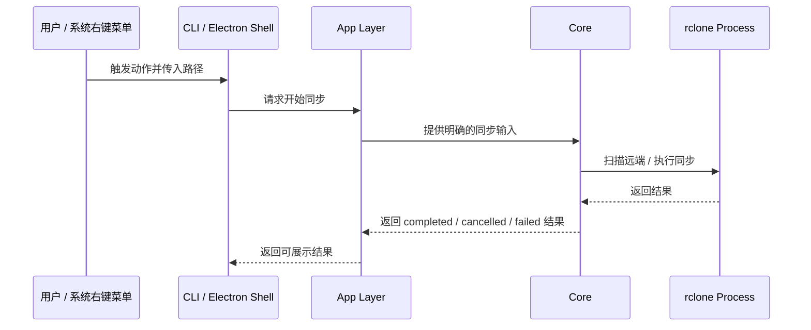
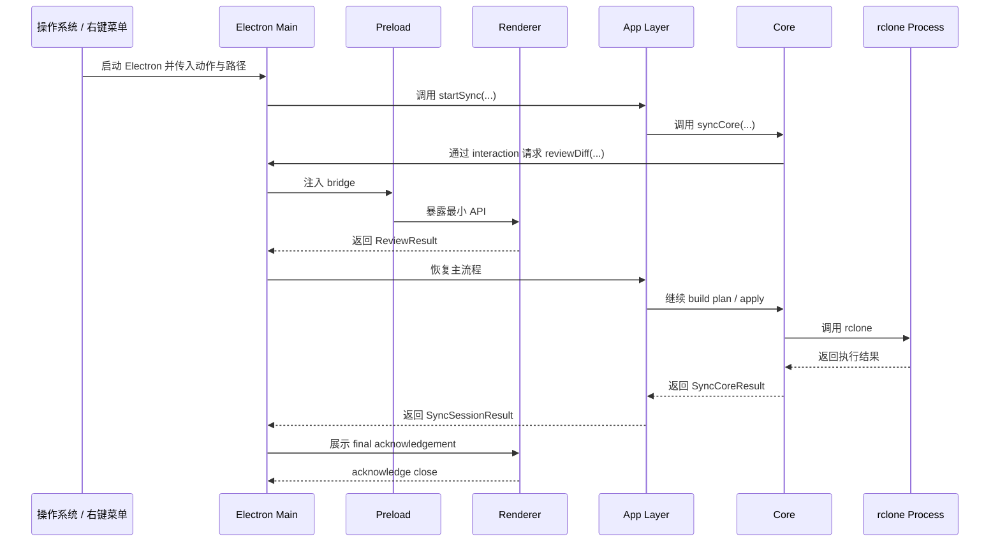
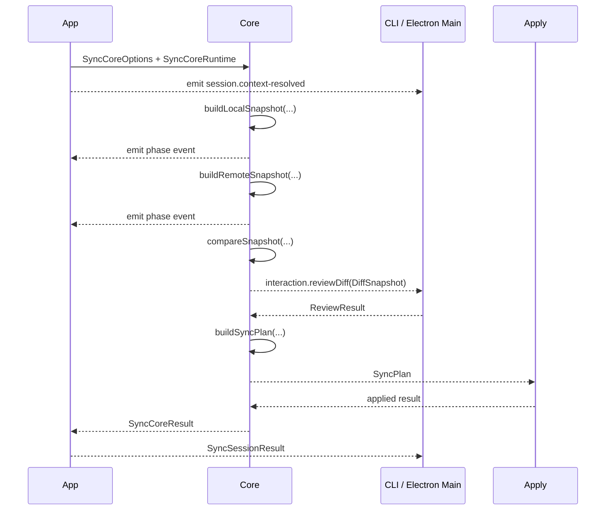

# sync-with-rclone 当前方案

## 1. 当前总结构

当前方案由四层组成：

- `shell`
- `app`
- `core`
- `rclone`




这张图想表达的是：

- `electron` 是当前桌面壳层
- `cli` 是当前保留的命令行壳层
- `app` 是 shell 和 `core` 之间的编排层
- `core` 会调用外部 `rclone` 进程


## 2. 目录职责

```text
src/           // 运行时代码
  app/         // 配置读取、路径规范化、同步任务解析、runtime paths、主流程编排
  cli/         // CLI入口、终端review、终端输出，可独立承接主流程
  core/        // Snapshot、Diff、SyncPlan、Apply、rclone 执行封装
  electron/    // 当前桌面主壳层，包含 main、preload、renderer、sync-session 窗口
scripts/       // 非运行时代码
  dev/         // 开发启动脚本
  build/       // 打包校验、产物准备脚本
  install/     // 安装器脚本、安装辅助脚本
resources/     // bundled binaries、图标等静态资源
templates/     // 默认配置模板
```
**层级边界:**
- core 不读取 Electron API，不解析配置文件
- app 负责把 shell 的输入整理成 core 的输入
- electron 负责桌面壳层和窗口，不直接承担同步业务
- cli 负责命令行壳层和终端交互


## 3. Electron、Vite、Renderer、Core 的关系

当前需要重点理解的是桌面运行链路：



需要特别记住：

- `Renderer` 不直接调用 `core`
- `Renderer` 通过 `preload` 暴露的 bridge 与 `Electron Main` 通信
- `Electron Main` 再去调用 `app`
- `app` 再去调用 `core`
- `core` 再去调用外部 `rclone` 进程
- `Vite` 的作用不是参与运行时通信，而是把 renderer 源码编译成 Electron 可加载的页面
- `CLI` 不是为了测试临时补出来的旁路，而是当前架构下的独立 shell 入口
- `CLI` 的存在也使 core 更容易独立运行、测试和排查
- `Electron Main` 使用 `startSync(...)` 的返回值推进 final 流程，不依赖 `session.result` event 推进控制流
- `Renderer` 负责按钮 pending 和重复点击防护；`Electron Main` 负责窗口生命周期和同步取消适配

## 4. 关键数据契约

### 4.1 `Snapshot`

```js
/**
 * @typedef {object} FileEntry
 * @property {string} path - Path relative to the root
 * @property {number} mtimeMs - Modified time in number
 * @property {number} size - File size
 */

/**
 * @typedef {object} Snapshot
 * @property {string} root - Absolute path of the root directory
 * @property {FileEntry[]} files - Serializable file entries sorted by path
 */
```

说明：

- `Snapshot` 是扫描结果的正式结构定义
- `root` 是绝对路径
- `files` 只记录文件，不记录目录
- 目录不是同步内容，只在 review UI 中由文件路径派生出来
- 空目录不会作为 snapshot 内容保存
- 本地扫描会在进入目录前应用 ignore 规则，已忽略目录不会继续读取子内容

示例：

```js
{
  root: "/project/root",
  files: [
    {
      path: "README.md",
      size: 1204,
      mtimeMs: 1711880000000
    },
    {
      path: "src/index.js",
      size: 532,
      mtimeMs: 1711880001000
    }
  ]
}
```

### 4.2 `DiffSnapshot`

```js
/** @enum {number} */
export const DiffState = Object.freeze({
  unchanged: 0,
  modified: 1,
  added: 2,
  deleted: 3,
})

/** @typedef {FileEntry & { state: DiffState }} DiffFileEntry */

/**
 * @typedef {object} DiffSnapshot
 * @property {string} srcRoot - Absolute path of the source folder
 * @property {string} dstRoot - Absolute path of the dest folder
 * @property {DiffFileEntry[]} files - Serializable file differences sorted by path
 * @property {{ modified: number, added: number, deleted: number }} summary
 */
```

说明：

- `DiffSnapshot` 是差异计算后的正式结构定义
- 它同时记录源端根路径和目标端根路径
- `files` 保存文件级差异
- `summary` 保存文件级差异统计
- 目录级统计由 `serializeDiffSnapshot` 在 review 展示前从文件路径派生
- 文件是否 `modified` 不只看时间戳精确相等，当前实现包含时间容差

示例：

```js
{
  srcRoot: "/local/project",
  dstRoot: "remote:project",
  summary: {
    added: 1,
    modified: 1,
    deleted: 0
  },
  files: [
    {
      path: "README.md",
      size: 1204,
      mtimeMs: 1711880000000,
      state: DiffState.modified
    },
    {
      path: "src/index.js",
      size: 532,
      mtimeMs: 1711880001000,
      state: DiffState.added
    }
  ]
}
```

### 4.3 `ReviewResult`

```js
/**
 * @typedef {'confirm' | 'cancel'} ReviewAction
 */

/**
 * Minimal review result contract returned from CLI or Electron review.
 *
 * @typedef {object} ReviewResult
 * @property {ReviewAction} action
 * @property {string[]} [selectedPaths]
 */
```

说明：

- `ReviewResult` 是 review 阶段返回给主流程的正式结构定义
- 它只表达结果，不表达 UI 细节
- `action = confirm` 表示继续
- `action = cancel` 表示正常取消，不是执行异常
- `selectedPaths` 是相对于当前 diff 根的路径集合

示例：

```js
{
  action: "confirm",
  selectedPaths: [
    "README.md",
    "src/index.js"
  ]
}
```

### 4.4 `SyncPlan`

```js
{
  action: "confirm",
  operations: [
    { type: "copy", path: "README.md" },
    { type: "copy", path: "src/index.js" },
    { type: "delete", path: "old.txt" }
  ]
}

// 说明:
// - 这里表达的是明确的执行意图，而不是 UI 状态
// - SyncPlan 只包含文件操作，不包含目录操作
```

示例含义：

- `SyncPlan` 是 apply 阶段的直接输入
- 它把“要做什么”压缩成明确的动作集合
- `applySyncPlan(...)` 会根据它执行 rclone batch copy 和 delete
- delete 后会执行内部 `rclone rmdirs <destination-root> --leave-root` 清理因文件删除而变空的目标目录，但不会把空目录作为同步内容或 review 项

### 4.5 `SyncCoreRuntime`

```js
{
  events: {
    eventListener(event) {}
  },
  interactions: {
    reviewDiff(diffSnapshot) {}
  },
  dependents: {
    runCommand(command, args) {},
    createBatchFile(paths) {},
    removeBatchFile(filePath) {}
  }
}
```

说明：

- `events.eventListener` 是观察流，用于进度、日志和 UI 展示，不推进主流程
- `interactions.reviewDiff` 是业务等待点，`syncCore` 必须等待它返回 `ReviewResult` 才能继续
- `dependents` 是外部执行能力注入，主要用于测试和替换 rclone / batch file 相关能力
- `syncCore` 会 emit phase 级事件，事件类型定义在 `src/core/contract.js` 的 `PHASE_EVENT`
- `syncCore` 返回 `SyncCoreResult`，结果值定义在 `SYNC_RESULT`

### 4.6 `SyncSessionRuntime`

```js
{
  events: {
    eventListener(event) {}
  },
  interactions: {
    reviewDiff(diffSnapshot) {}
  },
  dependents: {
    runCommand(command, args) {},
    createBatchFile(paths) {},
    removeBatchFile(filePath) {}
  }
}
```

说明：

- `startSync` 是 app 层 session runner
- `startSync` 负责读取配置、解析同步任务、生成 `SyncSessionContext`
- `startSync` 把 core phase event 转换成 `SESSION_EVENT.PROGRESS`
- `startSync` 返回 `SyncSessionResult`
- `startSync` 会 emit `SESSION_EVENT.RESULT` 作为观察事件，但 Electron final 流程由返回值驱动

## 5. 数据契约在主要模块间的流转



运行时通道按职责区分：

- `return` 是控制流。`startSync(...)` 的返回值决定 Electron 是否展示 final、进程退出码和后续收尾。
- `events.eventListener` 是观察流。它用于展示 context、phase progress 和调试，不作为流程推进条件。
- `interactions.reviewDiff` 是业务等待点。它是 core 在 review 阶段继续执行所需的外部输入。

## 6. 打包与安装

### 6.1 打包步骤

1. Vite 先构建 renderer 页面
2. electron-builder 收集 Electron main、preload、renderer 构建产物
3. 打包时附带 resources/ 和 templates/
4. Windows 下由 NSIS 生成安装器
5. 安装器负责注册右键菜单

### 6.2 安装步骤

1. 用户运行安装器
2. 安装器写入程序文件
3. 安装器把默认 `config.json` / `rclone.conf` 初始化到安装目录下的 `config/`
4. 安装器分发 templates/ 和 bundled binaries
5. 安装器注册右键菜单
6. 用户后续通过右键菜单或 CLI 启动程序


### 6.3 安装后的目录结构

Windows 当前安装后的目录结构可按下面理解：

安装目录（管理员安装时通常是 `C:/Program Files/sync-with-rclone/`）:
  sync-with-rclone.exe
  config/
    config.json
    rclone.conf
  logs/
  resources/
    app.asar
    binaries/
    templates/

含义是：

- 程序本体安装在安装目录
- 程序运行时读取的配置默认位于安装目录下的 `config/`
- 日志默认位于安装目录下的 `logs/`
- `rclone` 二进制来自安装目录下的 bundled resources
- Windows 右键菜单调用时使用命名参数 `--mode` 和 `--local`，避免打包后的额外 argv 干扰参数定位

## 7. 当前打包和运行结论

当前 renderer 的构建方式是：

- 使用 Vite 构建
- 由 Vite 把 `.vue` 源码编译成 Electron 可加载页面
- Electron 加载的是构建产物，而不是直接执行 `.vue`

当前打包方式是：

- 使用 `electron-builder`
- Windows 安装器使用 `NSIS`
- 安装器负责注册右键菜单
- 安装产物包含 bundled `rclone` 和配置模板
- mac 当前主要安装链路是 `pkg`，配置目录和 Finder Quick Actions 初始化由安装阶段承担
- `dmg` / `zip` 产物当前只作为开发验证和手动安装产物，不作为主要安装初始化链路

当前尚未视为稳定事实的部分是：

- Windows 安装阶段自动初始化安装目录 `config/` 的细节
- 覆盖安装 / 卸载链路
