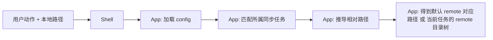
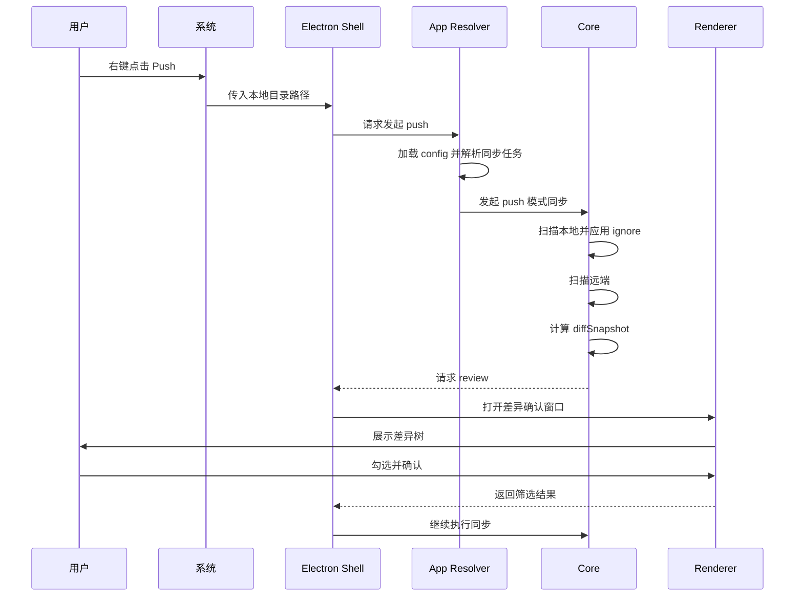
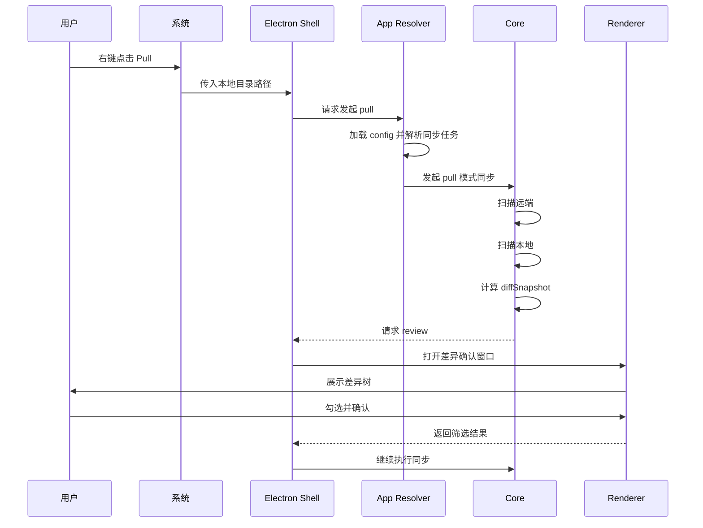
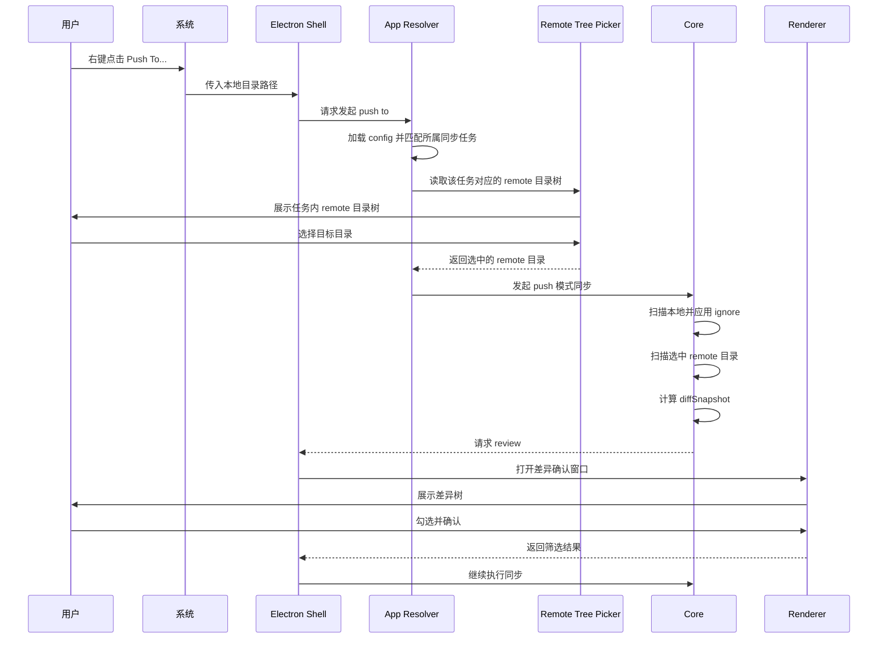
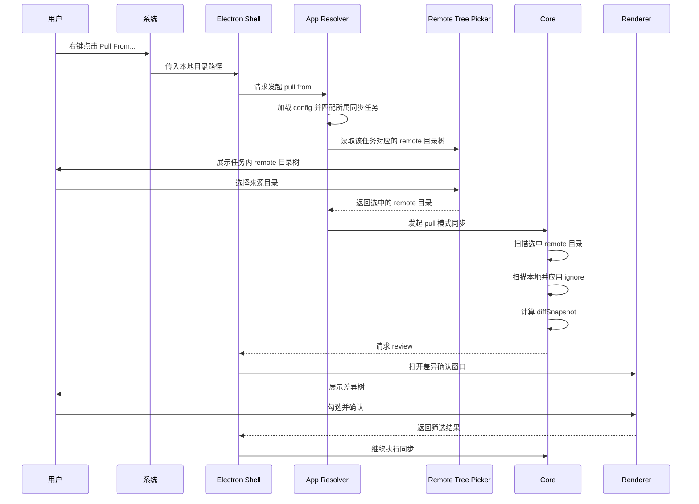
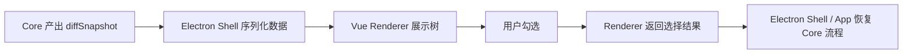
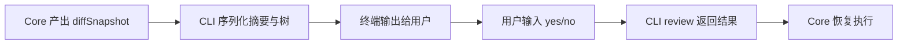

# sync-with-rclone 交互与运行流程

## 1. 用户触发流程

- 系统右键菜单: 正常用户的访问入口
- CLI: 作为开发人员和测试的入口


## 2. 右键菜单动作

目标菜单项：

- `Push`
- `Pull`
- `Push To...`
- `Pull From...`
- `Open Config`

所有动作在真正进入扫描前，都应先经过 config 解析阶段。

## 3. 配置解析流程



配置解析的职责：

- 判断当前本地路径是否属于某个同步任务
- 计算该路径相对于任务根目录的相对路径
- 在 `Push / Pull` 下直接得到默认 remote 对应路径
- 在 `Push To... / Pull From...` 下得到当前同步任务对应的 remote 目录树
- 取出任务级额外 ignore patterns
- 拒绝任何跨同步任务的路径组合

这里最后一步的含义是：

- `Push / Pull` 不是“猜一个 remote”，而是直接得到这个本地路径在当前 `syncJob` 中唯一对应的 remote 路径
- `Push To... / Pull From...` 也不是得到多个 remote 候选项，而是得到“当前 `syncJob` 的 remote 根目录树”，供用户在这个任务内部继续选目录
## 4. `Push` 流程



## 5. `Pull` 流程



## 6. `Push To...` / `Pull From...` 流程补充

对于 `Push To...` 和 `Pull From...`：

- 程序仍先匹配当前本地路径所属的同步任务
- 然后读取该同步任务对应 remote 根目录下的目录树
- 用户只能在这个任务的 remote 目录树里选择一个目录
- 选中的目录和当前本地路径必须始终属于同一个同步任务
- 再进入扫描和 review 阶段

### `Push To...` 流程图



### `Pull From...` 流程图



## 7. Review 阶段流程

review 是整个产品的关键暂停点。

它的职责是：

- 接收差异数据
- 展示可读的差异树
- 允许用户筛选
- 返回结果给核心流程

正确模型如下：



CLI 下对应的模型是：



## 8. 数据流要求

### Core -> UI

Core 不应该直接把内部 `Map` 结构裸传给 UI 作为长期协议。

更稳妥的做法是：

- 先把 `diffSnapshot` 转成 plain JSON
- 再通过 IPC 发给 renderer

### UI -> Core

Renderer 不要把整个 UI 状态原样回传。

建议回传精简的 `reviewResult`，例如：

```js
{
  action: 'confirm',
  selectedPaths: ['src/index.js', 'docs/readme.md']
}
```

约束是：

- `action` 表示用户是否确认继续
- `selectedPaths` 必须是相对于当前 diff 根目录的路径
- 不要把 renderer 内部的展开状态、选中状态树、组件局部状态原样回传给 Core

## 9. CLI 兼容流程

虽然桌面模式是主路径，但 Core 仍然应支持 CLI 运行。

CLI 模式下的 review 可以是：

- 文本摘要确认
- 树状文本输出
- yes/no 继续确认
- 后续再扩展更细的终端交互筛选

这样可以保证：

- Core 可测试
- Core 可脱离 Electron 跑通
- 后续自动化脚本仍可接入

## 10. 错误流程

至少要定义清楚以下中断点：

- 本地路径不存在
- config 中找不到匹配的同步任务
- remote 路径无法解析
- `rclone` 启动失败
- 扫描结果无效
- 用户取消 review
- 应用阶段失败

产品层面要求：

- 界面需要告诉用户失败发生在哪一步
- 用户取消不应被当成异常报错
