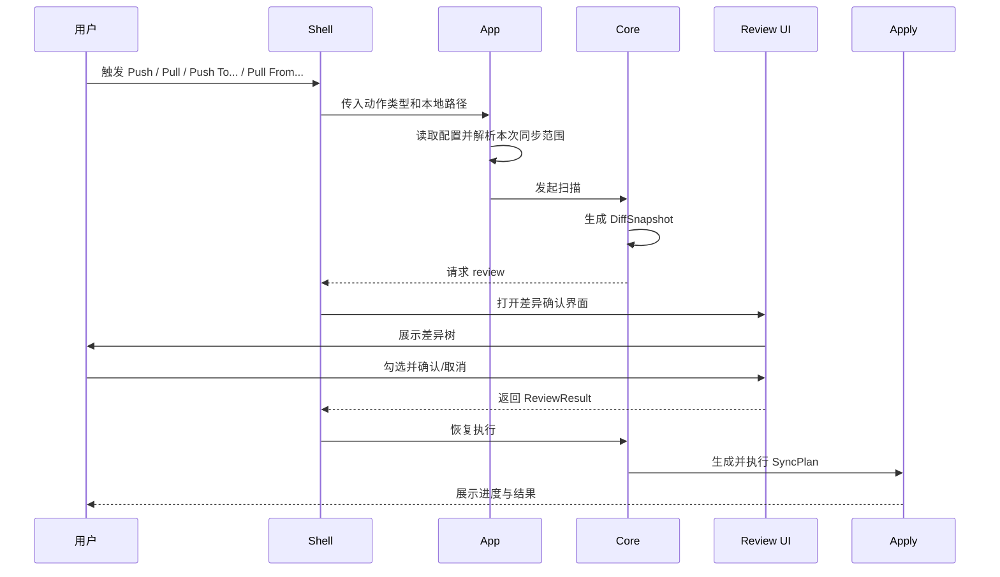
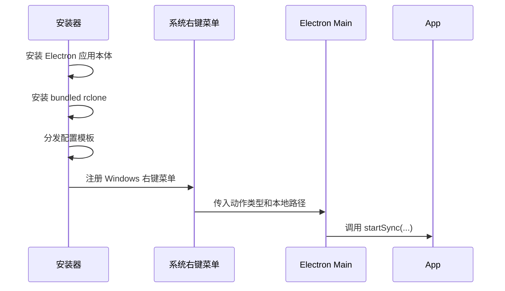
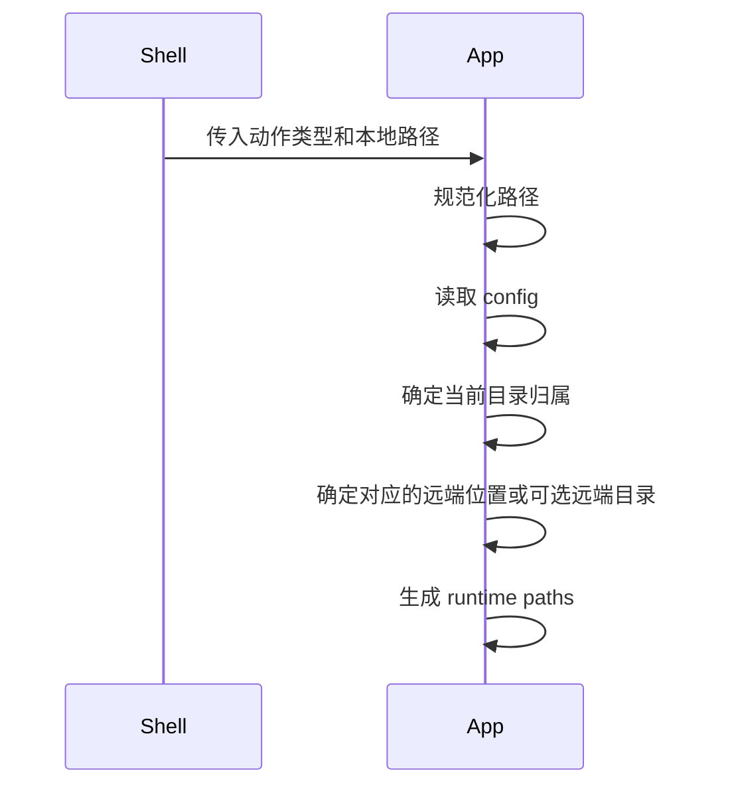
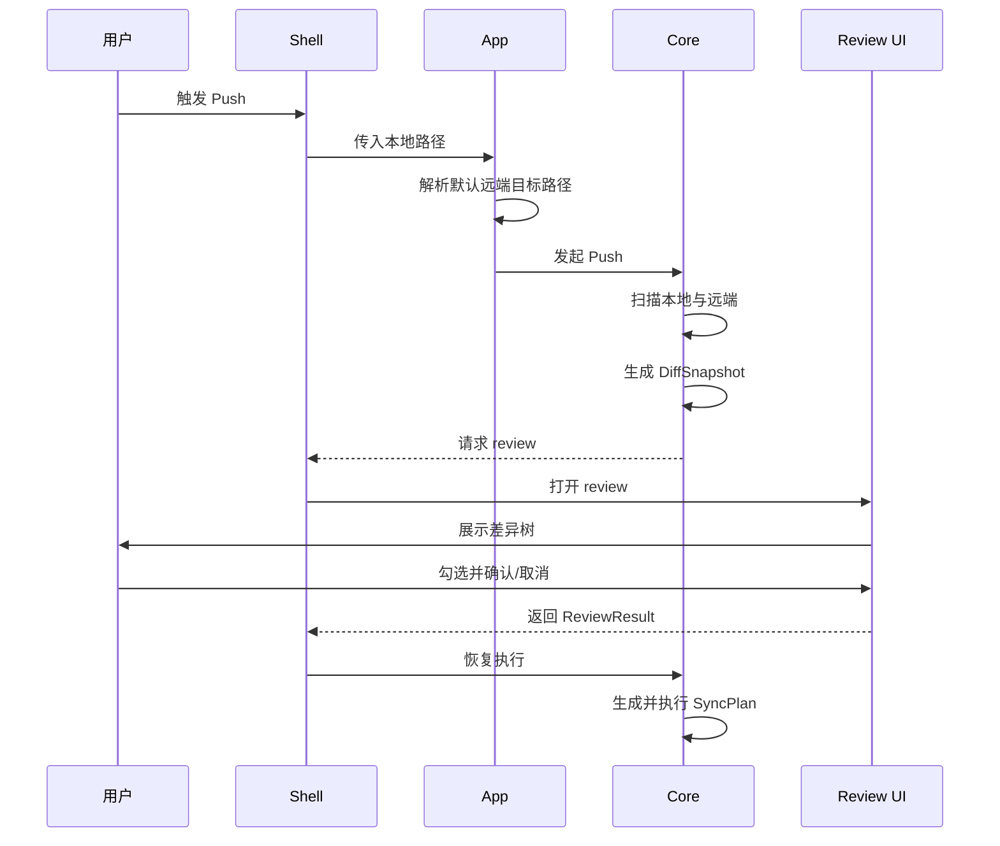
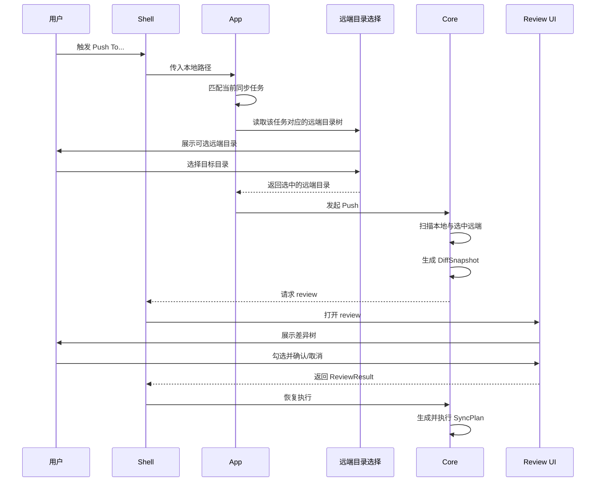
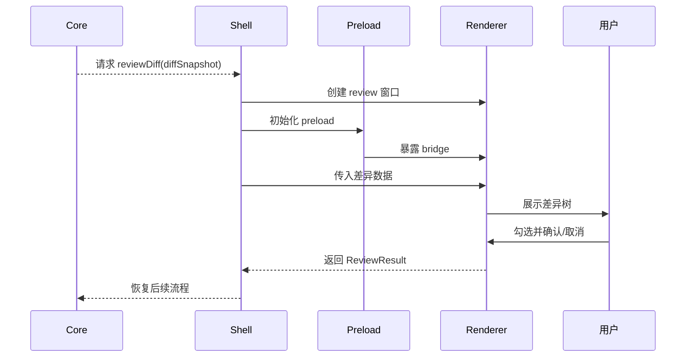
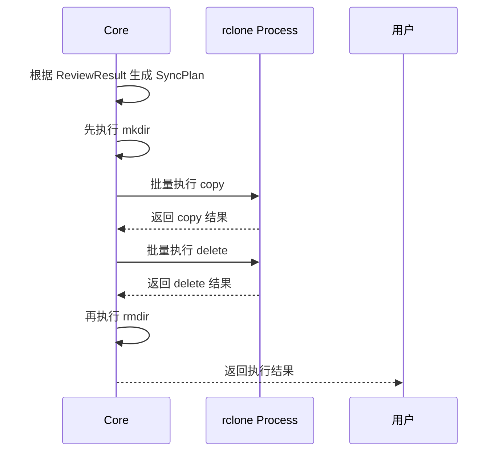

# sync-with-rclone 流程图

## 1. 从用户点击到执行完成的总流程

这张图的用途是先帮助人理解全貌。

## 2. 安装到触发流程

## 3. 配置解析流程

这一步的职责是：

- 判断当前本地路径属于哪一组同步关系
- 在 `Push / Pull` 下得到默认对应的远端路径
- 在 `Push To... / Pull From...` 下得到当前范围内可选择的远端目录
- 拒绝跨同步关系组合

## 4. `Push` 流程

`Push` 的关键点是：

- 当前本地目录是源
- 默认对应的远端目录是目标

## 5. `Pull` 流程

`Pull` 的关键点是：

- 默认对应的远端目录是源
- 当前本地目录是目标

## 6. `Push To...` 流程

`Push To...` 的关键点是：

- 当前本地目录仍然是源
- 用户需要额外选择远端目标目录

## 7. `Pull From...` 流程

`Pull From...` 的关键点是：

- 当前本地目录仍然是目标
- 用户需要额外选择远端来源目录

## 8. Review 流程

## 9. Apply 流程

当前 apply 的执行策略是：

- `copy` / `delete` 优先批量执行
- `mkdir` / `rmdir` 逐目录执行
- `rclone` 调用显式指定配置路径

## 10. 当前阶段限制

当前流程文档只把这些写成已成立事实：

- 右键菜单注册已经接入安装器脚本
- review / progress / result 这条 Electron 链已打通
- 配置默认读取 app data 路径

当前不应写成既成事实的内容：

- 安装器初始化配置文件已经稳定
- 升级安装已经稳定
- 卸载链路已经稳定
