# sync-with-rclone 流程图

## 1. 从用户点击到执行完成的总流程

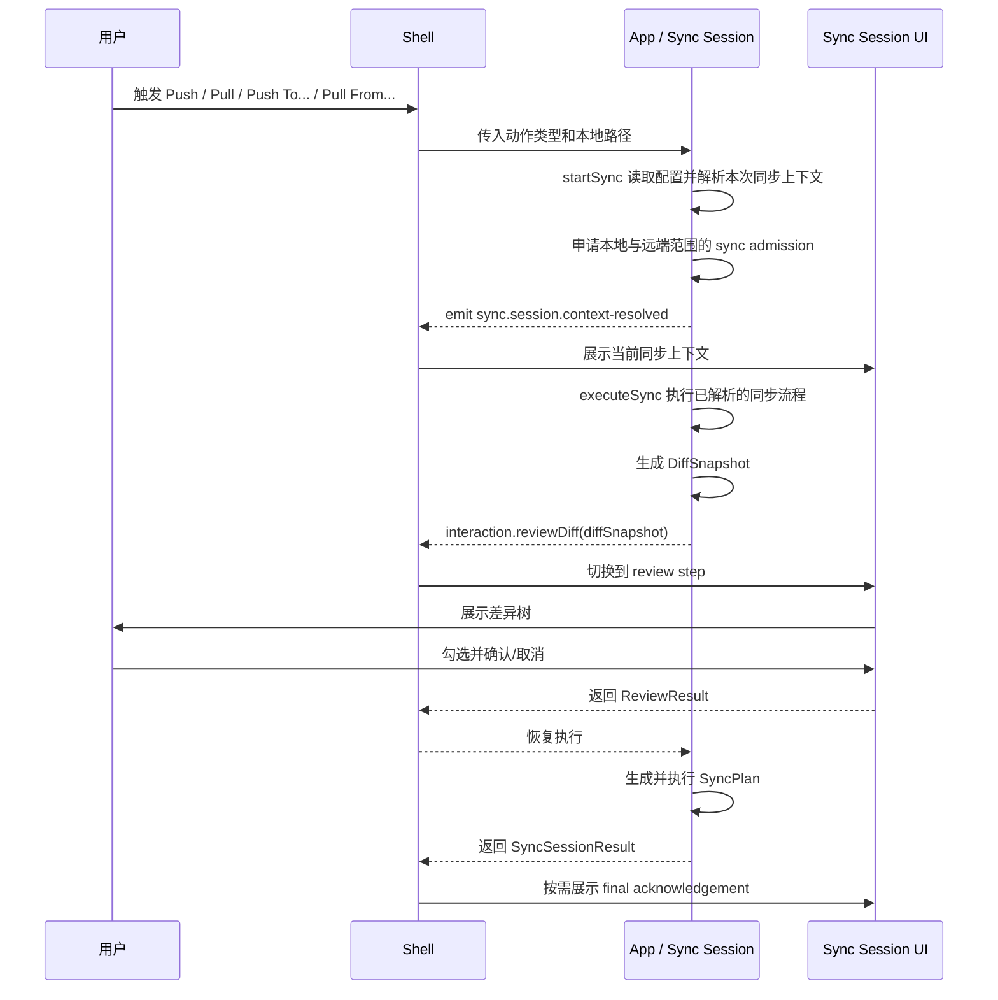
```mermaid
sequenceDiagram
  participant U as 用户
  participant S as Shell
  participant A as App / Sync Session
  participant W as Sync Session UI

  U->>S: 触发 Push / Pull / Push To... / Pull From...
  S->>A: 传入动作类型和本地路径
  A->>A: startSync 读取配置并解析本次同步上下文
  A->>A: 申请本地与远端范围的 sync admission
  A-->>S: emit sync.session.context-resolved
  S->>W: 展示当前同步上下文
  A->>A: executeSync 执行已解析的同步流程
  A->>A: 生成 DiffSnapshot
  A-->>S: interaction.reviewDiff(diffSnapshot)
  S->>W: 切换到 review step
  W->>U: 展示差异树
  U->>W: 勾选并确认/取消
  W-->>S: 返回 ReviewResult
  S-->>A: 恢复执行
  A->>A: 生成并执行 SyncPlan
  A-->>S: 返回 SyncSessionResult
  S->>W: 按需展示 final acknowledgement
```

这张图的用途是先帮助人理解全貌。

`startSync` 管理一次 sync session 的外围生命周期，包括 history、context、远端目录准备、session events 和最终结果；`executeSync` 负责 snapshot、compare、review、plan 和 apply。

## 2. 安装到触发流程

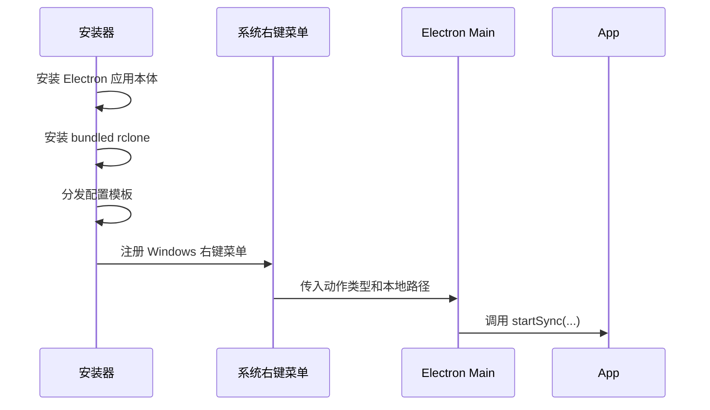
```mermaid
sequenceDiagram
  participant I as 安装器
  participant M as 系统右键菜单
  participant E as Electron Main
  participant A as App

  I->>I: 安装 Electron 应用本体
  I->>I: 安装 bundled rclone
  I->>I: 分发配置模板
  I->>M: 注册 Windows 右键菜单
  M->>E: 传入动作类型和本地路径
  E->>A: 调用 startSync(...)
```

## 3. 配置解析流程

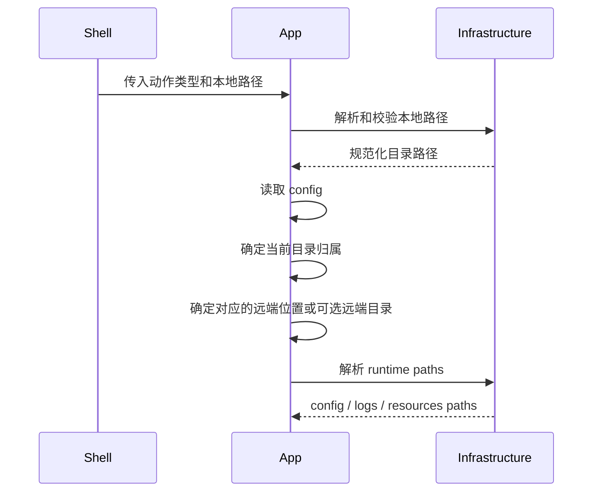
```mermaid
sequenceDiagram
  participant S as Shell
  participant A as App
  participant I as Infrastructure

  S->>A: 传入动作类型和本地路径
  A->>I: 解析和校验本地路径
  I-->>A: 规范化目录路径
  A->>A: 读取 config
  A->>A: 确定当前目录归属
  A->>A: 确定对应的远端位置或可选远端目录
  A->>I: 解析 runtime paths
  I-->>A: config / logs / resources paths
```

这一步的职责是：

- 判断当前本地路径属于哪一组同步关系
- 在 `Push / Pull` 下得到默认对应的远端路径
- 在 `Push To... / Pull From...` 下得到当前范围内可选择的远端目录
- 拒绝跨同步关系组合

## 4. `Push` 流程

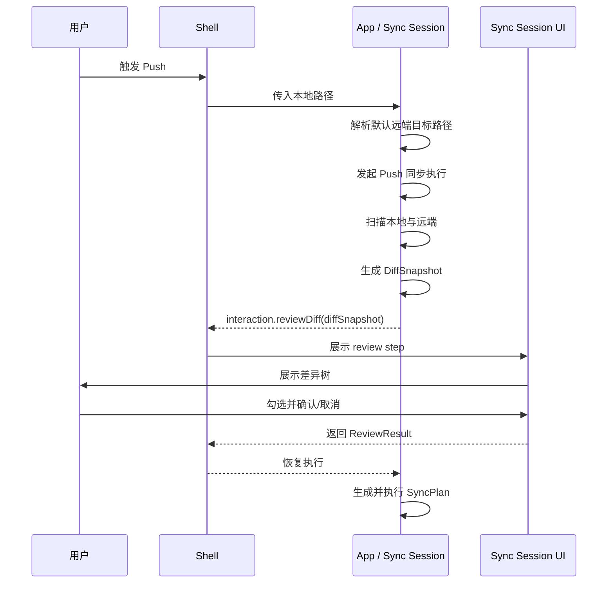
```mermaid
sequenceDiagram
  participant U as 用户
  participant S as Shell
  participant A as App / Sync Session
  participant W as Sync Session UI

  U->>S: 触发 Push
  S->>A: 传入本地路径
  A->>A: 解析默认远端目标路径
  A->>A: 发起 Push 同步执行
  A->>A: 扫描本地与远端
  A->>A: 生成 DiffSnapshot
  A-->>S: interaction.reviewDiff(diffSnapshot)
  S->>W: 展示 review step
  W->>U: 展示差异树
  U->>W: 勾选并确认/取消
  W-->>S: 返回 ReviewResult
  S-->>A: 恢复执行
  A->>A: 生成并执行 SyncPlan
```

`Push` 的关键点是：

- 当前本地目录是源
- 默认对应的远端目录是目标
- global 与 mapping exclusions 同时过滤 local 与 remote Snapshot；这些路径不进入 review，也不会被复制或删除
- `.gitignore` 仍只过滤 local Snapshot；远端存在但被本地 `.gitignore` 省略的内容属于目标端多余内容，会进入删除差异

## 5. `Pull` 流程

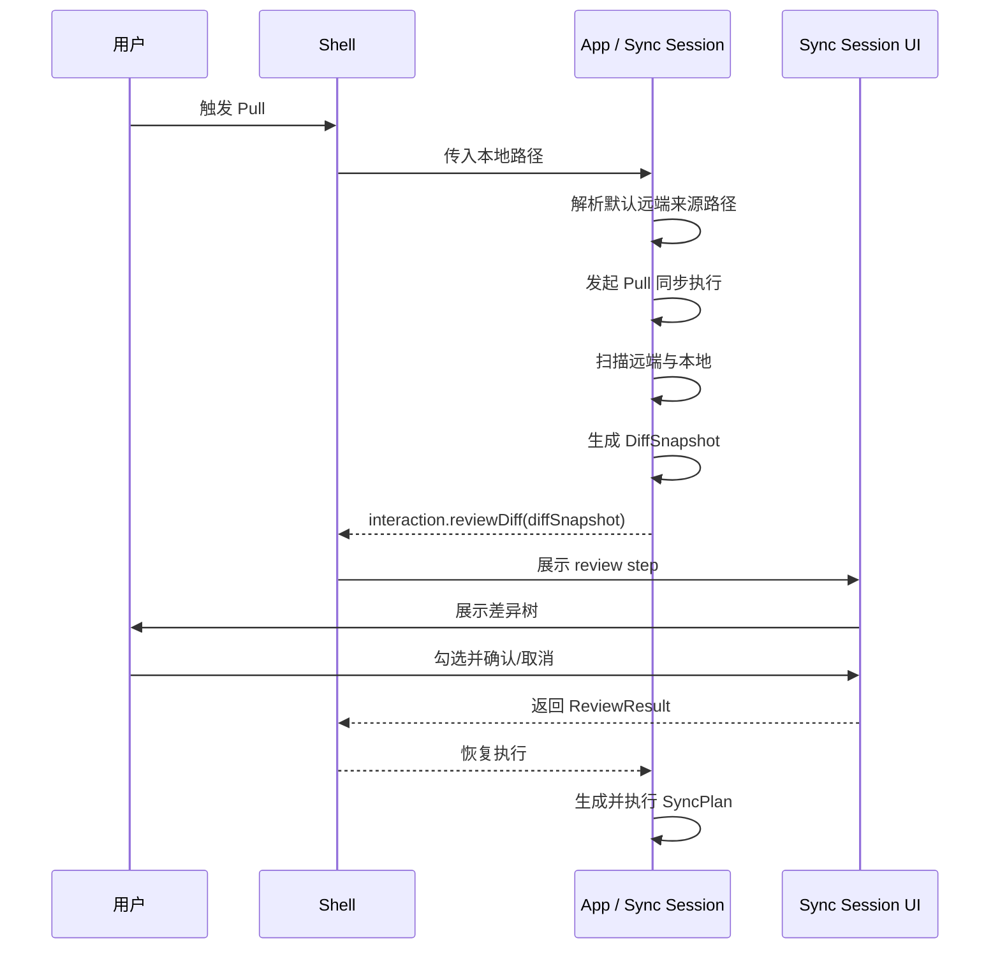
```mermaid
sequenceDiagram
  participant U as 用户
  participant S as Shell
  participant A as App / Sync Session
  participant W as Sync Session UI

  U->>S: 触发 Pull
  S->>A: 传入本地路径
  A->>A: 解析默认远端来源路径
  A->>A: 发起 Pull 同步执行
  A->>A: 扫描远端与本地
  A->>A: 生成 DiffSnapshot
  A-->>S: interaction.reviewDiff(diffSnapshot)
  S->>W: 展示 review step
  W->>U: 展示差异树
  U->>W: 勾选并确认/取消
  W-->>S: 返回 ReviewResult
  S-->>A: 恢复执行
  A->>A: 生成并执行 SyncPlan
```

`Pull` 的关键点是：

- 默认对应的远端目录是源
- 当前本地目录是目标
- global 与 mapping exclusions 同时过滤 remote 与 local Snapshot；这些路径不进入 review，也不会被复制或删除
- remote Snapshot 不应用本地 `.gitignore` policy；远端作为 truth，能够恢复本地当前被 `.gitignore` 省略的同名内容
- review 确认后，在执行 Plan 时逐项检查最终选择是否穿过本地内部 symbolic link；冲突项记录为失败，其他安全项继续批量执行
- rclone 批次或基础设施错误仍停止后续有风险的阶段，不采用无条件 continue-on-error

## 6. `Push To...` 流程

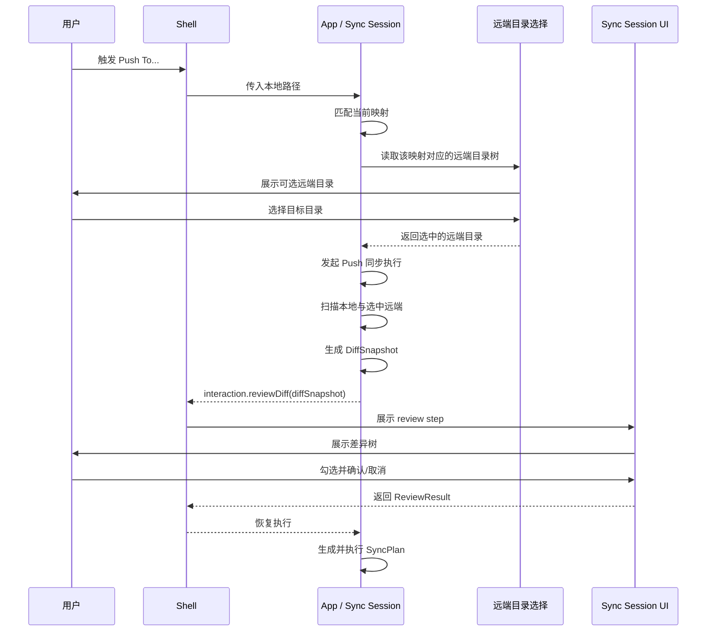
```mermaid
sequenceDiagram
  participant U as 用户
  participant S as Shell
  participant A as App / Sync Session
  participant T as 远端目录选择
  participant W as Sync Session UI

  U->>S: 触发 Push To...
  S->>A: 传入本地路径
  A->>A: 匹配当前映射
  A->>T: 读取该映射对应的远端目录树
  T->>U: 展示可选远端目录
  U->>T: 选择目标目录
  T-->>A: 返回选中的远端目录
  A->>A: 发起 Push 同步执行
  A->>A: 扫描本地与选中远端
  A->>A: 生成 DiffSnapshot
  A-->>S: interaction.reviewDiff(diffSnapshot)
  S->>W: 展示 review step
  W->>U: 展示差异树
  U->>W: 勾选并确认/取消
  W-->>S: 返回 ReviewResult
  S-->>A: 恢复执行
  A->>A: 生成并执行 SyncPlan
```

`Push To...` 的关键点是：

- 当前本地目录仍然是源
- 用户需要额外选择远端目标目录

## 7. `Pull From...` 流程

```mermaid
sequenceDiagram
  participant U as 用户
  participant S as Shell
  participant A as App / Sync Session
  participant T as 远端目录选择
  participant W as Sync Session UI

  U->>S: 触发 Pull From...
  S->>A: 传入本地路径
  A->>A: 匹配当前映射
  A->>T: 读取该映射对应的远端目录树
  T->>U: 展示可选远端目录
  U->>T: 选择来源目录
  T-->>A: 返回选中的远端目录
  A->>A: 发起 Pull 同步执行
  A->>A: 扫描选中远端与本地
  A->>A: 生成 DiffSnapshot
  A-->>S: interaction.reviewDiff(diffSnapshot)
  S->>W: 展示 review step
  W->>U: 展示差异树
  U->>W: 勾选并确认/取消
  W-->>S: 返回 ReviewResult
  S-->>A: 恢复执行
  A->>A: 生成并执行 SyncPlan
```

`Pull From...` 的关键点是：

- 当前本地目录仍然是目标
- 用户需要额外选择远端来源目录

## 8. Review 流程

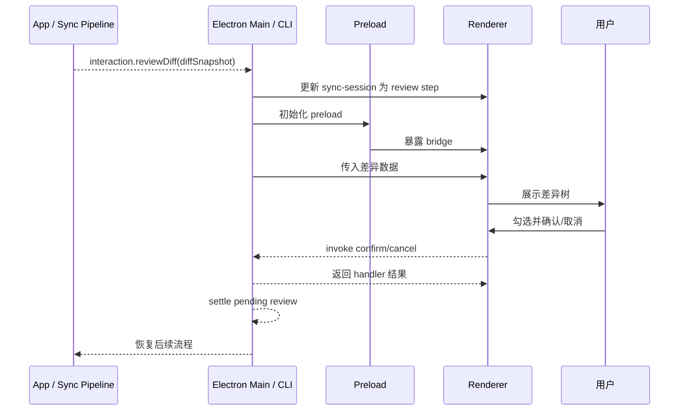
```mermaid
sequenceDiagram
  participant A as App / Sync Pipeline
  participant S as Electron Main / CLI
  participant P as Preload
  participant R as Renderer
  participant U as 用户

  A-->>S: interaction.reviewDiff(diffSnapshot)
  S->>R: 更新 sync-session 为 review step
  S->>P: 初始化 preload
  P->>R: 暴露 bridge
  S->>R: 传入差异数据
  R->>U: 展示差异树
  U->>R: 勾选并确认/取消
  R-->>S: invoke confirm/cancel
  S-->>R: 返回 handler 结果
  S-->>S: settle pending review
  S-->>A: 恢复后续流程
```

这一步的职责边界是：

- `executeSync` 只知道它需要一个 `ReviewResult`
- Electron Main 把 `reviewDiff` 适配成 sync-session 窗口里的 review step
- Renderer 负责按钮 pending 和重复点击防护
- Main 以 `pendingReview` 作为是否处于 review 等待点的权威状态

## 9. Apply 流程

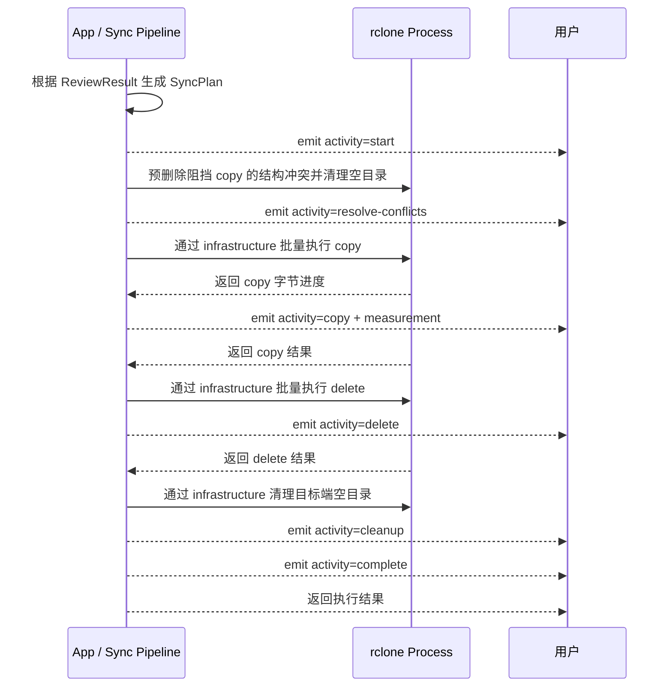
```mermaid
sequenceDiagram
  participant A as App / Sync Pipeline
  participant RC as rclone Process
  participant U as 用户

  A->>A: 根据 ReviewResult 生成 SyncPlan
  A-->>U: emit activity=start
  A->>RC: 预删除阻挡 copy 的结构冲突并清理空目录
  A-->>U: emit activity=resolve-conflicts
  A->>RC: 通过 infrastructure 批量执行 copy
  RC-->>A: 返回 copy 字节进度
  A-->>U: emit activity=copy + measurement
  RC-->>A: 返回 copy 结果
  A->>RC: 通过 infrastructure 批量执行 delete
  A-->>U: emit activity=delete
  RC-->>A: 返回 delete 结果
  A->>RC: 通过 infrastructure 清理目标端空目录
  A-->>U: emit activity=cleanup
  A-->>U: emit activity=complete
  A-->>U: 返回执行结果
```

当前 apply 的执行策略是：

- `copy` / `delete` 使用 batch file 批量执行
- `buildSyncPlan()` 用 path trie 找出与 copy path 互为祖先/后代的 delete path，不对所有 copy/delete 做两两比较
- 被选中的结构冲突 delete 排在 copy 前；如果 copy 所需的冲突删除没有被用户选中，plan 构建会拒绝执行
- apply 依次执行结构冲突 delete、空目录清理、copy、普通 delete、最终空目录清理；copy 失败时不会继续删除不构成阻挡的目标端旧文件
- apply 进度以 `start` / `resolve-conflicts` / `copy` / `delete` / `cleanup` / `complete` activity 表达
- 只有 `copy` activity 会携带 `measurement` 字节进度
- `rclone` 调用显式指定配置路径

## 10. Session result 与 final acknowledgement 流程

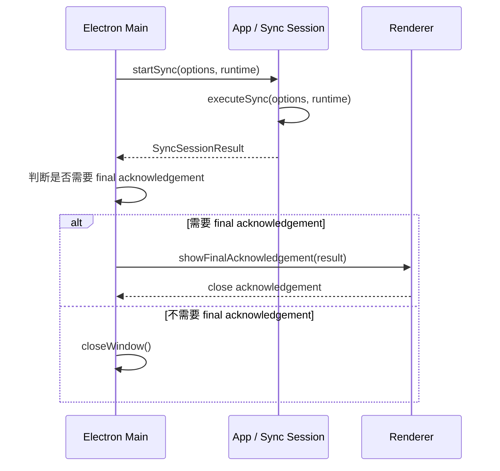
```mermaid
sequenceDiagram
  participant E as Electron Main
  participant A as App / Sync Session
  participant R as Renderer

  E->>A: startSync(options, runtime)
  A->>A: executeSync(options, runtime)
  A-->>E: SyncSessionResult
  E->>E: 判断是否需要 final acknowledgement
  alt 需要 final acknowledgement
    E->>R: showFinalAcknowledgement(result)
    R-->>E: close acknowledgement
  else 不需要 final acknowledgement
    E->>E: closeWindow()
  end
```

这里的结论是：

- `SyncSessionResult` 是 Electron Main 推进 final 流程和退出码判断的依据
- `SYNC_SESSION_EVENT.RESULT`（值为 `sync.session.result`）只是观察事件，不作为 final 流程的控制点
- cancelled 是正常运行结果；failed 会导致桌面入口以失败码退出
- review 阶段取消可以直接收尾；进入执行阶段后的取消可按策略展示 final acknowledgement
- cancelled final acknowledgement 会展示已执行操作的汇总，并允许展开查看每个 operation 的执行状态
- failed final acknowledgement 根据 `sessionResult.error.code` 展示多语言错误信息，并始终提供打开日志文件夹的入口
- 技术故障会写入 app-owned `diagnostics.log`，记录 application error、cause chain 和底层命令输出，不改变返回给 shell 的 result；正常完成、取消和预期的 admission 冲突不写诊断日志

## 10.1 多入口启动与同步 admission

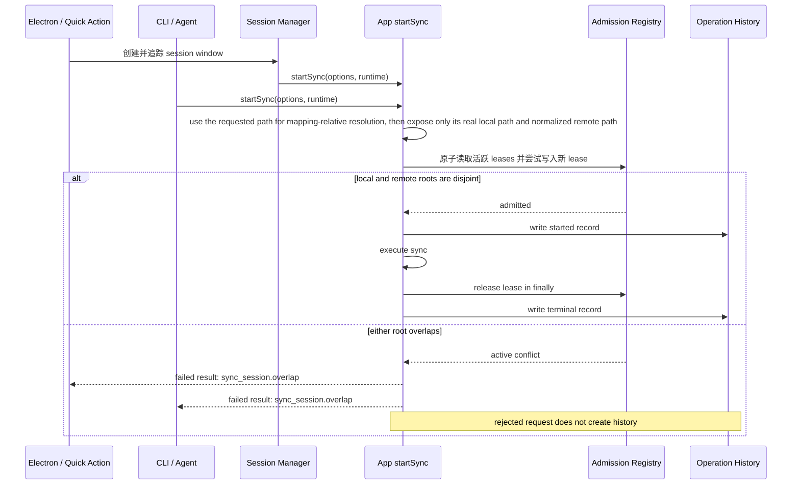
```mermaid
sequenceDiagram
  participant E as Electron / Quick Action
  participant C as CLI / Agent
  participant SM as Session Manager
  participant A as App startSync
  participant R as Admission Registry
  participant H as Operation History

  E->>SM: 创建并追踪 session window
  SM->>A: startSync(options, runtime)
  C->>A: startSync(options, runtime)
  A->>A: use the requested path for mapping-relative resolution, then expose only its real local path and normalized remote path
  A->>R: 原子读取活跃 leases 并尝试写入新 lease
  alt local and remote roots are disjoint
    R-->>A: admitted
    A->>H: write started record
    A->>A: execute sync
    A->>R: release lease in finally
    A->>H: write terminal record
  else either root overlaps
    R-->>A: active conflict
    A-->>E: failed result: sync_session.overlap
    A-->>C: failed result: sync_session.overlap
    Note over A,H: rejected request does not create history
  end
```

关键点：

- Quick Action 启动不主动创建主窗口。
- Main window is created directly by `desktop-application.js`; the Electron sync-session uses a controller because it must bridge the long-running `startSync` application operation with an interactive window.
- Session Manager 只管理 Electron 窗口和取消生命周期；GUI、CLI 与未来 agent 调用都经过 `startSync` 的同一 admission gate。
- Registry 位于 config directory，通过短时 mutex 和每个同步独立的 lease 在进程间共享状态；owner 进程消失后，其 lease 会在下次读取时清理。
- 只有 canonical 本地范围和 normalized 远端范围都不重叠时才允许并行；任一侧相同或互为祖先/后代都会拒绝后来请求。远端显式路径必须在 normalization 后仍位于 mapping remote root 内。
- 每个 session 的 progress channel 独立，history 不持久化 progress sample。
- operation history 保存主 UI 使用的操作摘要；`diagnostics.log` 独立保存所有入口共用的技术故障信息。
- 关闭主窗口不会终止 session；没有窗口且没有活跃 session 时应用退出。
- session window 使用平行的 `sessionState` 和 `sessionResult`：执行进度只更新前者，终态 acknowledgement 只读取后者。
- session 失败页始终提供日志文件夹入口；用户点击后由 Electron Main 解析并打开 runtime log directory，不创建或导航主窗口。

## 11. 主窗口配置管理流程

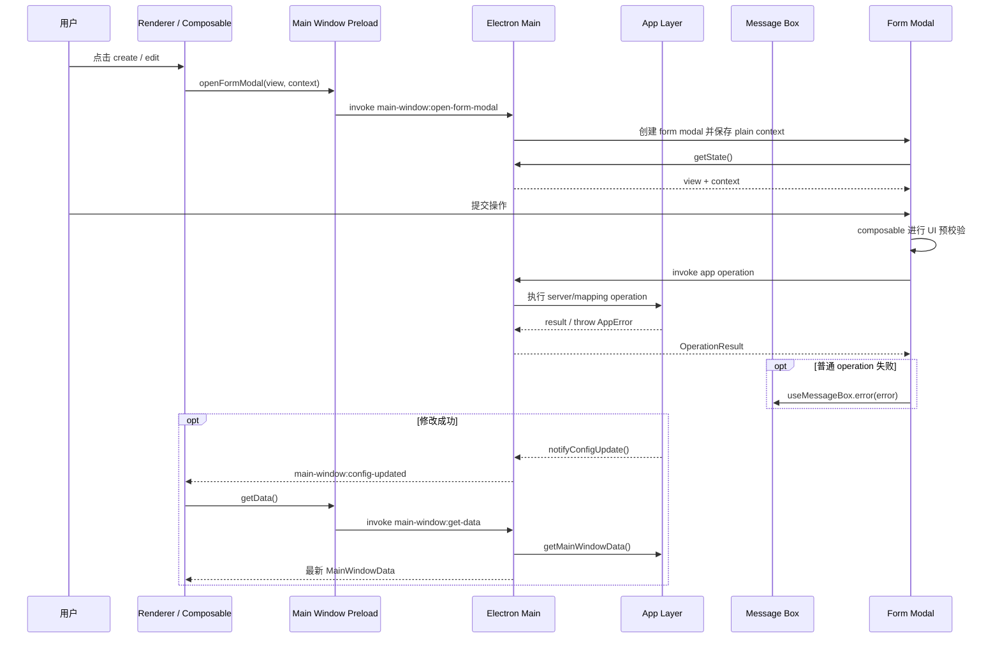
```mermaid
sequenceDiagram
  participant U as 用户
  participant R as Renderer / Composable
  participant MP as Main Window Preload
  participant EM as Electron Main
  participant APP as App Layer
  participant MB as Message Box
  participant M as Form Modal

  U->>R: 点击 create / edit
  R->>MP: openFormModal(view, context)
  MP->>EM: invoke main-window:open-form-modal
  EM->>M: 创建 form modal 并保存 plain context
  M->>EM: getState()
  EM-->>M: view + context
  U->>M: 提交操作
  M->>M: composable 进行 UI 预校验
  M->>EM: invoke app operation
  EM->>APP: 执行 server/mapping operation
  APP-->>EM: result / throw AppError
  EM-->>M: OperationResult
  opt 普通 operation 失败
    M->>MB: useMessageBox.error(error)
  end
  opt 修改成功
    APP-->>EM: notifyConfigUpdate()
    EM-->>R: main-window:config-updated
    R->>MP: getData()
    MP->>EM: invoke main-window:get-data
    EM->>APP: getMainWindowData()
    EM-->>R: 最新 MainWindowData
  end
```

当前结论：

- 主窗口 renderer 传完整的 plain `server` 和 `mapping` 对象；`server.mappings` 只属于主窗口组合视图，不传给 modal
- Electron Main 不重新组装 modal context，只校验 modal 名称并创建窗口
- Electron Main 负责 modal 和 message-box 的窗口生命周期；app operation 的返回值或异常负责业务控制流
- form modal renderer 不直接读取 app config，也不直接调用 rclone
- App Layer 提供应用操作：组合主窗口数据、读写 app config、读写 rclone config、删除 mapping
- server/mapping 修改成功后，App Layer 通过 `app-events.js` 发出 config update 通知，主窗口 renderer 再读取 `MainWindowData`
- message-box 只作为临时状态窗口，不替换普通 modal 的内容
- 普通 validation/message/confirmation 由 renderer 的 `useMessageBox()` facade 发起
- 需要观察 operation 进度时，shell 使用 `createOperationReporter(operation, display)`
- reporter 组装完整 `OperationReportState`；Electron Main 的 `message-box/operation-presentation.js` 注入 GUI display 并转换最终 `OperationResult`，CLI 注入带 Vue I18n 的 terminal display
- 同一个失败只展示一次：main-managed progress operation 由 reporter 展示；普通 operation 的失败由 renderer composable 展示

## 12. Create Server 与 operation progress

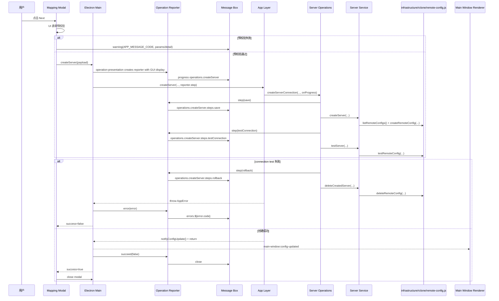
```mermaid
sequenceDiagram
  participant U as 用户
  participant M as Mapping Modal
  participant EM as Electron Main
  participant OR as Operation Reporter
  participant MB as Message Box
  participant APP as App Layer
  participant SO as Server Operations
  participant SS as Server Service
  participant RC as infrastructure/rclone/remote-config.js
  participant MW as Main Window Renderer

  U->>M: 点击 Next
  M->>M: UI 表单预校验
  alt 预校验失败
    M->>MB: warning(APP_MESSAGE_CODE, params/detail)
  else 预校验通过
    M->>EM: createServer(payload)
    EM->>OR: operation-presentation creates reporter with GUI display
    OR->>MB: progress operations.createServer
    EM->>APP: createServer(..., reporter.step)
    APP->>SO: createServerConnection(..., onProgress)
    SO->>OR: step(save)
    OR->>MB: operations.createServer.steps.save
    SO->>SS: createServer(...)
    SS->>RC: listRemoteConfigs() + createRemoteConfig(...)
    SO->>OR: step(testConnection)
    OR->>MB: operations.createServer.steps.testConnection
    SO->>SS: testServer(...)
    SS->>RC: testRemoteConfig(...)
  end
  alt connection test 失败
    SO->>OR: step(rollback)
    OR->>MB: operations.createServer.steps.rollback
    SO->>SS: deleteCreatedServer(...)
    SS->>RC: deleteRemoteConfig(...)
    APP-->>EM: throw AppError
    EM->>OR: error(error)
    OR->>MB: errors.${error.code}
    EM-->>M: success=false
  else 创建成功
    APP-->>EM: notifyConfigUpdate() + return
    EM-->>MW: main-window:config-updated
    EM->>OR: succeed(false)
    OR->>MB: close
    EM-->>M: success=true
    M->>EM: close modal
  end
```

关键点：

- UI 表单预校验只用于即时反馈；当前 composable 会用 semantic warning code 展示验证消息
- Electron handler 调用 `message-box/operation-presentation.js`；该 adapter 在调用 app operation 前创建 reporter，并调用 display 的 `open`
- app/server operation 只通过 callback 上报 `save` / `testConnection` / `rollback` step，不依赖 message-box
- reporter 把 operation/step code 组装成完整 `operations.*` locale key；GUI/CLI surface 不重复理解 key 结构
- 创建失败由 reporter 组装 error state 并调用 display 的 `update`；renderer 不再打开第二个 contextual error
- 失败时保留 Create Server modal，让用户继续修改表单
- 成功时 app operation 先发出 config update；operation-presentation 随后完成 message-box acknowledgement 并返回成功，modal 再关闭
- success acknowledgement 由 caller 表达、reporter 编排、surface function 实现；当前 create-server 成功不要求 acknowledgement
- CLI 接入同一 app operation 时复用相同 reporter，并注入 `createCliOperationReportDisplay()`；完整 state 由 CLI 的 Vue I18n instance 翻译后输出到 terminal

## 13. Edit Server 流程

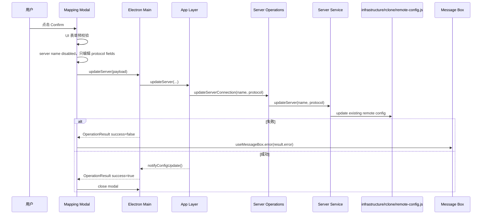
```mermaid
sequenceDiagram
  participant U as 用户
  participant M as Mapping Modal
  participant EM as Electron Main
  participant APP as App Layer
  participant SO as Server Operations
  participant SS as Server Service
  participant RC as infrastructure/rclone/remote-config.js
  participant MB as Message Box

  U->>M: 点击 Confirm
  M->>M: UI 表单预校验
  M->>M: server name disabled，只编辑 protocol fields
  M->>EM: updateServer(payload)
  EM->>APP: updateServer(...)
  APP->>SO: updateServerConnection(name, protocol)
  SO->>SS: updateServer(name, protocol)
  SS->>RC: update existing remote config
  alt 失败
    EM-->>M: OperationResult success=false
    M->>MB: useMessageBox.error(result.error)
  else 成功
    APP-->>EM: notifyConfigUpdate()
    EM-->>M: OperationResult success=true
    M->>EM: close modal
  end
```

关键点：

- 需要 main-managed progress 的 server/mapping mutation 统一通过 `message-box/operation-presentation.js` 接入 `createOperationReporter()`
- server name 在 edit surface 中 disabled；update payload 不包含新名称
- `app-api.js` 只协调现有 server 的 protocol update，并在成功后发布 config update
- `operations/server.js` 负责 update progress lifecycle，不引用 mapping operation
- `services/server.js` 负责 server validation、existence policy、remote/server 转换，并把 adapter error 转成 `SERVER_*`
- `remote-config.js` 只负责 raw rclone config dump/create/update/delete/test 命令
- application 不提供 server rename；手动修改 rclone config 名称后，需要重新指定引用旧名称的 mappings
- 普通 operation 失败由 renderer composable 调用 `messageBox.error(error)` 展示一次

## 14. Delete Server / Delete Mapping 流程

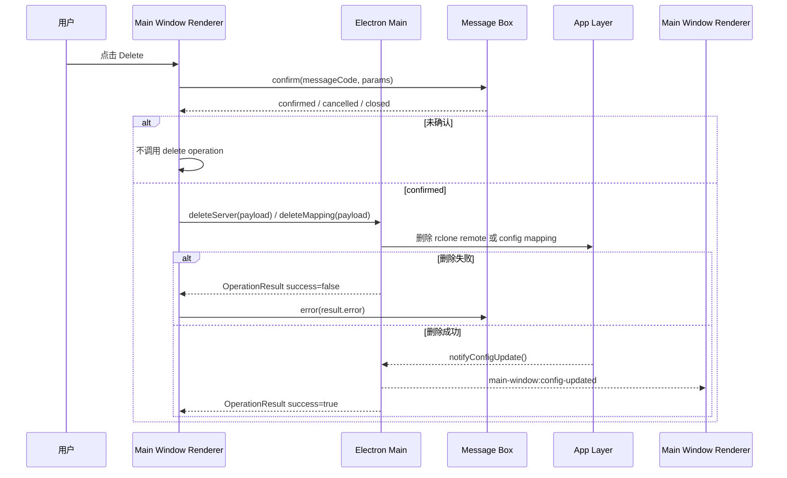
```mermaid
sequenceDiagram
  participant U as 用户
  participant R as Main Window Renderer
  participant EM as Electron Main
  participant MB as Message Box
  participant APP as App Layer
  participant MW as Main Window Renderer

  U->>R: 点击 Delete
  R->>MB: confirm(messageCode, params)
  MB-->>R: confirmed / cancelled / closed
  alt 未确认
    R->>R: 不调用 delete operation
  else confirmed
    R->>EM: deleteServer(payload) / deleteMapping(payload)
    EM->>APP: 删除 rclone remote 或 config mapping
    alt 删除失败
      EM-->>R: OperationResult success=false
      R->>MB: error(result.error)
    else 删除成功
      APP-->>EM: notifyConfigUpdate()
      EM-->>MW: main-window:config-updated
      EM-->>R: OperationResult success=true
    end
  end
```

关键点：

- confirmation 属于 renderer intent：`confirm()` 自动使用 `messages.` 前缀，并传入 `serverName` / `mappingLabel` 插值参数
- confirm state 不携带 level，使用中性的 question icon
- Electron Main 只在用户确认后收到 delete IPC，不重复决定是否需要确认
- mapping 删除只修改 `config.json`，不删除本地或远端文件
- 删除成功后由 App Layer 发出 config update 通知，主窗口 renderer 重新读取数据
- 删除失败通过 `errors.${error.code}` 展示一次

## 15. 当前阶段限制

当前流程文档只把这些写成已成立事实：

- 右键菜单注册已经接入安装器脚本
- sync-session Electron 链已打通
- GUI 使用单一 Electron Main 进程承载可选主窗口和多个互不重叠的 sync-session
- Windows packaged runtime 默认从 `%APPDATA%/sync-with-rclone/config/` 读取配置，macOS packaged runtime 默认从 Application Support 读取配置
- 打包后的 session argv 会先由 `--session` 进入同步窗口，再按 `--mode`、`--local`、`--remote` 解析，避免额外参数导致位置漂移

当前不应写成既成事实的内容：

- 安装器初始化配置文件已经稳定
- 升级安装已经稳定
- 卸载链路已经稳定
