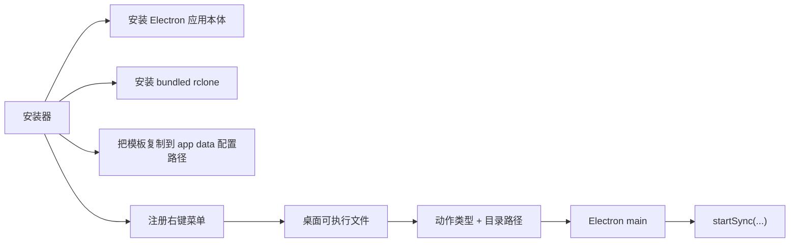
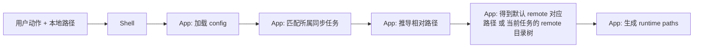
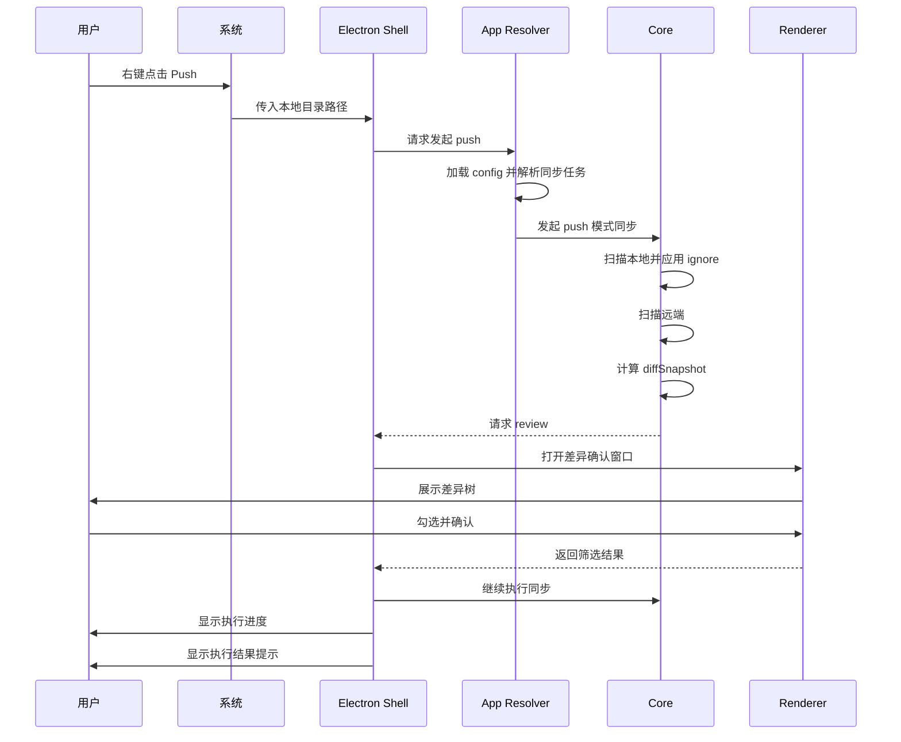
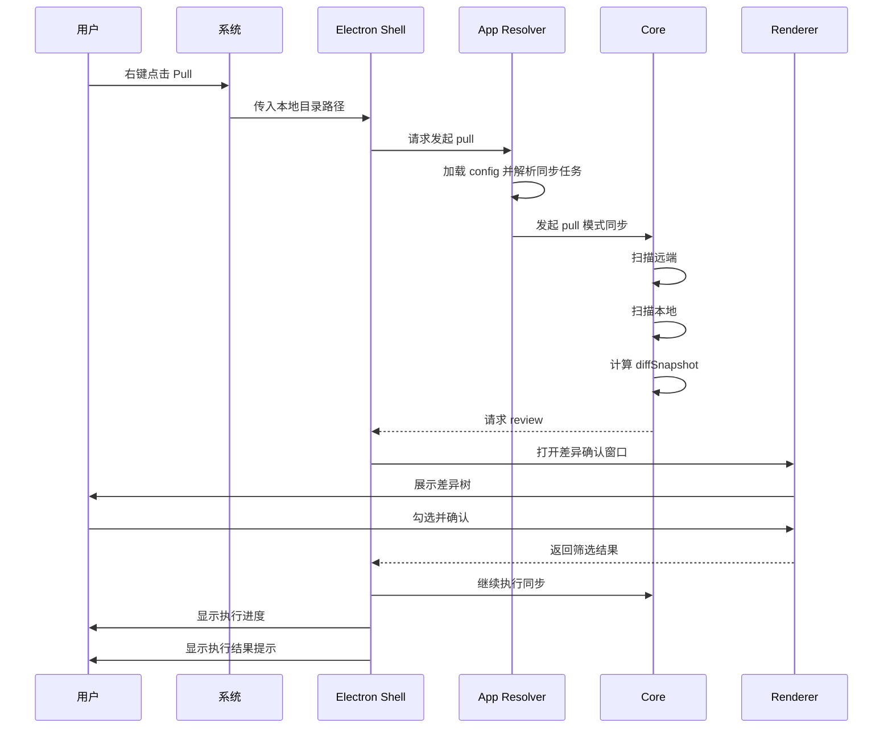
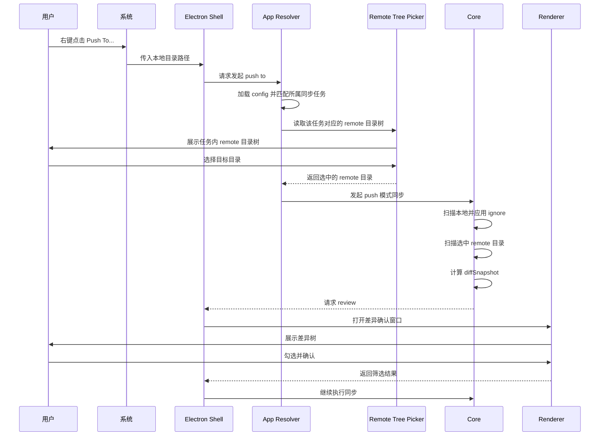
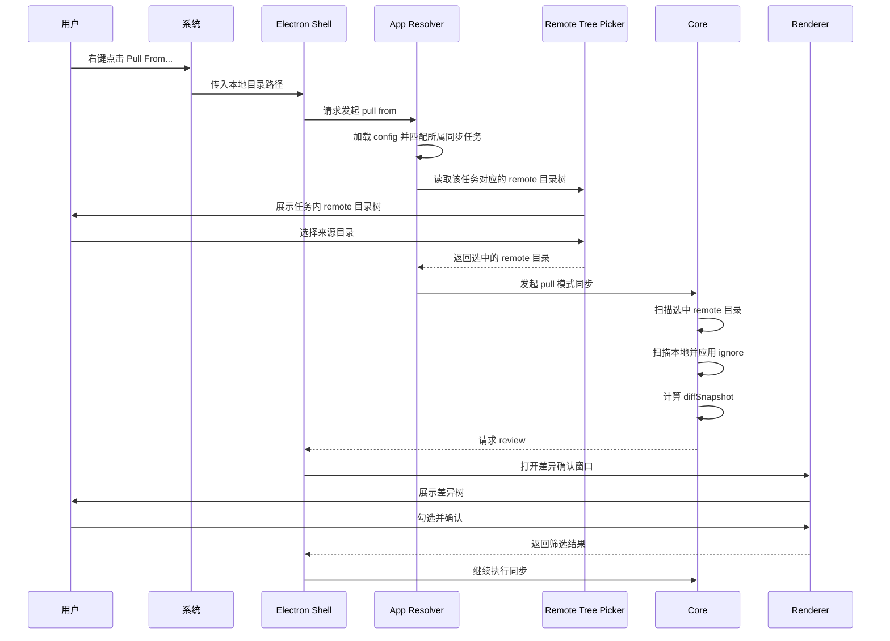
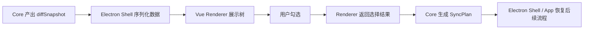
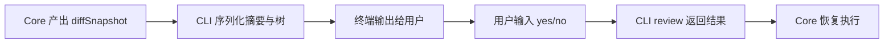

# sync-with-rclone 交互与运行流程

## 1. 用户触发流程

- 系统右键菜单: 正常用户的访问入口
- CLI: 作为开发人员和测试的入口

## 1.1 安装与入口流程

Windows 第一阶段的目标流程应当是：



稳定要求：

- 右键菜单不应直接调用 core
- 右键菜单应调用安装后的桌面可执行文件
- 桌面入口接收动作类型和目录路径，再进入 app/core 流程
- 卸载时必须移除这些右键菜单注册项
- 安装器初始化默认配置目前仍应视为目标行为，未稳定前不应写成既成事实


## 2. 右键菜单动作

目标菜单项：

- `Push`
- `Pull`
- `Push To...`
- `Pull From...`
- `Open Config`

所有动作在真正进入扫描前，都应先经过 config 解析阶段。

Windows 第一阶段当前打包骨架先覆盖：

- `Push`
- `Pull`

后续同一套注册机制再扩展到：

- `Push To...`
- `Pull From...`
- `Open Config`

## 3. 配置解析流程



配置解析的职责：

- 判断当前本地路径是否属于某个同步任务
- 计算该路径相对于任务根目录的相对路径
- 在 `Push / Pull` 下直接得到默认 remote 对应路径
- 在 `Push To... / Pull From...` 下得到当前同步任务对应的 remote 目录树
- 取出任务级额外 ignore patterns
- 拒绝任何跨同步任务的路径组合

当前实现里，配置读取的默认位置是：

- macOS: `~/Library/Application Support/sync-with-rclone/config.json`
- Windows: `%APPDATA%/sync-with-rclone/config.json`
- Linux/其他: `~/.config/sync-with-rclone/config.json`

也可以通过环境变量 `CONFIG_PATH` 指向自定义路径。

当前 runtime paths 还会统一导出：

- app directory
- app config path
- rclone config path
- log directory
- bundled rclone binary path

因此 apply 阶段调用 `rclone` 时，应显式使用 app 层提供的 `rcloneConfigPath`。

这里最后一步的含义是：

- `Push / Pull` 不是“猜一个 remote”，而是直接得到这个本地路径在当前 `syncJob` 中唯一对应的 remote 路径
- `Push To... / Pull From...` 也不是得到多个 remote 候选项，而是得到“当前 `syncJob` 的 remote 根目录树”，供用户在这个任务内部继续选目录
- 如果配置文件当前不存在，则当前实现会退回到显式传入 `remoteFolderPath` 的模式

当前阶段的限制：

- 第一阶段没有配置管理页
- 安装后仍可能需要用户手动检查或编辑 app data 目录中的配置文件
- 直接双击桌面可执行文件不应视为正式使用路径
## 4. `Push` 流程



## 5. `Pull` 流程



## 6. `Push To...` / `Pull From...` 流程补充

对于 `Push To...` 和 `Pull From...`：

- 程序仍先匹配当前本地路径所属的同步任务
- 然后读取该同步任务对应 remote 根目录下的目录树
- 用户只能在这个任务的 remote 目录树里选择一个目录
- 选中的目录和当前本地路径必须始终属于同一个同步任务
- 再进入扫描和 review 阶段

### `Push To...` 流程图



### `Pull From...` 流程图



## 7. Review 阶段流程

review 是整个产品的关键暂停点。

它的职责是：

- 接收差异数据
- 展示可读的差异树
- 允许用户筛选
- 返回结果给核心流程

正确模型如下：



CLI 下对应的模型是：



## 8. 数据流要求

### Core -> UI

Core 不应该直接把内部 `Map` 结构裸传给 UI 作为长期协议。

更稳妥的做法是：

- 先把 `diffSnapshot` 转成 plain JSON
- 再通过 IPC 发给 renderer

### UI -> Core

Renderer 不要把整个 UI 状态原样回传。

建议回传精简的 `reviewResult`，例如：

```js
{
  action: 'confirm',
  selectedPaths: ['src/index.js', 'docs/readme.md']
}
```

如果用户取消，则应返回：

```js
{
  action: 'cancel',
  selectedPaths: []
}
```

约束是：

- `action` 表示用户是否确认继续
- `selectedPaths` 必须是相对于当前 diff 根目录的路径
- 不要把 renderer 内部的展开状态、选中状态树、组件局部状态原样回传给 Core
- 用户取消应作为正常流程返回，而不是抛成执行错误

### Core -> Apply

review 结束后，Core 不应直接跳到执行命令，而应先生成 `SyncPlan`。

也就是：

- `DiffSnapshot` 回答“有哪些差异”
- `ReviewResult` 回答“用户允许哪些路径继续”
- `SyncPlan` 回答“接下来具体执行哪些操作”
- 如果 `ReviewResult.action === 'cancel'`，则 `SyncPlan` 应为空计划

当前 apply 的执行策略应是：

- `copy` / `delete` 优先批量执行，避免每个文件都单独起一次 `rclone`
- `mkdir` / `rmdir` 保持逐目录执行，确保空目录和顺序语义清楚
- 所有 `rclone` 命令都应显式带上 app 层提供的 `rcloneConfigPath`
- `copy` 阶段应尽量保留文件时间和 metadata
- 如果 review 被取消，则 apply 阶段应直接返回空结果
- 执行进度窗口应至少显示几百毫秒，避免快速任务只闪一下

当前 apply 的执行策略应是：

- `copy` / `delete` 优先批量执行，避免每个文件都单独起一次 `rclone`
- `mkdir` / `rmdir` 保持逐目录执行，确保空目录和顺序语义清楚
- 所有 `rclone` 命令都应显式带上 app 层提供的 `rcloneConfigPath`

## 9. CLI 兼容流程

虽然桌面模式是主路径，但 Core 仍然应支持 CLI 运行。

CLI 模式下的 review 可以是：

- 文本摘要确认
- 树状文本输出
- yes/no 继续确认
- 后续再扩展更细的终端交互筛选

这样可以保证：

- Core 可测试
- Core 可脱离 Electron 跑通
- 后续自动化脚本仍可接入

## 10. 错误流程

至少要定义清楚以下中断点：

- 本地路径不存在
- config 中找不到匹配的同步任务
- remote 路径无法解析
- `rclone` 启动失败
- 扫描结果无效
- 用户取消 review
- 应用阶段失败

产品层面要求：

- 界面需要告诉用户失败发生在哪一步
- 用户取消不应被当成异常报错
