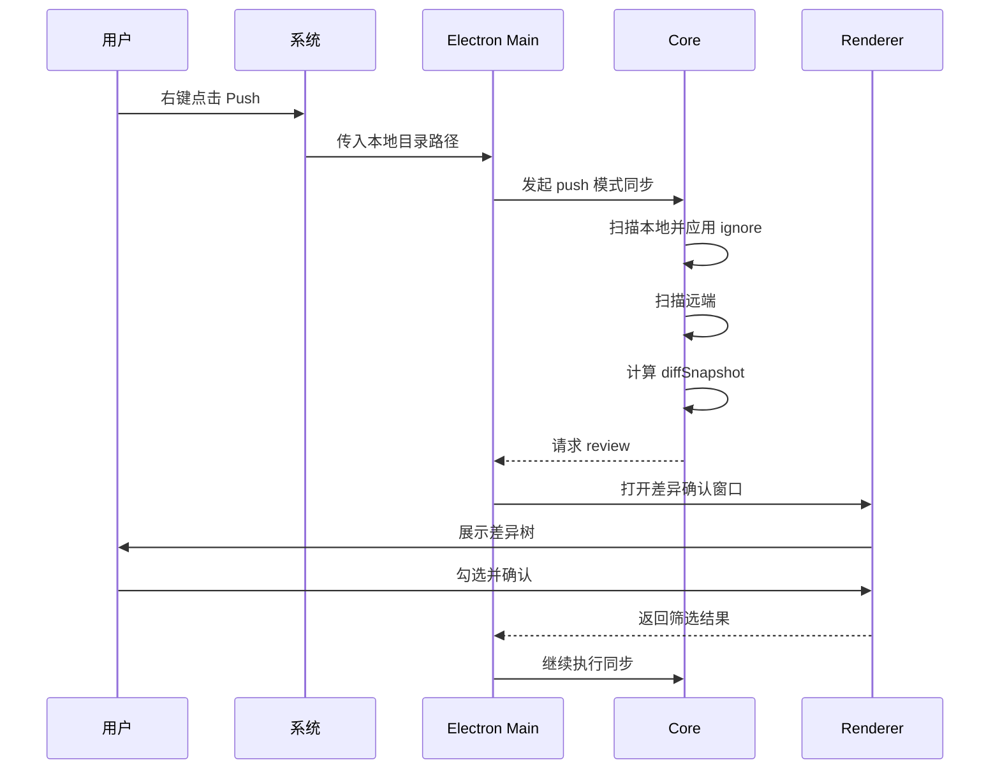
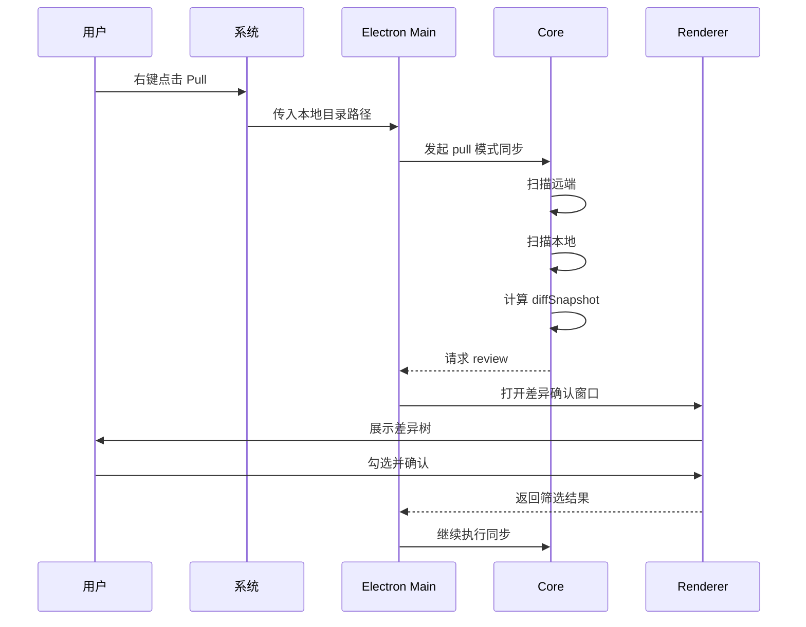
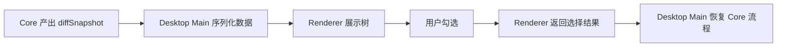

# sync-with-rclone 交互与运行流程

## 1. 用户触发流程

第一阶段主要入口有两种：

- 系统右键菜单
- CLI

推荐优先支持的真实产品入口是系统右键菜单。

## 2. 右键菜单动作

目标菜单项：

- `Push`
- `Pull`
- `Push To...`
- `Pull From...`

## 3. `Push` 流程



## 4. `Pull` 流程



## 5. Review 阶段流程

review 是整个产品的关键暂停点。

它的职责是：

- 接收差异数据
- 展示可读的差异树
- 允许用户筛选
- 返回结果给核心流程

正确模型如下：



## 6. 数据流要求

### Core -> UI

Core 不应该直接把内部 `Map` 结构裸传给 UI 作为长期协议。

更稳妥的做法是：

- 先把 `diffSnapshot` 转成 plain JSON
- 再通过 IPC 发给 renderer

### UI -> Core

Renderer 不要把整个 UI 状态原样回传。

建议回传精简的 review 结果，例如：

```js
{
  approved: true,
  selectedPaths: ['src/index.js', 'docs/readme.md'],
  excludedPaths: ['node_modules']
}
```

## 7. CLI 兼容流程

虽然桌面模式是主路径，但 Core 仍然应支持 CLI 运行。

CLI 模式下的 review 可以是：

- 自动接受
- 文本摘要确认
- 简化的终端交互

这样可以保证：

- Core 可测试
- Core 可脱离 Electron 跑通
- 后续自动化脚本仍可接入

## 8. 错误流程

至少要定义清楚以下中断点：

- 本地路径不存在
- remote 路径无法解析
- `rclone` 启动失败
- 扫描结果无效
- 用户取消 review
- 应用阶段失败

产品层面要求：

- 界面需要告诉用户失败发生在哪一步
- 用户取消不应被当成异常报错
