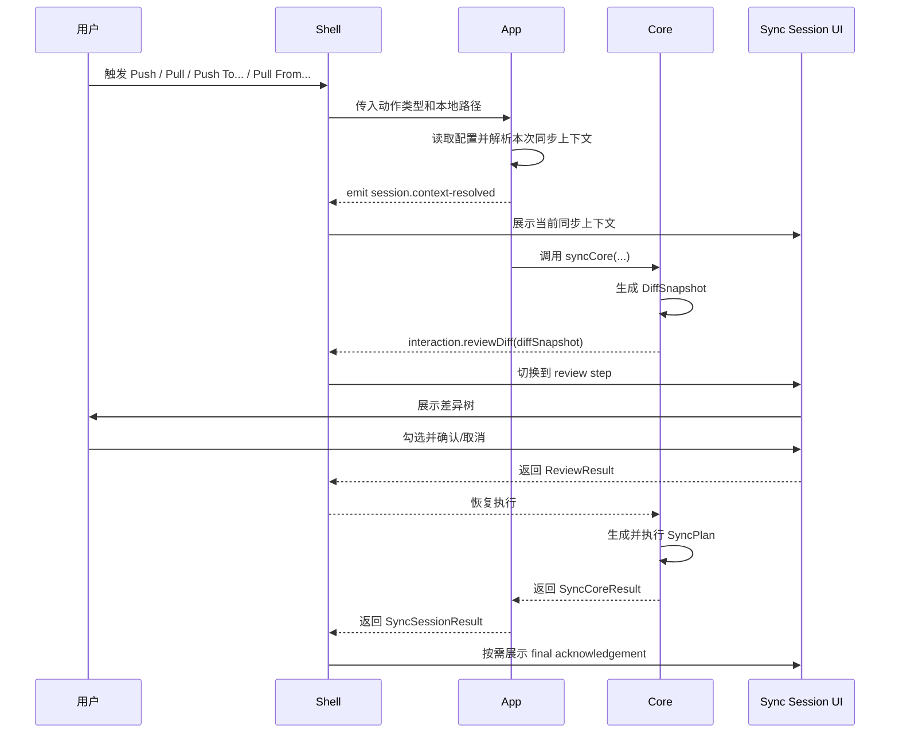
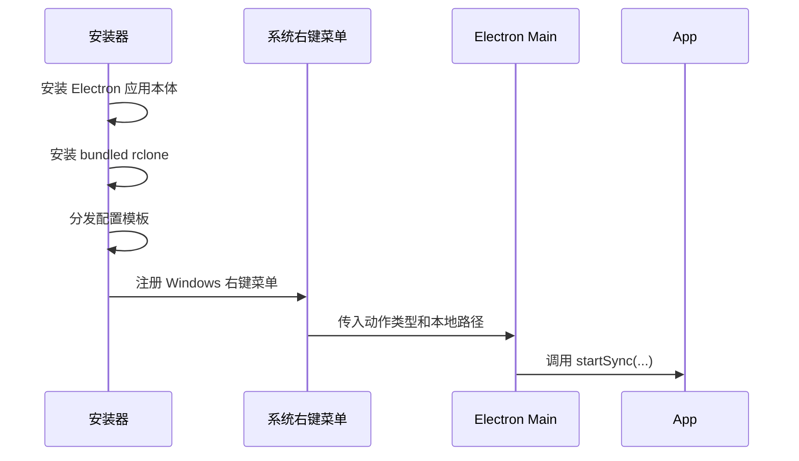
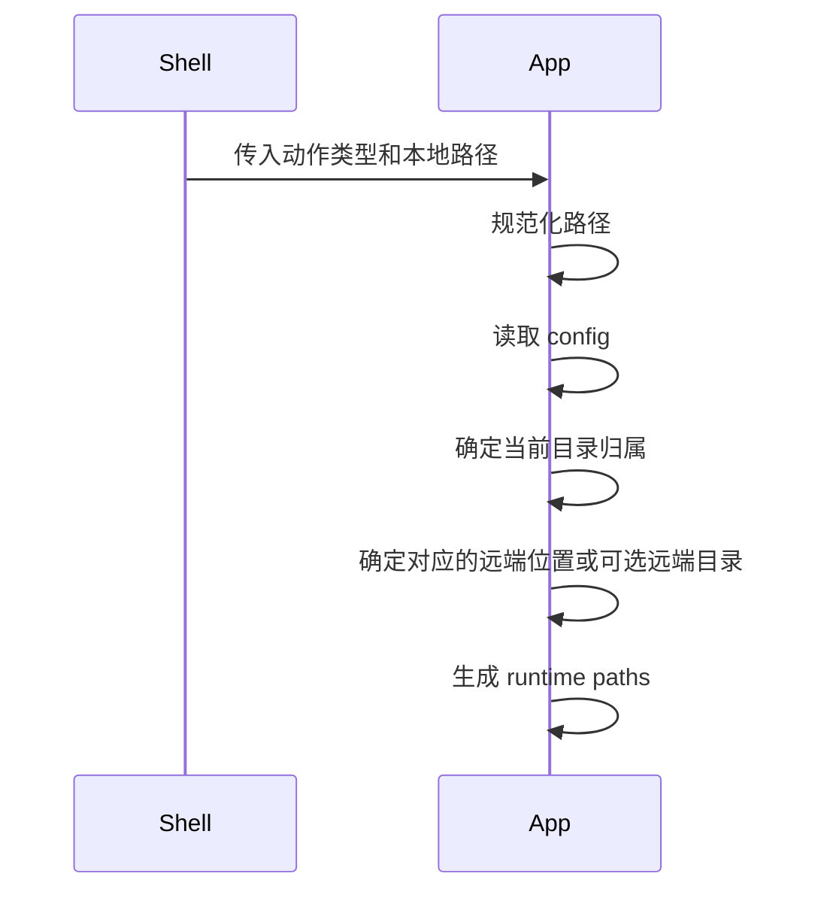
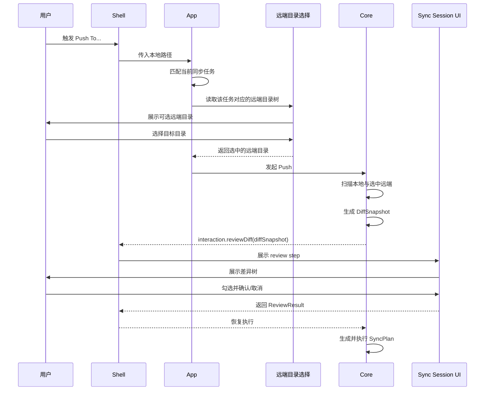
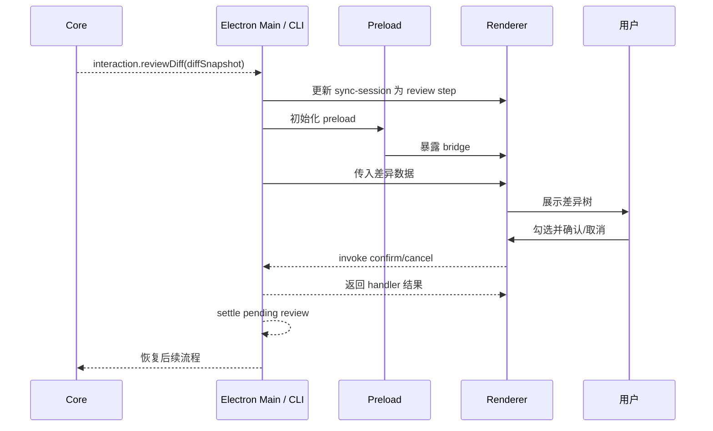
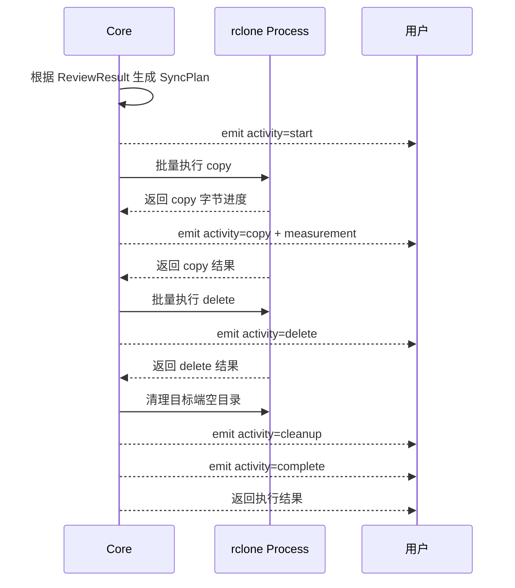
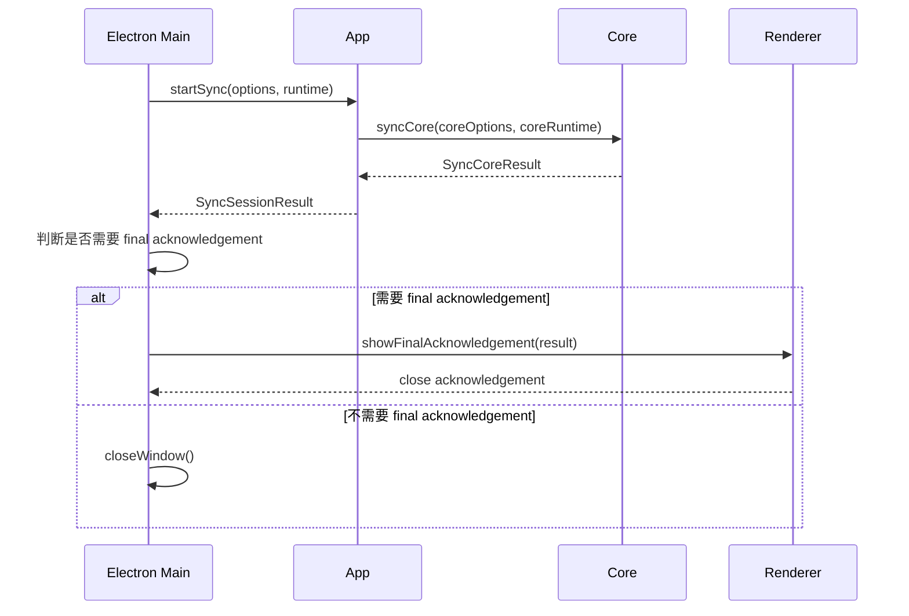
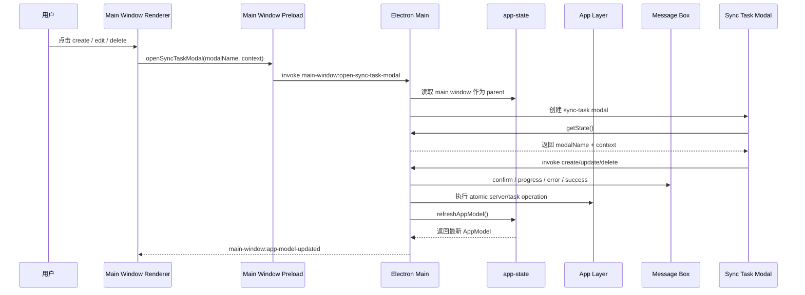
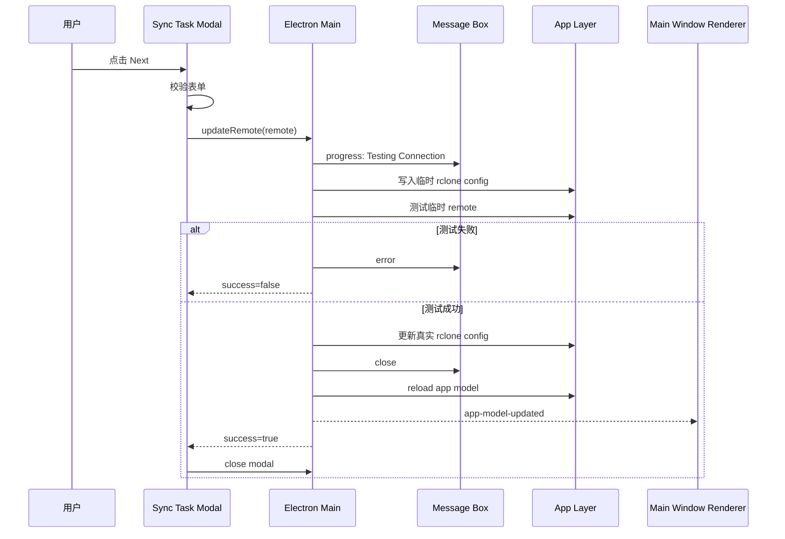
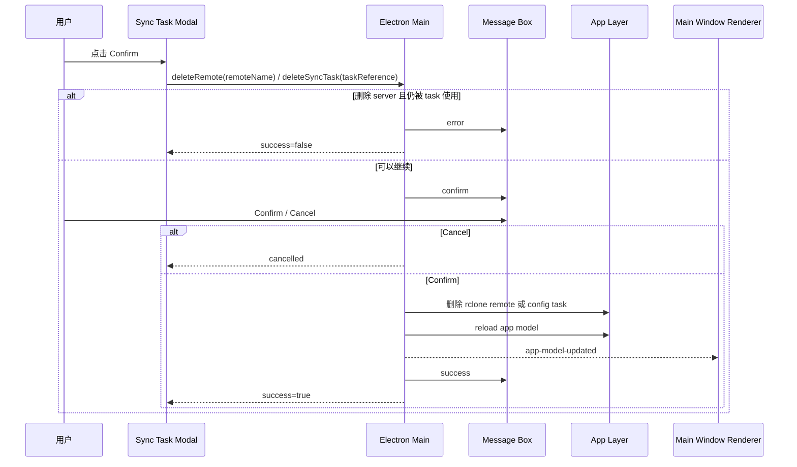

# sync-with-rclone 流程图

## 1. 从用户点击到执行完成的总流程

这张图的用途是先帮助人理解全貌。

## 2. 安装到触发流程

## 3. 配置解析流程

这一步的职责是：

- 判断当前本地路径属于哪一组同步关系
- 在 `Push / Pull` 下得到默认对应的远端路径
- 在 `Push To... / Pull From...` 下得到当前范围内可选择的远端目录
- 拒绝跨同步关系组合

## 4. `Push` 流程

`Push` 的关键点是：

- 当前本地目录是源
- 默认对应的远端目录是目标

## 5. `Pull` 流程

`Pull` 的关键点是：

- 默认对应的远端目录是源
- 当前本地目录是目标

## 6. `Push To...` 流程

`Push To...` 的关键点是：

- 当前本地目录仍然是源
- 用户需要额外选择远端目标目录

## 7. `Pull From...` 流程

`Pull From...` 的关键点是：

- 当前本地目录仍然是目标
- 用户需要额外选择远端来源目录

## 8. Review 流程

这一步的职责边界是：

- `syncCore` 只知道它需要一个 `ReviewResult`
- Electron Main 把 `reviewDiff` 适配成 sync-session 窗口里的 review step
- Renderer 负责按钮 pending 和重复点击防护
- Main 以 `pendingReview` 作为是否处于 review 等待点的权威状态

## 9. Apply 流程

当前 apply 的执行策略是：

- `copy` / `delete` 使用 batch file 批量执行
- `delete` 后会执行 `rclone rmdirs <destination-root> --leave-root` 清理目标端空目录
- apply 进度以 `start` / `copy` / `delete` / `cleanup` / `complete` activity 表达
- 只有 `copy` activity 会携带 `measurement` 字节进度
- `rclone` 调用显式指定配置路径

## 10. Session result 与 final acknowledgement 流程

这里的结论是：

- `SyncSessionResult` 是 Electron Main 推进 final 流程和退出码判断的依据
- `SESSION_EVENT.RESULT` 只是观察事件，不作为 final 流程的控制点
- cancelled 是正常运行结果；failed 会导致桌面入口以失败码退出
- review 阶段取消可以直接收尾；进入执行阶段后的取消可按策略展示 final acknowledgement
- cancelled final acknowledgement 会展示已执行操作的汇总，并允许展开查看每个 operation 的执行状态
- failed final acknowledgement 会展示错误信息；只有 `quick-actions.log` 文件实际存在时才展示可打开的日志入口

## 11. 主窗口配置管理流程

当前结论：

- 主窗口 renderer 传完整的 plain `server` 和 `syncTask` 对象；`server.tasks` 只属于主窗口组合视图，不传给 modal
- Electron Main 不重新组装 modal context，只校验 modal 名称并创建窗口
- Electron Main 负责 modal 生命周期、message-box 生命周期和流程推进
- sync-task modal renderer 不直接读取 app config，也不直接调用 rclone
- App Layer 提供原子操作：读取 app model、读写 app config、读写 rclone config、删除 task
- server/syncTask 修改成功后，Electron Main 刷新 `AppModel` 并通知主窗口 renderer
- message-box 只作为临时状态窗口，不替换普通 modal 的内容

## 12. Edit Server 流程

关键点：

- 表单校验失败时不打开 message-box
- 连接测试和保存过程中的状态只显示在 message-box
- 失败时保留 Edit Server modal，让用户继续修改表单
- 成功时关闭 message-box，刷新主窗口模型，然后关闭 modal

## 13. Delete Server / Delete Task 流程

关键点：

- server 删除前必须检查是否仍有 sync task 引用该 server
- 被引用的 server 不能删除，只展示 error message-box
- task 删除只修改 `config.json`，不删除本地或远端文件
- 删除成功后由 Electron Main 统一刷新 `AppModel`

## 14. 当前阶段限制

当前流程文档只把这些写成已成立事实：

- 右键菜单注册已经接入安装器脚本
- sync-session Electron 链已打通
- 配置默认读取安装目录下的 `config/`
- 打包后的 session argv 会先由 `--session` 进入同步窗口，再按 `--mode`、`--local`、`--remote` 解析，避免额外参数导致位置漂移

当前不应写成既成事实的内容：

- 安装器初始化配置文件已经稳定
- 升级安装已经稳定
- 卸载链路已经稳定
