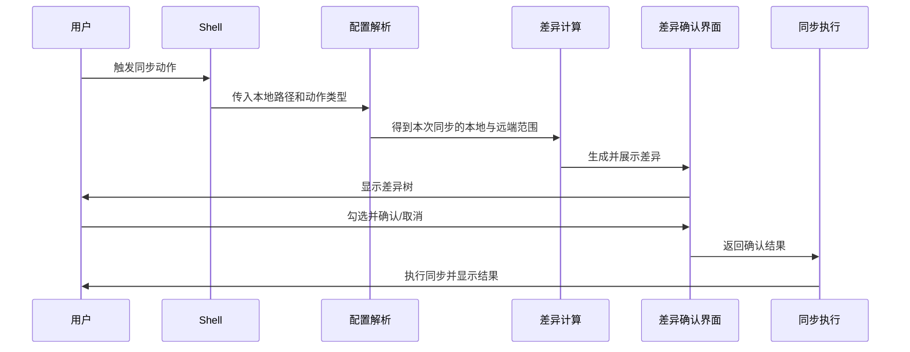

# sync-with-rclone 产品需求文档

## 1. 背景

开发过程中，经常会临时编写些功能测试、需求实验、验证脚本等过渡工程。这些工程还具备回看的价值，但也没重要到单开一个git仓库的地步。并且这些目录和正式目录一样，经常包含类似node_modules、packages、libraries等依赖文件，体积庞大且琐碎，一般的同步软件不支持`.gitignore`，根本束手无策。
因此，`sync-with-rclone`的初衷，就是解决这些中间工程的同步问题，让它们也能方便的进行备份和找回。

## 2. 产品定义

`sync-with-rclone` 是一个面向仍有价值的中间工程的同步工具。

它更适合处理这类目录：

- 有保留价值，但未必值得单独建仓库
- 希望继续沿用 `.gitignore` 来决定哪些文件不要同步

## 3. 目标用户

这个工具主要面向这类开发者：

- 需要在多台设备上，实现本地目录和服务器之间来回同步
- 拥有 `.gitignore` 风格工作习惯
- 一点点恋旧，担心清理后未来仍需找回

## 4. 产品目标

这个产品希望建立这样一套体验：

1. `.gitignore`过滤机制应与Git相符。
2. 同步操作应像复制粘贴一样符合直觉，不应再有复杂的交互过程。
3. 有GUI界面展示即将操作的文件，让用户确认。

桌面端需要同时满足以下窗口行为：

- 主窗口在用户打开应用时出现，并且同一时间最多只有一个。
- 右键菜单可以直接发起同步会话，而不强制打开主窗口。
- 不同且互不重叠的本地、远程目录可以通过 GUI 或 CLI 并行同步。
- 同一台设备上，本地或远程范围发生重叠的同步不能并行执行；无论从 GUI 还是 CLI 发起，后来的请求都应被明确拒绝。
- 同步进度由各自的会话窗口独立展示；最终状态进入统一的操作日志。

## 5. 核心功能

映射是用户创建和管理的持久同步关系，定义本地根目录、远端根目录及其专用排除规则。创建映射不会让两个目录自动保持同步；每次同步仍由用户通过右键菜单、GUI 或 CLI 手动发起。

1. **完美支持 `.gitignore`**

同步时应支持 `.gitignore`，并且过滤行为与Git一致。

这项能力的意义是：

- 不该同步的庞大且琐碎的文件不会轻易混入
- 符合开发人员的工作习惯，不会对其造成额外困扰
- 这是产品能让开发者信任的基础

`.gitignore` 描述本地工作区不应上传的内容。`Push` 会让远端与 `.gitignore` 选择后的本地内容一致，因此删除远端多余路径；`Pull` 以远端备份内容为 truth，并可恢复本地当前被 `.gitignore` 省略的同名内容。

应用还提供独立于 `.gitignore` 的排除规则。全局排除规则作用于所有映射，映射排除规则只作用于当前映射；两者取并集。匹配路径在本地与远端都不参与比较、复制和删除，也不会出现在确认列表中。排除规则是双向硬排除，不支持 `!` 否定规则，默认排除 `.DS_Store`、`Thumbs.db` 和 `.git`。

同步根路径本身可以是 symbolic link，应用会先解析为真实目录。同步根内部的 symbolic link 是同步边界：不会作为内容上传，也不会扫描或写入其目标。Pull 中被 symbolic link 阻挡的文件操作应作为逐项失败返回，其他安全文件仍继续同步；批次或基础设施错误仍遵循 failure-safe 的停止策略。

2. **右键菜单快捷操作**

用户可以直接对某个本地目录点击右键，在右键菜单里发起同步操作。

这项能力的意义是：

- 不需要先打开主程序再选目录
- 不需要每次都去选择本地路径和远程路径

3. **GUI界面展示差异**

程序需要在真正执行前展示差异，并允许用户通过图形界面确认。

这项能力的意义是：

- 用户可以先看清楚将要发生什么
- 用户不会在“盲同步”的状态下直接执行
- 用户可以选择只同步其中一部分文件，对应平时操作Git仓库的习惯

同步失败时，如果 Finder / 右键菜单启动日志存在，会话窗口可以直接在文件管理器中定位该日志文件。结构化操作记录仍可由用户在主窗口日志面板中独立查看。

4. **GUI配置管理界面**

由于 rclone 的配置较为复杂，也不直观，并且当前工具需要免去开发者每次手动选择同步路径的麻烦，因此产品提供图形化配置管理界面。

这项能力的意义是：

- 简化用户上手工具的难度
- 帮助用户创建、编辑、删除映射和 rclone remote
- 在创建 server 时验证它能否可靠保留文件修改时间，避免已经同步完成的文件在下一次预览中再次显示为差异
- 如果 server 支持，可提供 checksum 作为额外的内容一致性校验；普通同步不应依赖这项可选能力

## 6. 主要交互流程

## 7. 用户动作

当前右键菜单提供：

- `Push`: 把当前本地目录的内容推向它默认对应的远端位置，用户不需要额外选择目标目录。
- `Pull`: 把当前本地目录默认对应的远端内容拉回本地，用户不需要额外选择来源目录。

主窗口 Settings 面板提供 `Open Config Folder`，用于打开配置所在位置。

产品层面计划覆盖的动作包括：

- `Push To...`: 把当前本地目录的内容推向一个由用户额外指定的远端目录，因此会多一步选择目标目录。
- `Pull From...`: 从一个由用户额外指定的远端目录拉取内容到当前本地目录，因此会多一步选择来源目录。

## 8. RoadMap
- [x] 支持.gitignore筛选文件
- [x] 支持发起 `Push` 或 `Pull`操作
- [x] GUI展示差异树
- [x] 添加右键菜单栏的便捷操作
- [x] 形成一键安装包
- [ ] 支持发起 `Push To` 或 `Pull From`操作
- [ ] 发起 `Push To` 或 `Pull From`操作时展示远程文件夹的目录树供用户选择
- [x] GUI配置管理界面：管理映射和 rclone remote，并测试基本连接
- [ ] 在创建 server 时验证文件修改时间保留能力，并在可用时提供额外的 checksum 校验
