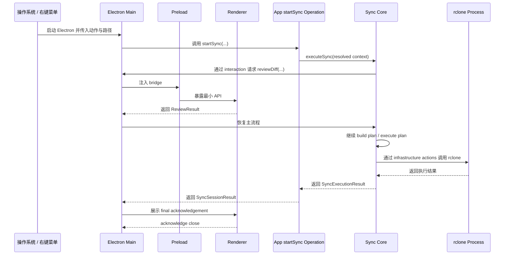

# Desktop and CLI architecture

> 返回 [架构总览](../Architecture.md)。

## 1. 统一产品入口与 CLI

当前采用一个 Electron 可执行文件作为统一产品入口，再区分 GUI 单实例模式和 CLI 命令模式：

```text
sync-with-rclone                 -> 启动桌面 UI
sync-with-rclone list-mappings      -> 命令模式，列出映射
sync-with-rclone list-servers    -> 命令模式，列出 servers
sync-with-rclone sync push ...   -> 命令模式，执行同步
```

`src/shell/launch-classifier.cjs` 统一分类 main、session 和 CLI 启动。入口先识别显式 `--session`，其余启动只有在首个应用参数是 `shell/cli/command-contract.cjs` 声明的正式 CLI 子命令时才进入 CLI。参数后部出现命令同名的路径或值不会改变启动类型，顶级 `push` / `pull` 不再作为 CLI 命令兼容。

`shell/cli/commands.js` 使用同一 command contract 建立 command-to-handler registry。外部 CLI protocol 仍然是字符串，但 launch allowlist 与 dispatch 不重复手写 command name；registry 在 module initialization 时校验 contract 与 handler 数量一致。

当前 CLI surface 由以下命令组成：

| Command | Responsibility |
| --- | --- |
| `sync [--yes] push\|pull <local-path> [remote-path]` | review 并执行同步；非 TTY 调用必须传入 `--yes`。 |
| `list-servers [--json]` | 列出 servers。 |
| `get-server <server> [--json]` | 读取一个 server。 |
| `list-server-folders <server> [folder] [--json]` | 读取远端目录树。 |
| `test-server <server>` | 测试 server 连接。 |
| `create-server <server> <protocol> [field=value ...]` | 创建 server。 |
| `update-server <server> <protocol> [field=value ...]` | 更新 server protocol configuration。 |
| `delete-server <server>` | 删除 server。 |
| `list-mappings [--json]` | 列出 mappings。 |
| `create-mapping <server> <local-folder> <remote-folder>` | 创建 mapping。 |
| `update-mapping <server> <local-folder> <new-server> <new-local-folder> <new-remote-folder>` | 更新 mapping。 |
| `update-mapping-exclusion-patterns <server> <local-folder> [pattern ...]` | 替换 mapping exclusion patterns。 |
| `delete-mapping <server> <local-folder>` | 删除 mapping，不删除本地或远端文件。 |
| `list-global-exclusion-patterns [--json]` | 列出 global exclusion patterns。 |
| `update-global-exclusion-patterns [pattern ...]` | 替换 global exclusion patterns。 |

`sync` 同时接受 `--mode`、`--local` / `--folder`、`--remote` 和 `--bypass-config` 命名参数。默认情况下 local path 必须命中 mapping，显式 remote path 必须位于该 mapping 的 remote root 内；`--bypass-config` 跳过 mapping resolution，因此必须显式提供 remote path。query commands 的 `--json` 输出为 AI / automation 提供 machine-readable boundary。

GUI 启动通过 `requestSingleInstanceLock()` 汇入一个 Electron Main 进程。这个进程可以持有零或一个主窗口，以及多个 sync-session 窗口。普通启动创建或聚焦主窗口；`--session` 启动只提交同步会话。CLI 命令不参与 GUI 单实例锁；同步范围的并发安全由所有 shell 共用的 `startSync` admission 保证。统一入口识别 CLI 模式后加载命令行壳层，由它负责参数路由、终端输出和终端 review。交互式 CLI review 默认展示全部差异并请求 yes/no 确认，`--yes` 跳过该确认并选择全部差异；非 TTY 调用必须显式传入 `--yes`，避免脚本或 agent 在没有用户确认的情况下执行文件变更。

`src/shell/index.cjs` 是产品可执行文件唯一入口；`package.json` 的 `start`、Electron 开发启动脚本和构建后的可执行文件都使用它。`prestart` 先构建 renderer，使 `npm start` 可以进入 main、session 或 CLI 任一路径。入口执行 startup composition，并根据 launch classification 加载 `shell/cli` 或 `shell/electron`。Renderer 不调用 CLI，只通过 preload bridge 请求 Electron Main，再由 Electron Main 调用 app 层。

Electron renderer 使用单一 `renderer/index.html` 和 `renderer/src/index.js` bootstrap。`contracts/renderer-surface.js` 定义五个合法 surface；每个 BrowserWindow 仍配置自己的 preload，再由 `main/load-renderer-surface.js` 通过 query 参数把 surface 名传给 bootstrap。Bootstrap 校验 surface 后动态加载对应 Vue root，因此共享 mount、i18n 和 stylesheet 初始化，同时保留独立 surface chunk 与 preload capability boundary。

## 2. Electron、Vite、Renderer、Application 的关系

当前需要重点理解的是桌面运行链路：



需要特别记住：

- `Renderer` 不直接调用 core 或 infrastructure
- `Renderer` 通过 `preload` 暴露的 bridge 与 `Electron Main` 通信
- `Electron Main` 再去调用 `app`
- `app/operations/sync/start.js` 解析 application context，再调用独立 core workflow
- infrastructure 调用外部 `rclone` 进程
- `Vite` 的作用不是参与运行时通信，而是把 renderer 源码编译成 Electron 可加载的页面
- `CLI` 不是为了测试临时补出来的旁路，而是由统一产品入口按启动协议加载的独立 shell adapter
- `CLI` 的存在也使 shell-neutral application flow 更容易独立运行、测试和排查
- 打包后可以由同一个 Electron 可执行文件承接 CLI 命令；这是入口分发，不改变 CLI 与 Electron UI 的依赖边界
- `Electron Main` 使用 `startSync(...)` 的返回值推进 final 流程，不依赖 `sync.session.result` event 推进控制流
- `Renderer` 负责按钮 pending 和重复点击防护；`Electron Main` 负责窗口生命周期和同步取消适配

## 3. GUI 窗口与会话生命周期

- 第二次 GUI 启动通过 single-instance `additionalData` 传递规范化 launch request，不依赖可能被 Chromium 重排的 argv。
- 主窗口是可重建的进程级单例；`desktop-application.js` 直接调用 `main-window/window.js` 创建窗口，不增加无职责的 runner。关闭主窗口不会取消活跃同步。
- `shell/electron/main/sync-session/controller.js` 把 application use case 连接到 session window 的 events、review interaction、acknowledgement 和 cancellation。
- `shell/electron/contracts/sync-session-stage.js` 定义 Main 与 Renderer 共用的 Analyze、Review、Sync UI stage 及其 phase 映射。
- `shell/electron/main/sync-session/manager.js` 只管理活跃 Electron session handle、取消和退出条件，不拥有同步重叠规则。
- admission 成功后，`shell/electron/main/sync-session/window.js` 为每个窗口维护独立 channel prefix、UI state、review Promise 和 AbortController。
- `shell/electron/renderer/src/surfaces/shared/TreeNode.vue` 是 folder dialog 与 sync review 共用的树节点组件，不属于任一单独 surface。
- session manager 在最后一个 session 清理后检查 Electron 窗口；没有窗口且不是显式 shutdown 时直接退出应用，不需要向 DesktopApplication 回传 idle 事件。
- 最后一个 session 完成且没有主窗口时，Electron Main 在 terminal history 写入完成后退出。

## 4. `FormModalState`

```js
{
  view: "editServer",
  context: {
    selectedServer: {
      name: "synology",
      type: "sftp",
      address: "nas.local",
      status: "unknown",
      config: {}
    },
    selectedMapping: {
      displayName: "Projects",
      rcloneRemote: "synology",
      localBasePath: "/Users/me/Projects",
      remoteBasePath: "Projects"
    }
  }
}
```

说明：

- 主窗口 renderer 只能把可 structured-clone 的纯数据传给 Electron Main
- Vue reactive proxy、DOM 对象、函数和窗口对象不能作为 IPC payload
- 主窗口 renderer 打开 modal 时传完整的 plain `server` 和 `mapping` 对象
- server 对象使用 app-level 结构 `{ name, type, address, status, config }`
- 任何主窗口 renderer 的 UI 组合字段都不传给 modal
- Electron Main 不重新组装 modal context，只校验 form view 并创建窗口
- Electron Main 的 server IPC handler 只校验 payload 是否为 plain object；字段语义错误交给 app/server/rclone operation 返回 `SERVER_*`
- `context.selectedServer` 和 `context.selectedMapping` 是 Electron Main 传给 form modal 的纯数据
- form modal 的初始状态不通过 `additionalArguments` 传入 renderer
- Electron Main 保存 `modalState`，preload 暴露 `window.formModal.getState()`，renderer 启动后异步读取

## 5. `OperationReportState`

```js
{
  mode: "message",
  level: "warning",
  key: "errors.server.already_exists",
  params: {
    serverName: "synology"
  },
  detail: "The server name is already in use."
}
```

`OperationReportState` 是 operation reporter 与各类展示 surface 之间的最小契约：

```ts
type OperationReportState = {
  mode: 'message' | 'confirm' | 'progress'
  level?: 'info' | 'warning' | 'error' | 'success'
  key?: string
  params?: Record<string, SerializableValue>
  detail?: string
  text?: {
    title?: string
    message: string
  }
}
```

约束：

- `key` 和 `text` 必须且只能出现一个
- `level` 只属于 `message` mode；`confirm` 和运行中的 `progress` 不携带 level
- `params` 必须是可序列化 plain object
- `detail` 是可选的运行时补充信息；它会覆盖 locale 中同一 key 的 detail
- `text` 只用于外部文本或非预期运行时文本，不用于普通内部 UI 文案
- `normalizeOperationReportState()` 会补全 message mode 的默认 level，并对非法内部状态直接抛错

语义 key 由调用 facade 完整生成：

```text
messages.${messageCode}
errors.${errorCode}
operations.${operation}
operations.${operation}.steps.${step}
operations.${operation}.succeeded
```

message-box renderer 不解释 code 类型，也不为 key 增加前缀。它只把收到的完整 key 解析成 `{ title, message, detail }`：

- title 从当前 key 或最近的祖先 key 继承
- message 优先读取 `${key}.message`，也允许 key 本身是 string
- 找不到翻译时使用 message-box surface 的通用 fallback，不显示原始 key
- confirm 使用中性的问号图标
- progress 使用 loading 图标
- message 根据 level 选择 info / warning / error / success 图标
- renderer 根据解析后的 title 更新 document/native window title

### 5.1 普通消息 facade 与 operation progress facade

普通 renderer 交互使用 `useMessageBox(windowPreload)`：

```js
messageBox.information(code, options)
messageBox.warning(code, options)
messageBox.success(code, options)
messageBox.confirm(code, options)
messageBox.error(error)
```

- `information` / `warning` / `success` 通过内部 `notify()` 生成 message mode，并增加 `messages.` 前缀
- `confirm` 生成无 level 的 confirm mode，并增加 `messages.` 前缀
- `error` 接受 `AppError`、序列化 error 或普通 error，并增加 `errors.` 前缀
- renderer caller 只表达展示意图、稳定 code 和插值参数，不构造 `mode`、`level` 或完整 locale key

Operation progress 的正式 kit 位于 app 层：

```js
const reporter = createOperationReporter(
  APP_OPERATION.CREATE_SERVER,
  {
    open,
    update,
    close,
  },
)

try {
  await execute(reporter.step)
  await reporter.succeed()
}
catch (error) {
  await reporter.error(error)
}

// A caller may use reporter.close(result) as an alternative terminal event.
```

- `createOperationReporter()` 是系统级 operation progress kit
- reporter 接受中性的 `open` / `update` / `close` display interface，不依赖 message-box
- reporter 自己组装完整 `OperationReportState`，包括 `mode`、`level`、完整 locale key、params 和 error detail
- surface function 不需要理解 operation、step、success 或 error 的结构，只负责展示收到的 state
- `step(code, params)` 明确表示 step progress；未来 percentage/count progress 需要在 reporter 中增加对应 semantic method，不能伪装成 step
- `succeed(needAcknowledgement)` 由 reporter 决定关闭或更新为 success state，并复用最初 `open()` 返回的 acknowledgement
- app operation 仍然只接收 callback，不依赖 reporter 或任何具体 surface
- 当前 `createServer` operation 保留 callback-based `save` / `testConnection` / `rollback` 进度上报

`src/shell/electron/main/message-box/operation-presentation.js` 是 Electron Main 的 operation/error presentation adapter。它把 `src/shell/electron/main/message-box/window.js` 的三个 GUI 函数适配为 display interface，并把最终值或错误转换成 `OperationResult`：

- `open: openMessageBox` 创建/替换 GUI message-box 并返回 acknowledgement Promise
- `update: updateMessageBox` 原子替换 GUI state
- `close: closeMessageBox` 关闭 GUI window 并 settle acknowledgement
- GUI function 不包含 operation-specific key assembly
- main-window 与 form-modal handler 复用该 adapter，不各自组装 reporter 或 error state

CLI 使用 `src/shell/cli/operation-report-display.js` 暴露同一中性 interface：

- `open(state)` / `update(state)` 接收 reporter 组装好的完整 state，`close(result)` 结束展示
- CLI display 使用 `src/shell/cli/i18n.js` 创建真实 Vue I18n instance
- locale 从 `LC_ALL` / `LC_MESSAGES` / `LANG` 解析，支持 `en` 和 `zh-CN`，fallback 为 English
- CLI 从共享 `src/shell/locales/` 读取 operation/error translation，不依赖 Electron renderer
- terminal surface 输出翻译后的 message/detail；initial acknowledgement 立即 resolve，不阻塞命令执行

### 5.2 Message-box 生命周期

- message-box 是 Electron Main 里的进程级单例窗口，同一时间只允许存在一个
- parent 由 `app-state.js` 选择：优先 active modal，其次 main window
- Electron Main 内部 `openMessageBox(...)` 的 Promise 返回 `confirmed` / `cancelled` / `closed` / `replaced`
- 这些 lifecycle 值属于 `OPERATION_REPORT_ACKNOWLEDGEMENT`，表示展示交互如何结束；它们不是 `operation-result.js` 定义的业务执行结果
- renderer 通过 preload 的 `showMessageBox(payload)` 打开普通消息或确认框，IPC 返回标准 `OperationResult`
- 已有窗口再次 open 时，旧 Promise 以 `replaced` settle，新 state 原子替换当前 state
- `updateMessageBox()` 替换完整 state，不依赖旧 state 拼接 title/message
- message-box renderer 通过 `getState()` 读取初始状态，通过 state event 接收后续替换
- message-box renderer 通过 confirm/cancel bridge 通知 Electron Main；Electron Main 拥有最终关闭和 Promise settle

## 6. 语义 code 与 locale 组织

稳定 code 是程序契约，locale 文案是展示实现。三类 code 使用各自已有的命名惯例：

```text
APP_ERROR_CODE      server.already_exists
APP_MESSAGE_CODE    server.delete_confirmation
APP_OPERATION       createServer
progress step       testConnection
```

- error/message code 使用带 domain namespace 的点分 snake_case
- operation 和 step 是 JavaScript operation 名称，使用 camelCase
- caller 使用 `APP_ERROR_CODE`、`APP_MESSAGE_CODE`、`APP_OPERATION` 和对应 step 常量，不手写正式 code
- typed locale root 防止不同类别发生碰撞：`errors`、`messages`、`operations`
- error/message code 的点只表达 domain namespace；operation progress 的 `steps` 由 `reporter.step()` 明确赋予语义

`defineLocaleTree(entries)` 让 canonical dotted code 可以直接定义 nested locale tree：

```js
messages: defineLocaleTree({
  [APP_MESSAGE_CODE.SERVER_DELETE_CONFIRMATION]: {
    title: 'Delete Server',
    message: 'Delete server "{serverName}"?',
  },
})
```

它在 locale module import 时运行一次，并拒绝空 segment、不安全 segment 和 path/value collision。它不是运行时翻译器；实际翻译仍由 Vue I18n 在 renderer 中完成。

locale 先按是否跨 shell 共享，再按 ownership 组织：

```text
src/shell/locales/
  locale-tree.js
  <locale>/
    index.js
    errors.js
    domains/
      server.js
      mapping.js

src/shell/electron/renderer/src/i18n/locales/<locale>/
  index.js
  common.js
  surfaces/
    main-window.js
    message-box.js
    sync-session.js
    form-modal.js
```

- shared domain module 拥有该 domain 的 messages、errors 和 operations，GUI/CLI 共用
- shared `errors.js` 翻译跨 shell 使用的 application-visible errors，包括 path/config/remote/ipc/rclone codes
- renderer surface module 只拥有 Electron UI surface 的固定文案
- `surfaces/message-box.js` 只定义 level title、confirmation/progress chrome 和 fallback，不承载业务文案
- shared locale `index.js` 组合 `messages` / `errors` / `operations` typed roots
- renderer locale `index.js` 再把 shared locale 与 common/surface fragments 组合
- English 和 Chinese 必须保持相同 key shape；English fallback 只是运行时安全网，不替代 locale parity

对应实现入口：

```text
src/app/app-errors.js
src/app/app-messages.js
src/app/app-api.js
src/app/contracts/operation-report.js
src/app/app-events.js
src/app/operations/operation-reporter.js
src/shell/cli/i18n.js
src/shell/cli/operation-report-display.js
src/shell/electron/main/message-box/operation-presentation.js
src/shell/electron/main/message-box/window.js
src/shell/electron/renderer/src/composables/useMessageBox.js
src/shell/electron/renderer/src/surfaces/message-box/MessageBox.presentation.js
src/shell/locales/locale-tree.js
```
