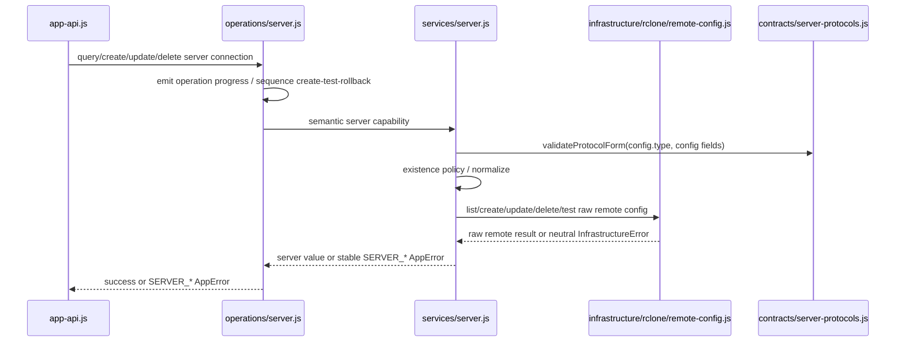

# Servers and mappings

> 返回 [架构总览](../Architecture.md)。

## 1. `MainWindowData`

```js
{
  servers: [
    {
      name: "synology",
      type: "sftp",
      address: "nas.local",
      status: "unknown",
      config: {
        type: "sftp",
        host: "nas.local"
      }
    }
  ],
  mappings: []
}
```

说明：

- `MainWindowData` 是主窗口 renderer 的当前只读展示数据
- `src/app/app-api.js` 通过 `getMainWindowData()` 组合 server 列表和 mapping 列表
- server connection 由 `src/app/services/server.js` 从 raw rclone remote 转换而来，对外结构固定为 `{ name, type, address, status, config }`
- mapping 通过 `src/app/services/mapping.js` 访问；JSON persistence 位于 `src/infrastructure/configuration/app-config-store.js`
- 如果 mapping 引用了不存在的 server，`getMainWindowData()` 会补充 `status = "missing"` 的 server 占位对象，方便 UI 显示异常状态
- `src/shell/electron/main/app-state.js` 只保存 Electron 窗口状态，不缓存业务数据
- renderer 通过 preload bridge 调用 `main-window:get-data`
- form modal view 名称和校验属于 Electron shared contract，位于 `src/shell/electron/contracts/form-modal.js`，供 Electron Main 和 renderer 共用；删除 server/mapping 是 main-window action，不属于 form view
- server/mapping 修改成功后，app operation 通过 `src/app/app-events.js` 发布 config update；Electron Main 通过 `app-api.js` 注册监听，再发送 `main-window:config-updated` 通知主窗口 renderer 重新读取数据

## 2. `RcloneRemote` 与 `ServerConnection`

当前配置层有两个不同的数据结构：

```js
// 只在 remote-config.js 和 app/services/server.js 边界内使用
{
  name: "synology",
  config: {
    type: "sftp",
    host: "nas.local",
    port: "22",
    user: "xiaobo"
  }
}

// app 层和 UI 层使用
{
  name: "synology",
  type: "sftp",
  address: "nas.local",
  status: "unknown",
  config: {
    type: "sftp",
    host: "nas.local",
    port: "22",
    user: "xiaobo"
  }
}
```

说明：

- `RcloneRemote` 的正式结构是 `{ name, config }`
- `RcloneRemote.config` 是 rclone 配置的原始字段集合，包含 `type`
- `infrastructure/rclone/remote-config.js` 只负责执行 config dump/create/update/delete 和 connection probe，不负责 server policy
- `ServerConnection` 的正式结构是 `{ name, type, address, status, config }`
- `app/services/server.js` 是 remote 和 server 之间的唯一转换层
- `type` 从 `config.type` 派生
- `address` 从 `config.host` / `config.url` / `config.remote` / `config.endpoint` 派生，只用于展示
- `status` 是 app/UI 状态，不写入 rclone config
- 上层模块不直接使用 remote 术语；`app-api.js` 调用 `createServerConnection` / `updateServerConnection` / `deleteServerConnection`

## 3. Server operation flow



当前职责边界：

- `app-api.js` 暴露 create、update 和 delete 用户意图，并在成功后通过 `app-events.js` 发布更新
- `operations/server.js` 负责 server resource 的 operation progress，以及 create → test → rollback、update 和 delete sequencing
- `operations/mapping.js` 负责独立的 mapping resource operations，不承担 server rename 补偿
- `services/server.js` 负责 name/protocol validation、remote existence policy、remote/server 对象转换和 adapter error mapping
- `remote-config.js` 负责 config dump/create/update/delete/test 命令和 raw `{ name, config }` 解析，不判断资源应该存在或不应存在
- 已识别的 rclone 技术失败由 `remote-config.js` 包装为带 `INFRASTRUCTURE_ERROR_CODE` 的 `InfrastructureError`；`services/server.js` 按当前 server capability 抛出 `SERVER_*` AppError，并通过 cause 保留 infrastructure 和 native process error，不逐项翻译 lower-level code
- `name` 是 server 与 remote 共享的资源标识；创建后在 application UI/API 中视为不可变标识，server update 只修改 protocol configuration
- 协议字段校验由 `services/server.js` 调用 `contracts/server-protocols.js` 完成
- application 不提供 server rename；外部手动修改 rclone config 中的名称后，引用旧名称的 mappings 会显示 missing server，必须由用户重新指定 server
- `remote-files.js` 负责远端 raw folder entries、recursive file listing、folder ensure 和 copy/delete/cleanup actions，不与 remote configuration CRUD 混合；`server-folder-tree.js` 把 raw entries 组装为 application TreeNode
- adapter command/parse 错误在 server service 边界转换为稳定的 `SERVER_*` error

## 4. App config store、services 与 operation policy

- `infrastructure/configuration/app-config-store.js` 统一拥有运行时默认配置、读取、schema normalization、序列化和原子写入；CJS Electron 初始化如需确保配置存在，也通过动态 import 复用 `ensureAppConfig()`。完整 load → mutate → save 临界区复用 `runtime/file-mutex.js`，因此同一 config path 的 GUI/CLI 写入会跨进程串行
- `operations/mapping.js` 负责 mapping input/reference validation、path normalization 和 progress lifecycle
- `services/mapping.js` 负责 mapping conflict、create/update/delete/retarget policy，并把完整 JSON transaction 隐藏在 service boundary 后
- `operations/settings.js` 负责 global exclusion input validation；`services/global-settings.js` 负责读取和更新 capability
- `services/app-config.js` 为 sync context resolution 提供完整 configuration read capability
- store 的 `updateAppConfig(mutator)` 只通过 `services/app-config.js` 暴露给 application services，不暴露给 operations、core 或 shells

当前序列化后的 `config.json` 结构为：

```json
{
  "globalExclusionPatterns": [
    ".DS_Store",
    "Thumbs.db",
    ".git"
  ],
  "mappings": [
    {
      "displayName": "ProjectsSynced",
      "rcloneRemote": "synology-sftp",
      "localBasePath": "/Users/example/ProjectsSynced",
      "remoteBasePath": "ProjectsSynced",
      "exclusionPatterns": [],
      "lastSyncMode": null,
      "lastSyncFolder": null,
      "lastSyncDate": null
    }
  ]
}
```

配置属性语义：

- `globalExclusionPatterns` 对所有 mappings 生效；匹配路径在 Push 和 Pull 中均不比较、不复制、不删除
- `mappings[].displayName` 是可选的人类可读名称
- `mappings[].rcloneRemote` 引用 `rclone.conf` 中的 remote name
- `mappings[].localBasePath` 与 `remoteBasePath` 定义 mapping root；触发子目录时，相对路径追加到 remote root
- `mappings[].exclusionPatterns` 只作用于当前 mapping，并与 global patterns 取并集
- `lastSyncMode`、`lastSyncFolder`、`lastSyncDate` 保存可选的最近同步 metadata
- local path 同时命中多个 mappings 时，优先使用最具体的 local root

运行时路径可通过 `APP_ROOT_PATH`、`CONFIG_DIRECTORY`、`CONFIG_PATH` 和 `RCLONE_CONFIG_PATH` 覆盖；`DEBUG` 控制 CLI failure 是否输出 stack。打包后的默认配置目录是 macOS 的 `~/Library/Application Support/sync-with-rclone/config/` 或 Windows 的 `%APPDATA%/sync-with-rclone/config/`。
