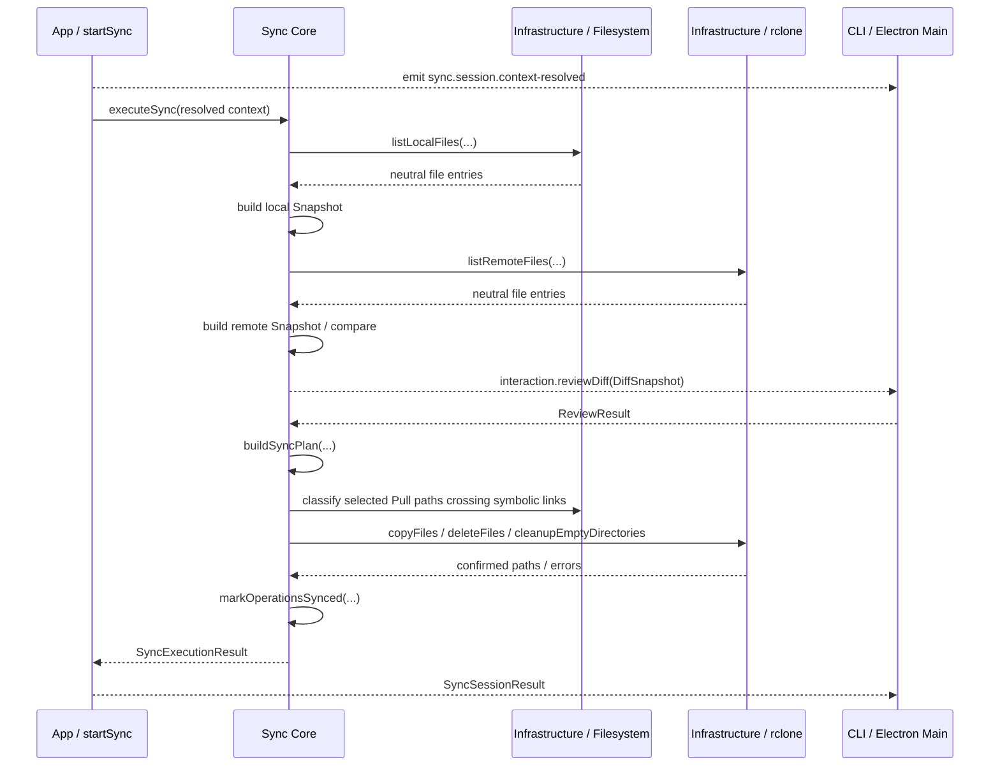

# Synchronization architecture

> 返回 [架构总览](../Architecture.md)。

## 1. `Snapshot`

```js
/**
 * @typedef {object} FileEntry
 * @property {string} path - Path relative to the root
 * @property {number} mtimeMs - Modified time in number
 * @property {number} size - File size
 */

/**
 * @typedef {object} Snapshot
 * @property {string} root - Canonical local root or normalized rclone remote root
 * @property {FileEntry[]} files - Serializable file entries sorted by path
 */
```

说明：

- `Snapshot` 是扫描结果的正式结构定义
- `root` 是 canonical 本地绝对路径或 normalized rclone remote path
- `files` 只记录文件，不记录目录
- 目录不是同步内容，只在 review UI 中由文件路径派生出来
- 空目录不会作为 snapshot 内容保存
- 本地扫描会在进入目录前依次应用 exclusion 和 `.gitignore`，被任一规则排除的目录不会继续读取子内容
- 当前 scanner 会读取同步根目录及其后代目录中的 `.gitignore`，并通过 `ignore` package 支持常用 pattern、注释、嵌套规则和 `!` negation
- 当前实现尚未达到 PRD 所要求的完整 Git compatibility：`readPatterns()` 会先对每一行调用 `trim()`，无法原样保留 Git 对转义空格等边缘语法的解释；项目也尚未使用 Git CLI compatibility corpus 做逐项对照验证
- exclusion 同时改变 local 与 remote Snapshot；匹配路径属于双向 unmanaged namespace
- `.gitignore` 只由本地 scanner 解析，因此仍只改变 local Snapshot；Push 省略这些本地路径，Pull 可以从未被 exclusion 排除的完整远端 truth 恢复同名内容
- `Snapshot` 只表达扫描到的文件事实，不携带扫描省略原因、远端协议能力、hash 能力或 backend 精度等基础设施属性

示例：

```js
{
  root: "/project/root",
  files: [
    {
      path: "README.md",
      size: 1204,
      mtimeMs: 1711880000000
    },
    {
      path: "src/index.js",
      size: 532,
      mtimeMs: 1711880001000
    }
  ]
}
```

## 2. `DiffSnapshot`

```js
/** @enum {number} */
export const DiffState = Object.freeze({
  unchanged: 0,
  modified: 1,
  added: 2,
  deleted: 3,
})

/** @typedef {FileEntry & { state: DiffState }} DiffFileEntry */

/**
 * @typedef {object} DiffSnapshot
 * @property {string} srcRoot - Absolute path of the source folder
 * @property {string} dstRoot - Absolute path of the dest folder
 * @property {DiffFileEntry[]} files - Serializable file differences sorted by path
 * @property {{ modified: number, added: number, deleted: number }} summary
 */
```

说明：

- `DiffSnapshot` 是差异计算后的正式结构定义
- 它同时记录源端根路径和目标端根路径
- `files` 保存文件级差异
- `summary` 保存文件级差异统计
- 目录级统计由 `serializeDiffSnapshot` 在 review 展示前从文件路径派生
- 文件是否 `modified` 由路径、大小和 `mtimeMs` 决定；当前实现对 `mtimeMs` 使用 1 秒容差
- 同步扫描流水线假设远端协议能可靠保存并返回文件 `mtime`；当前配置界面只测试基本连接，尚未实现 `mtime` / hash capability probe。这类能力即使加入，也属于 app/configuration policy，不进入 `Snapshot` 或 `DiffSnapshot` 数据契约
- 当前支持的 NAS 远端基线是 SFTP；Synology WebDAV 不保证返回源文件 `mtime`，不满足可靠重复同步预览的要求
- apply 阶段传入 `--sftp-disable-hashcheck`。Synology 的 SFTP 路径和 shell 卷路径可能不同，未验证的 `md5sum_command` / `sha1sum_command` 会让 rclone 在上传完成后误判 checksum 失败并重试整批 copy。hash 能力只在未来配置界面验证通过后作为可选增强使用
- apply 阶段暂时不使用 `--inplace`，保留 rclone 默认的 `.partial` 上传行为，让用户和系统都能区分未完成文件与已完成文件。代价是 Synology 回收站可能保留失败上传的 `.partial` 文件；这是运维清理问题，不应通过牺牲完成状态可见性来隐藏

示例：

```js
{
  srcRoot: "/local/project",
  dstRoot: "remote:project",
  summary: {
    added: 1,
    modified: 1,
    deleted: 0
  },
  files: [
    {
      path: "README.md",
      size: 1204,
      mtimeMs: 1711880000000,
      state: DiffState.modified
    },
    {
      path: "src/index.js",
      size: 532,
      mtimeMs: 1711880001000,
      state: DiffState.added
    }
  ]
}
```

## 3. `ReviewResult`

```js
/**
 * @typedef {'confirm' | 'cancel'} ReviewAction
 */

/**
 * Minimal review result contract returned from CLI or Electron review.
 *
 * @typedef {object} ReviewResult
 * @property {ReviewAction} action
 * @property {string[]} [selectedPaths]
 */
```

说明：

- `ReviewResult` 是 review 阶段返回给主流程的正式结构定义
- 它只表达结果，不表达 UI 细节
- `action = confirm` 表示继续
- `action = cancel` 表示正常取消，不是执行异常
- `selectedPaths` 是相对于当前 diff 根的路径集合

示例：

```js
{
  action: "confirm",
  selectedPaths: [
    "README.md",
    "src/index.js"
  ]
}
```

## 4. `SyncPlan`

```js
{
  action: "confirm",
  operations: [
    { type: "delete", path: "blocked-path" },
    { type: "copy", path: "README.md" },
    { type: "copy", path: "src/index.js" },
    { type: "delete", path: "old.txt" }
  ]
}

// 说明:
// - 这里表达的是明确的执行意图，而不是 UI 状态
// - SyncPlan 只包含文件操作，不包含目录操作
// - copy 前的 delete 用来解决路径结构冲突；copy 后的 delete 是普通 mirror cleanup
```

示例含义：

- `SyncPlan` 是 apply 阶段的直接输入
- 它把“要做什么”压缩成明确的动作集合
- `core/planning/execute-sync-plan.js` 解释计划并协调 copy、delete 和 cleanup
- `infrastructure/rclone/remote-files.js` 执行具体 rclone batch commands，不拥有 SyncPlan 生命周期
- `build-sync-plan.js` 用 path trie 找出与 copy path 互为祖先/后代的结构冲突 delete，并将它们排在 copy 前；必要的冲突删除没有被用户选中时，plan 构建会失败
- apply 顺序为 structural-conflict delete → empty-directory cleanup → copy → ordinary delete → final cleanup；普通 delete 延后，使 copy 失败时尽量保留未阻挡 copy 的目标端旧内容

## 5. `ApplyProgress`

```js
{
  activity: "copy",
  index: 2,
  total: 6,
  measurement: {
    current: 1048576,
    total: 2097152,
    unit: "bytes"
  }
}
```

说明：

- `ApplyProgress` 是 apply 阶段的进度观察事件结构，只用于 UI 展示和调试，不推进主流程
- `activity` 当前固定为 `start` / `resolve-conflicts` / `copy` / `delete` / `cleanup` / `complete`
- `index` 是当前 activity 在固定 activity 列表中的位置，`total` 是固定 activity 总数
- `measurement` 只在 copy 阶段有字节进度；其他 activity 为 `null`
- UI 可以用 `index` 和 copy 阶段的 `measurement` 推导整体进度条，但同步执行不直接暴露一个最终百分比
- 这个结构表达当前正在发生的 apply 状态，不包含完整 UI 步骤列表

copy 之外的示例：

```js
{
  activity: "cleanup",
  index: 4,
  total: 6,
  measurement: null
}
```

## 6. `SyncExecutionRuntime`

```js
{
  events: {
    eventListener(event) {}
  },
  interactions: {
    reviewDiff(diffSnapshot) {}
  }
}
```

说明：

- `events.eventListener` 是观察流，用于进度、日志和 UI 展示，不推进主流程
- `interactions.reviewDiff` 是业务等待点，`executeSync` 必须等待它返回 `ReviewResult` 才能继续
- rclone 命令执行属于 infrastructure 内部实现，不通过 synchronization runtime 注入
- `executeSync` 会 emit `sync.phase.*` 事件，事件类型定义在 `src/core/contract.js` 的 `SYNC_PHASE_EVENT`
- apply 阶段的 progress payload 使用 `ApplyProgress`
- `executeSyncPlan` 通过直接的 `onProgress` callback 上报 apply progress，不使用通用 runtime wrapper
- `executeSync` 返回 `SyncExecutionResult`，结果值定义在 `SYNC_RESULT`

## 7. `SyncSessionRuntime`

```js
{
  events: {
    eventListener(event) {}
  },
  interactions: {
    reviewDiff(diffSnapshot) {}
  }
}
```

说明：

- `startSync` 是 app 层 synchronization use case
- `startSync` 负责读取配置、解析映射、生成 `SyncSessionContext`
- `startSync` 把 sync phase event 转换成 `SYNC_SESSION_EVENT.PROGRESS`
- `startSync` 返回 `SyncSessionResult`
- `startSync` 会 emit `SYNC_SESSION_EVENT.RESULT`（值为 `sync.session.result`）作为观察事件，但 Electron final 流程由返回值驱动
- `startSync` 遇到技术故障时写入跨平台 `diagnostics.log`，Electron、CLI 与未来自动化入口共用同一排障文件
- sync-session window state 由平行的 `sessionState` 与 `sessionResult` 组成：前者保存 context、stage、phase、message、progress 和 review，后者只保存终态结果
- 失败页始终提供日志文件夹入口；Electron Main 在用户点击后解析 runtime log directory 并打开，不通过 app result 传递路径

## 8. Application lifecycle 与 sync admission

- `app/operations/sync/start.js` 是 shell-neutral application operation，负责 context resolution、sync admission、history、session events、error mapping 和最终结果。
- `app/operations/sync/admission.js` 拥有“本地或远端根路径相同或互为祖先/后代即冲突”的 application policy；本地路径先解析为 canonical filesystem path，远端路径先按 rclone remote/folder 语义消解 `.`、`..` 和斜杠，非重叠同步才可以并行。
- `core/execute-sync.js` 负责已解析上下文中的 snapshot、compare、review、plan 和 apply 流程；core execution contract 定义在 `core/contract.js`，application session events 定义在 `app/contracts/sync.js`。
- remote-folder probe/mkdir 是可复用的 infrastructure action；`startSync` 在 application policy 确认需要创建目标目录后直接调用它。
- `infrastructure/runtime/runtime-paths.js` 从进程、平台、安装目录和环境变量解析运行时路径。
- `infrastructure/runtime/file-mutex.js` 提供基于原子锁文件、owner PID、token、超时和 stale-owner recovery 的通用跨进程临界区。
- `infrastructure/runtime/sync-lease-store.js` 在该 mutex 下串行化 registry 更新，并为每个活跃同步保存独立 lease；它只存取跨进程状态，不决定路径是否冲突。
- `infrastructure/filesystem/local-path.js` 负责本地路径规范化、home 展开、目录存在性校验、real path 解析和 platform-aware comparison key；所选同步根目录及其父级 link 都解析到真实目录。`app/operations/sync/resolve-mapping.js` 在 context resolution 边界把技术错误转换成 application error。
- `infrastructure/rclone/remote-path.js` 是 remote name、relative/absolute folder path、dot segment、范围和重叠判断的统一入口；application operations 与 config store 不再各自解释 rclone path。
- `startSync` 先解析一次 `SyncSessionContext`，再申请 lease；申请成功后才写 started history 并执行，结束时在 `finally` 中释放 lease。
- lease 位于当前 app directory 的 `runtime/sync-admission/` 下，因此使用同一 app root 的 Electron 与 CLI 进程共享 admission 状态。不同 app roots、不同设备以及绕过本应用直接运行的 rclone 不在保护范围内。
- lease 带有 owner PID；读取 registry 时会清除格式错误或 owner 进程已经结束的 lease。任一侧路径重叠时，`startSync` 返回 `sync_session.overlap`，被拒绝的请求不写 operation history。

## 9. File services、Snapshot 与 plan application

- `core/exclusions.js` 通过 `normalizeExclusionPatterns()` 统一验证并规范化全局与 mapping patterns；application operations 保存规范化结果，`createExclusions()` 复用它建立 matcher 和 rclone exclude patterns。`executeSync()` 每次只创建一个 Exclusions 对象，local 与 remote Snapshot builder 共同使用
- `infrastructure/filesystem/local-files.js` 扫描本地普通文件并返回 neutral file entries；exclusion、`.gitignore`、内部 symbolic links 和特殊对象只影响扫描结果，扫描循环响应 AbortSignal，但不创建 Snapshot
- `infrastructure/rclone/remote-files.js` 把编译后的 exclude patterns 传给 recursive `lsjson` 以提前剪枝，并在解析结果后用同一 matcher 复核；它还提供 raw copy/delete/cleanup/ensure actions
- `core/snapshots/build-snapshot.js` 从 neutral entries 构建并排序 Snapshot，不知道 entries 来自本地文件系统还是 rclone
- `core/snapshots/compare-snapshots.js` 只比较两侧文件事实；excluded 路径不会进入任一 Snapshot，`.gitignore` 省略路径在 Push 中表现为远端删除，在 Pull 中表现为从远端 truth 恢复
- `core/snapshots/acquire-snapshots.js` 只使用调用者提供的 Exclusions 调用 local/rclone scanners，再把 neutral entries 建立为 Snapshot；它不创建或默认补齐同步策略
- `core/planning/sync-plan-result.js` 创建带 `pending | synced | failed` 状态的 execution-result operations，并根据 confirmed paths 或逐项 failure 更新结果
- `infrastructure/filesystem/local-symbolic-links.js` 独立实现本地 symbolic-link 边界发现；它用 Set 缓存已确认安全、缺失、非目录和 symbolic-link 路径，每个唯一既有路径组件至多执行一次 `lstat()`
- `core/planning/pull-symbolic-link-failures.js` 独立拥有 Pull symlink policy：把直接冲突标为 operation-level failure，并联动阻挡结构冲突 delete 与依赖 copy。专用注释和单一入口使这项边缘策略可以独立修改或移除
- `core/planning/execute-sync-plan.js` 调用 symlink policy 后批量执行其余安全路径；批次错误仍按结构冲突 delete、copy、普通 delete 的 failure-safe 顺序停止
- `app/operations/sync/start.js` 只处理 application lifecycle，不拥有 Snapshot 或 SyncPlan 流程

## 10. 数据契约在主要模块间的流转



运行时通道按职责区分：

- `return` 是控制流。`startSync(...)` 的返回值决定 Electron 是否展示 final、进程退出码和后续收尾。
- `events.eventListener` 是观察流。它用于展示 context、progress 和调试，不作为流程推进条件。
- `interactions.reviewDiff` 是业务等待点。它是 application sync execution 在 review 阶段继续执行所需的外部输入。

Progress 与 operation history 保持分离：

- `SYNC_SESSION_EVENT.PROGRESS`（值为 `sync.session.progress`）只进入对应 session window，不写入 history。
- operation history 每个 session 只保存一条 started 和一条 succeeded / failed / cancelled。
- `operation-history.jsonl` 保存面向用户的操作概况；`diagnostics.log` 保存技术故障细节，不进入主窗口的 Logs panel。
- GUI sessions 与主窗口位于同一进程，因此 history emitter 可以实时通知 Logs panel。
- 独立 CLI 写入的 history 仍通过刷新或重新打开 Logs panel 读取。
